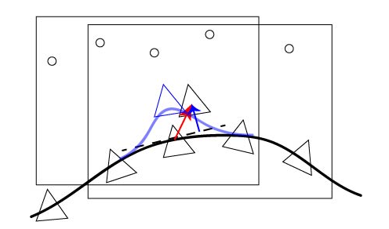

# DSO——NullSpace的计算与推理


## 写在前面

这部分的代码着实很难，一方面论文中几乎没有提这个事情，另一方面这部分的参考资料也确实是比较少，网上能搜索到的基本都是讨论FEJ对零空间的保持问题，所以笔者在看这一部分的时候，着实很艰难，写这篇笔记的时候也是因为自己的觉得理论和公式推导至少能说服我自己了，因此才写出来，不对的地方也希望小伙伴们能够指出来，大家一起进步。

---

## Reference

这次先把自己参考的文章列出来，自己平时是不太喜欢写参考的 ，也算是逼自己能在一篇笔记中把自己想讲的事情讲清楚，这次确实自己也不是那么清楚，所以列出来大家一起分析，一起进步；

1. https://blog.csdn.net/xxxlinttp/article/details/100080080
2. https://www.zhihu.com/question/52869487/answer/258663651
3. https://blog.csdn.net/fb_941219/article/details/100279527
4. Huang, Guoquan P., Anastasios I. Mourikis, and Stergios I. Roumeliotis. "A first-estimates Jacobian EKF for improving SLAM consistency." *Experimental Robotics*. Springer, Berlin, Heidelberg, 2009.


---

## SLAM中的零空间

这部分就是简介一下SLAM中的零空间，我们都知道对于纯视觉SLAM而言，其零空间有7维——3维旋转+3维位置+1维尺度；对于VINS系统而言，充分的加速度计激励可以为系统提供尺度信息，加速度计同时可以提供重力方向，使得pitch和roll可观，因此其不客观的维度为4维——3维位置+1维yaw方向。

通常举例子最常用的就是尺度，也就是当地图的规模扩大一个倍数的时候，整个SLAM的优化问题是不变的，也就是我们所说的不客观。进而这里明确一个点：**SLAM中的零空间其实是整个优化问题的零空间，而不是说是优化中某个节点的零空间**。就是说整个优化问题存在不客观的维度，这个不客观的维度会通过优化问题进而影响到某个节点的优化，导致那个节点出现问题，常见的比如说纯视觉SLAM在转弯的时候，尺度会突然变化。


---

## DSO中使用到的零空间正交化（orthogonalize）

根据前面的论文和源码分析，DSO在零空间维度的保持上，使用了FEJ去维持，但是在整个优化过程中，作者同样使用了零空间的正交化去避免零空间对最终的增量产生的影响，盗用[参考[1]](https://blog.csdn.net/xxxlinttp/article/details/100080080)中的图示：



其中红色的箭头表示增量方程中求解出来的增量，黑色的虚线表示零空间在这个节点上可能产生的漂移，而蓝色的箭头表示最终我们正交化之后的增量结果，当正交化之后，相机最终的位置会到蓝色三角显示的位置。

下面就来进行一下这个部分详细的推导，不对的地方还请指出：

> Notation：
>
> 1. 下面的所有推导中，$x$表示优化节点的值，$\Delta{x}$表示求解的增量，$\delta{x}$表示零空间引起的漂移；
> 2. 其实下面所说的李代数大家自行理解为向量空间就好；


### 零空间如何影响当前的优化的

首先一步，祭出SLAM中的优化函数：
$$
E=\sum_{i=1}^{N}||z_i-h(x)||^{2}   \tag{1}
$$
其中i表示观测的index，这里只写了一个节点的优化目标函数，多个的类似，分析一个就已经可以说明问题了。

然后明确的一个点：**零空间的带来的优化漂移主要产生在增量方程的计算上**，也就是：
$$
\Delta{x}^{T}H\Delta{x}=2\Delta{x}^{T}b \tag{2}
$$
因为增量方程跟优化问题息息相关，优化问题受到零空间不可观的影响，导致了最终求解出来的增量产生了漂移，也就是说，根据公式(2)求解出来的增量可能是$\Delta{x_1}$，也可能是$\Delta{x_2}$，不管是哪一个，都满足优化目标函数（**注意不是都满足增量方程**）。所以，笔者认为其实零空间对于优化问题的影响其实是影响到了我们求解的增量——李代数。

这里就比较有意思的一点是：**零空间是如何影响李代数的？**我的第一感觉当然是线性影响，即$\hat{\Delta{x}}= \Delta{x}+\delta{x}$，但是实际上并不是线性关系，很简单的例子，当优化问题的尺度发生了变化，在增量中根本找不到一个量来线性的增加（直观上理解应该是：当尺度变化的时候，表征位移的增量$\Delta{x_p}$应该同时扩大或者缩小，旋转的增量可能不变），所以引出下面的公式：
$$
\hat{\Delta{x}}=se(\hat{\Delta{x}})=se(\Delta{x}+\delta{x})=se(\Delta{x})+N\delta{x}=\Delta{x}+N\delta{x} \tag{3}
$$
其中$N$表示李代数对于零空间变量的求导，这个地方对应于DSO代码中FrameHessian::setStateZero函数，作者采用了最原始的数值推导的方法。


### 正交化去除零空间对增量的影响

这部分主要基于公式(1)进行，因为零空间的漂移不会影响整个系统的目标函数，所以假设得到的增量为$\Delta{x}$，那么有如下公式：
$$
E=||z-h(x+\Delta{x}-N\delta{x})||^2=||z-h(x+\Delta{x})||^2  \tag{4}
$$
其中$\Delta{x}$是优化问题求解出来的，减去零空间的漂移意味着公式希望求解没有漂移的增量。上式的意思是说：当零空间引起增量值变化时，整个优化问题的输出是不变的！这符合我们的预期：还是那个例子，当尺度变化的时候，整个优化问题还是“按部就班”的在求解，只不过得到的尺度变化了而已，但是这个量没有观测，所以无法得到反馈进而去校正。

继续对公式(4)进行化简，这里分为前部分和后部分化简：
$$
\begin{aligned}
E&=||z-h(x+\Delta{x}-N\delta{x})||^2 \text{ where } \quad e=z-h(x) \quad J=\frac{\partial{e}}{\partial{x}}|_{x=x} \\
&=(e+J(\Delta{x}-N\delta{x}))^T(e+J(\Delta{x}-N\delta{x})) \\
&=e^Te+e^TJ(\Delta{x}-N\delta{x})+(\Delta{x}-N\delta{x})^TJ^Te+(\Delta{x}-N\delta{x})^TJ^TJ(\Delta{x}-N\delta{x}) \\
&=e^Te+e^TJ\Delta{x}-e^TJN\delta{x}+\Delta{x}J^Te-(N\delta{x})^TJ^Te+\Delta{x}^TJ^TJ\Delta{x}-(N\delta{x})^TJ^TJ\Delta{x}-\Delta{x}J^TJ(N\delta{x})+(N\delta{x})^TJ^TJ(N\delta{x}) \\
&=\underbrace{e^Te+e^TJ\Delta{x}+\Delta{x}J^Te+\Delta{x}^TJ^TJ\Delta{x}}_{||z-h(x+\Delta{x})||^2} \underbrace{-e^TJN\delta{x}-(N\delta{x})^TJ^Te-(N\delta{x})^TJ^TJ\Delta{x}-\Delta{x}J^TJ(N\delta{x})+(N\delta{x})^TJ^TJ(N\delta{x})}_{\delta{x} \text{ part}} \\
&=||z-h(x+\Delta{x})||^2
\end{aligned} \tag{5}
$$
可以看到，公式(4)前半部分化简之后刚好就是公式(4)的后半部分，所以直接消去，那么这时候相当于在求解后面仅仅与零空间相关的部分，写作公式(6)：
$$
(N\delta{x})^TJ^TJ(N\delta{x})=e^TJN\delta{x}+(N\delta{x})^TJ^Te+(N\delta{x})^TJ^TJ\Delta{x}+\Delta{x}J^TJ(N\delta{x}) \tag{6}
$$
这时候一个很重要的部分（**这部分笔者没有想到理论上的推导，只能是臆测了，有大神懂的话希望可以多加指点**），公式(6)中的$(N\delta{x})^TJ^Te$其实是等于0的：显然$J^Te$是优化问题的梯度，而零空间之所以能够肆意变化而不被优化察觉，就是因为零空间产生的影响与优化的梯度方向是正交的，就像一个平面上的点有可能是三维空间中的一条线一样，这条线长度再怎么变化，对于这个面而言始终是一个点。

那么回到公式(6)中，把这部分置零之后并对$\delta{x}$进行求导，我们就得到下面的结论：
$$
N\delta{x}=\Delta{x} \tag{7}
$$
参考[1]中对这个公式的说法是这两个值大概率是不会相等的，但是笔者个人认为他们不相等（数值和方向）是因为上面的原因：即零空间产生的影响($N\delta{x}$)与优化问题的梯度是正交的，但是对于通过GN或者LM法得到的增量，他们之间是有一个夹角的，就像最开始的图中显示的一样。

说回来，既然他们不相等，那么在求解公式(7)的时候，就必然要使用最小二乘法了，这部分就不赘述了，DSO作者使用了SVD来求解N的伪逆，之后使用公式(8)得到去除零空间影响的增量：
$$
\hat{\Delta{x}}=\Delta{x}-NN^{\dagger}\Delta{x} \tag{8}
$$
这部分代码比较少，笔者就直接贴出来了：

```C++
void EnergyFunctional::orthogonalize(VecX *b, MatXX *H) {
    std::vector<VecX> ns;
    ns.insert(ns.end(), lastNullspaces_pose.begin(), lastNullspaces_pose.end());
    ns.insert(ns.end(), lastNullspaces_scale.begin(), lastNullspaces_scale.end());

    // make Nullspaces matrix
    MatXX N(ns[0].rows(), ns.size());
    for (unsigned int i = 0; i < ns.size(); i++)
        N.col(i) = ns[i].normalized();

    // compute Npi := N * (N' * N)^-1 = pseudo inverse of N.
    Eigen::JacobiSVD<MatXX> svdNN(N, Eigen::ComputeThinU | Eigen::ComputeThinV);

    VecX SNN = svdNN.singularValues();
    double minSv = 1e10, maxSv = 0;
    for (int i = 0; i < SNN.size(); i++) {
        if (SNN[i] < minSv) minSv = SNN[i];
        if (SNN[i] > maxSv) maxSv = SNN[i];
    }
    for (int i = 0; i < SNN.size(); i++) {
        if (SNN[i] > setting_solverModeDelta * maxSv)
            SNN[i] = 1.0 / SNN[i];
        else SNN[i] = 0;
    }

    MatXX Npi = svdNN.matrixU() * SNN.asDiagonal() * svdNN.matrixV().transpose();    // [dim] x 9.
    MatXX NNpiT = N * Npi.transpose();    // [dim] x [dim].
    MatXX NNpiTS = 0.5 * (NNpiT + NNpiT.transpose());    // = N * (N' * N)^-1 * N'.

    if (b != 0) *b -= NNpiTS * *b;
    if (H != 0) *H -= NNpiTS * *H * NNpiTS;
}
```

DSO作者在求解完整个优化问题之后，对求得的增量进行了正交化：

```c++
if ((setting_solverMode & SOLVER_ORTHOGONALIZE_X) ||
    (iteration >= 2 && (setting_solverMode & SOLVER_ORTHOGONALIZE_X_LATER))) {
    VecX xOld = x;
    orthogonalize(&x, 0);
}
```

那么这部分的推导与代码也对上了。


### 正交化去除零空间对于增量方程的影响

在上面的正交化代码中，可以看到其实作者最开始是想对增量方程进行正交化的，那么之所以笔者先写了对增量进行正交化是因为这部分也要用到那一部分的结论，：
$$
\begin{aligned}
\Delta{x}^T\hat{H}\Delta{x}&=\Delta{x}^TH\Delta{x}-\delta{x}^T\overline{H}\delta{x} \quad \text{  where  } \quad \overline{H}=\overline{J}^T\overline{J} \quad \overline{J}=\frac{\partial{e}}{\partial{\delta{x}}}=\frac{\partial{e}}{\partial{x}}\frac{\partial{x}}{\delta{x}}=JN \\
&=\Delta{x}^TH\Delta{x}-(N^{\dagger}\Delta{x})^TN^TJ^TJN(N^{\dagger}\Delta{x}) \\
&=\Delta{x}^TH\Delta{x}-\Delta{x}^T(NN^{\dagger})^TH(NN^{\dagger})\Delta{x} 
\end{aligned} \tag{9}
$$
所以可以得到$\hat{H}=H-(NN^\dagger)^TH(NN^{\dagger})$，在代码中，作者对$NN^{\dagger}$进行了处理，使得其转置与自身相等，因此在计算的时候并没有取转置。

增量方程中的$b$部分也是同理，如下：
$$
\begin{aligned}
\Delta{x}^T\hat{b}&=\Delta{x}^Tb-\delta{x}^T\overline{b}\quad \text{  where  } \quad \overline{b}=\overline{J}^Te \quad \overline{J}=\frac{\partial{e}}{\partial{\delta{x}}}=\frac{\partial{e}}{\partial{x}}\frac{\partial{x}}{\delta{x}}=JN \\
&=\Delta{x}^{T}b-(N^{\dagger}\Delta{x})^TN^TJ^Te \\
&=\Delta{x}^{T}b-\Delta{x}^T(NN^{\dagger})^Tb
\end{aligned} \tag{10}
$$
根据上面的推导易得：
$$
\begin{aligned}
\hat{H} &= H-(NN^{\dagger})^TH(NN^{\dagger}) \\
\hat{b} &= b-(NN^{\dagger})^Tb
\end{aligned} \tag{11}
$$
这部分与代码中的也一致。


---

## 总结

1. 其实整个推导过程有点儿为了对代码而说服自己的过程。。。不过笔者自己也在这个过程中看了很多资料，学到一些东西，当然也期待关于这部分更好的解答；
2. 再次重申一遍，零空间是整个优化问题的零空间，其通过优化问题间接的影响节点的优化，正是因为这样，DSO在构建矩阵N的时候，其实是把所有的李代数与DSO优化问题的零空间进行求导的，这块儿具体可以看一下代码；然后我并不是特别赞成说零空间是增量方程中H矩阵的零空间，这样显然没有考虑到增量方程中的b，毕竟增量方程是目标函数求导之后的结果，如果增量考虑进零空间的影响，那么H和b其实都会变化的；
3. 有的同学可能觉得对于增量方程的正交化推导的有些云里雾里，其实这部分将笔者自己认为的$(N\delta{x})^TJ^Te=0$带入公式(5)中，通过对$\Delta{x}$求导也可以得到，当然如果笔者认为的$(N\delta{x})^TJ^Te=0$是不对的，那么你就当做是看了一篇臆测的推导吧：）
4. 感觉整体下来，DSO作者确实花了不少心思，先是在求解增量方程的时候消除零空间，然后是又对增量也消除了一遍，那么问题来了：这两个操作是必须绑定么？这个笔者也着实不是很明确；
5. 最后一个不太明白的地方是作者在构建N的时候，对每一列都进行了归一化，这个目前的猜想可能是为了方便进行SVD，且对于零空间的求解没有特别大的影响；
6. 整个推导过程中很多地方其实应该使用约等号的，比如线性化的时候等等，这里并没有写的那么严格；

