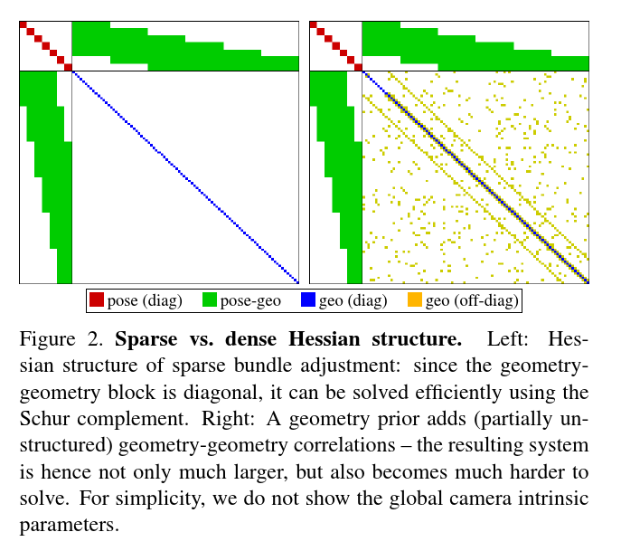
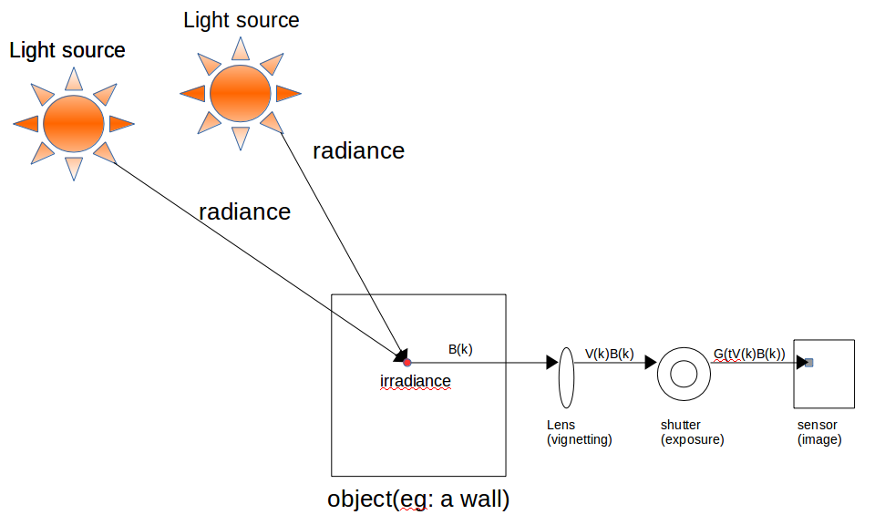
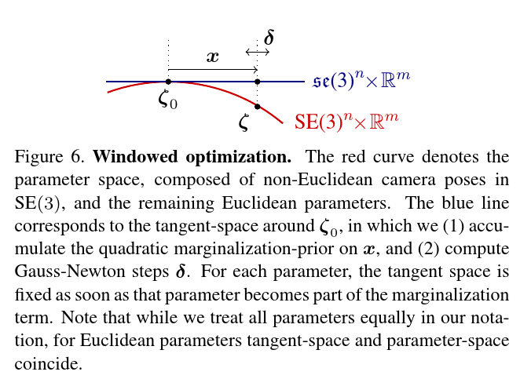

# Direct Sparse Odometry

---

## Abstract

本文提出了一个较为新颖的直接稀疏里程计（DSO）。**整个系统包含了完整的直接法（最小光度误差）模型**，状态包含相机的位姿，逆深度。为了达到实时运算，算法去除了直接法添加先验的做法，取而代之的是从整个图像上均匀的采样关键点。最后，整个系统添加了完整的光度标定，考虑了曝光时间，镜头渐晕以及非线性响应函数（这些基本上都是相机的参数）。

---

## Introduce

这部分主要介绍Direct vs Indirect、Sparse vs Dense方法。

#### Direct VS Indirect

- Indirect方法主要分为两步：1） 预处理图像，获得一致性的表示（指代匹配步骤，不管是匹配法或者光流法）；2） 使用观测进行自变量的估计；
- Direct方法舍弃了第一步，直接使用像素值的光度误差进行估计；

通常，Direct使用光度误差进行优化，而Indirect方法则使用几何误差进行优化。

#### Dense VS Sparse

- Sparse方法：利用图像中部分独立点进行重建；
- Dense方法：利用图像的全部像素进行重建；
- Semi-dense方法：避免重建整个平面，本质上还是使用部分子集进行重建，论文中描述子集的特点为连接程度大且约束严格，个人的理解是梯度比较大，优化信息比较明显；

个人感觉，Dense和Sparse再讲如何使用图像中的像素点。

关于两种方法的组合方法，这里不再赘述，详细可以看论文中的部分。DSO使用的显然就是Direct+Sparse方法，也就是优化方法是光度误差优化，而在整个过程中，是选择图像中一部分像素参与到优化的。

#### 关于为什么使用Direct方法

Indirect方法的优势是不言而喻的，关键点对于光照变化、镜头畸变具有很好的鲁棒性。但是针对相机的曝光时间、伽马矫正等已知噪声的影响，Indirect方法显得无能为力；但是对于Direct方法，由于使用光度误差进行优化，可以很自然的将相机的一些特性引入到模型中。

直接法的最大的优势就是不需要关键点的匹配，从而能得到一个更细粒度的几何表示（这点暂时没有感受到）；同时，直接法可以在整个图像上寻找有用的点，包括edge上的点和灰度比较低的点，这样的好处是能在稀疏纹理的地方显得更加的鲁邦。

稀疏法最大的优势在于保持了求解矩阵的稀疏性，没有引入几何先验使得Hassan阵是稀疏的，如下图：

#### 文章的结构

这里主要记录一下文章的组织结构，方便之后对照。

- 第二章都在讲优化的模型，包含
  - 相机的内参矫正和光度矫正；
  - 整个系统使用的误差公式；
  - 划窗优化；
- 第三章讲前端，包含
  - 如何提取特征点；
  - 如何正确有效且准确的初始化；
- 第四章讲解了系统的一些别的实验，包含：
  - 一些参数的选择；
  - 一些新引入的概念；
  - 一些扰动实验；
- 第五章做了总结；

---

### Visual Odometry Front-End

这部分算是对整个系统前端的算法描述，该前端的作用有三：

- 如何选择帧与特征点，如何构建误差方程，涉及到外点剔除和遮挡检测（what？）；
- 为后端提供一个良好的初始值，因为图像本身具有很高的非线性，在一个像素周围仅有1-2的半径范围能保证线性；
- 决定什么时候边缘化；

#### Frame Management

##### step1--初始化帧的跟踪

当新**关键帧**产生的时候，所有已经成熟的点就投影到当前的帧上而且稍微的膨胀一下（这块需要看一下代码是怎么做的）形成一个半稠密的深度图。之后的新帧（在该关键帧到下一个关键帧之间的帧）都用这一帧使用图像对齐方式进行位姿的初始化。论文中指出，仅仅是多使用像素是没有意义的，只会增加计算量，但是如果一个像素使用周围像素的深度则会大大的有益于初始化。

如果最终的均方根误差如果是上一帧的均方根误差的两倍，我们认为这次的对齐是失败的！此时并没有结束，作者在金字塔的最顶层（此时感受野最大）找了27个不同方向再次进行图像对齐（个人理解就是给迭代选择一个比较好的初值）！如果依旧失败应该就真的失败了。

##### step2--关键帧的选择

DSO关键帧的选择有三个条件：

- 光流追不上了，根据公式：

  $$
  f:=\left(\frac{1}{n} \sum_{i=1}^{n}\left\|\mathbf{p}-\mathbf{p}^{\prime}\right\|^{2}\right)^{\frac{1}{2}}
  $$
  

- 相机的移动（translation）会造成遮挡（occulsion）问题，即便是上述的f值很小，也可能会有动态的物体遮挡住相机，此时算法需要更多的关键帧来做到鲁邦，主要根据仅考虑平移$(R=I)$的光流公式：

  $$
  f_t:=\left(\frac{1}{n} \sum_{i=1}^{n}\left\|\mathbf{p}-\mathbf{p_t}^{\prime}\right\|^{2}\right)^{\frac{1}{2}}
  $$
  

- 如果两帧之间的曝光参数变化比较大，那么也应该生成一个关键帧，主要根据公式：

  $$
  a:=\left|\log \left(e^{a_{j}-a_{i}} t_{j} t_{i}^{-1}\right)\right|
  $$
  

这三个条件的数值在帧的追踪时都可以算出来，因此使用公式$w_{f} f+w_{f_{t}} f_{t}+w_{a} a>T_{\mathrm{kf}}$来决定要不要产生一个新的关键帧；

##### step3--关键帧的边缘化

DSO的边缘化帧选取也比较简单，设$I_1,I_2,...,I_n$是窗口中的关键帧，其中1表示最新的，n表示最老的，那么：

- 必须留下$I_1,I_2$，即最新的两个帧；

- 如果某个帧的观测点在最新帧中所占的比例不超过5%了，那么边缘化掉它；

- 把距离分数最大的帧边缘化掉，距离分数公式为：

  $$
  s\left(I_{i}\right)=\frac{\sqrt{d(i, 1)} }{\sum_{j \in[3, n] \backslash\{i\}}(d(i, j)+\epsilon)}
  $$
  

  可以看到该公式就是在最**离群**的帧，保证剩下的帧都和最新的帧距离很近；

- 在边缘化之后，会把以被边缘化的帧为host帧的点都给扔掉，这样H矩阵会稍微稀疏一些。

#### Point Management

在DSO中，作者使用较多的图像下采样操作来到达实时的效果，相比较于Indirect方法，DSO能够很有效的利用弱纹理、重复区域以及边缘的信息；

在对于active点的控制上，DSO保证整个划窗中只有$N_p$个点，这些点要均匀的分布在空间以及划窗的关键帧中；整个activa过程如下：

1. 在每个关键镇上选择Np个候选点，保证后面我们有足够的点可以用于激活；
2. 候选点不立刻进行优化，相反，他们会在后续的帧中用于track，生成一个初始的深度；
3. 在优化点的时候，从划窗中所有帧的观测中选择一部分进行active；

##### step1--候选点的选择（这里简单写一下，后面对照源码会再详细的说）

1. 把整个图像分作n个32*32的块，对每个块结合梯度直方图取得自阈值$\overline{g}$（这个步骤之后其实还会对块图像进行一个均值滤波），然后取$\overline{g}+g_{th}$作为最后的自适应阈值；
2. 为了得到均匀分布的点集，我们把图像分为若干个$d\times d$的像素块，选择其中大于自适应阈值的点作为关键点；
3. 为了更好的利用图像信息，作者又对$2d \times 2d$和$4d \times 4d$提取关键点，这一步主要是希望一些弱纹理的地方也能够提取出一些渐变边缘的点来帮助track，一个很好的例子就是一面渐变的墙，分辨率$d \times d$看不出来渐变边缘的点，但是分辨率再低一些就可以看出来一些；
4. 如果上述过程拿到的点比期望的要多，那么就增大d的值，如果少，就减小d的值，做到自适应，代码中是个递归，只递归一次；

##### step2--候选点的跟踪

候选点的跟踪使用离散的极线搜索来最小化光度误差。对于最好的匹配上的点，就用这个点计算深度和相关的协方差，用于下次的极线搜索。

##### step3--候选点的激活

当一些点被marge了，那么就要添加一些新的点进去，也就是active。

为了将关键点分散在图像和空间中，DSO将所有关键帧的active点都投影到当前帧上，然后选择与它们距离最大的点进行激活（requiring larger distance for candidates created during the second or third block-run，这里的block-run没看懂是什么意思）。

##### 异常值和遮挡的检测

关于异常值，1）在候选点的追踪过程中，如果在极线搜索的时候，光度误差明显不是那么小，那么这些点会被永久的丢弃掉，说明当前帧不用它了，这种做法能大幅减少重复区域的误匹配；2）光度误差明显大于阈值的要被去掉。该阈值也是根据当前帧情况变化的（在代码里要关注一下）。

------

### Direct Sparse Model

该章节主要分为三个部分：1）标定；2）模型；3）边缘化。下面依次总结；

#### 相机的几何标定

DSO使用小孔相机+径向失真的模型来表示相机，有如下公式，其中c表示相机的内参：

$$
\Pi_{\mathrm{c}}: \mathbb{R}^{3} \rightarrow \Omega
$$

#### 相机的光度标定

DSO中采用的光度响应模型如下公式所述：

$$
I_{i}(\mathbf{x})=G\left(t_{i} V(\mathbf{x}) B_{i}(\mathbf{x})\right)
$$

其中

- B表示该点的辐照度（irradiance），表示该点的总能量（与方向无关）；
- V表示镜头的渐晕，值域为$[0,1]$；
- $t_i$表示曝光时间；
- G表示光度响应函数，作用是将能量映射为像素值$[0, 255]$；

整个过程大概类似于下面的情形

关于里面详细的标定，这里不再赘述，可以参考reference中的链接或者文章。

现在，假设我们进行了相机的光度标定，那么我们就可以消除镜头的渐晕以及非线性光度相应函数的影响，拿到某个点真正对应的**能量**，亦即公式：

$$
I_{i}^{\prime}(\mathbf{x}):=t_{i} B_{i}(\mathbf{x})=\frac{G^{-1}\left(I_{i}(\mathbf{x})\right)}{V(\mathbf{x})}
$$

简单说，对于某个点x，首先逆推回光度值，然后消除渐晕的影响，就是sensor感受到真实的能量值，这个值相比于灰度值要更加的robust。

#### 模型公式

在开头就介绍过，DSO采用光度误差的方法进行优化，自然，这里光度误差也是对一个像素块的光度误差求和，正常情况下的公式如下：

$$
E_{\mathbf{p} j}:=\sum_{\mathbf{p} \in \mathcal{N}_{\mathbf{p}}} w_{\mathbf{p}}\left\|I_{j}\left[\mathbf{p}^{\prime}\right]-I_{i}[\mathbf{p}]\right\|_{\gamma}
$$

其中$\mathcal{N}_p$表示是一个像素块区域，$w_p$是每个像素的权重，$i, j$分别表示当前帧和参考帧，$\gamma$表示huber函数。

DSO在这个常规的步骤上又更近一步，因为前面已经对相机进行了光度校正，知道了整个非线性函数以及渐晕的模型，就可以用上面的转换公式把灰度值转移为**观测点的能量与曝光时间的乘积**，那么相比于灰度值，观测点的能量要显得更加稳定和抗干扰。**因此**，如果我们知道了相机的光度校正模型，那么就可以变为下面的公式，这里$I_i，I_j$就是经过光度校正之后的**观测点的能量与曝光时间的乘积**：

$$
E_{\mathbf{p} j}:=\sum_{\mathbf{p} \in \mathcal{N}_{\mathbf{p}}} w_{\mathbf{p}}\left\|\left(I_{j}\left[\mathbf{p}^{\prime}\right]\right)-\frac{t_{j}}{t_{i}}\left(I_{i}[\mathbf{p}]\right)\right\|_{\gamma}
$$

**但是**，如果我们并不知道光度校正模型呢？作者就也想用类似与$G(t_iV(x)B_i(x))=I$的方式来反过来获得**观测点的能量与曝光时间的乘积**，但是光度响应函数本身是一个非线性的函数，渐晕模型也是一个非线性的模型，为了简单起见（可以简单认为稍微校正一下总比什么都不做好得多），作者把这部分建模为线性模型：$I_i(p)=k(t_iB(x)+b)$，**如果我们连$t_i$也不知道**，那么模型就变为$I_i(p)=k^{\prime}B(x)+b^{\prime}$，其中$k^{\prime}=k*t_i, b^{\prime}=k*b$。

**所以**，综上所述，把两个考虑都加进来之后，光度误差公式就变作如下形式，其中，作者为了将k限制为正，并且去除求导变得越来越小的现象，把$k$处理为$e^a$的形式：
$$
E_{\mathbf{p} j}:=\sum_{\mathbf{p} \in \mathcal{N}_{\mathbf{p}}} w_{\mathbf{p}}\left\|\left(I_{j}\left[\mathbf{p}^{\prime}\right]-b_{j}\right)-\frac{t_{j} e^{a_{j}}}{t_{i} e^{a_{i}}}\left(I_{i}[\mathbf{p}]-b_{i}\right)\right\|_{\gamma}
$$

因此在使用的时候，会有如下几种情况：

- 知道光度校正模型，那么就把上述中的$I_i$通过公式转化为观测点的能量与曝光时间的乘积，此时作者加入了一个线性矫正系数的正则项$E_{\text {prior }}:=\sum_{i \in \mathcal{F}}\left(\lambda_{a} a_{i}^{2}+\lambda_{b} b_{i}^{2}\right)$，以此来迫使$a, b$两数是一个很小的数字；
- 如果不知道光度校正模型，那么都用线性模型进行校正，即$\lambda_a, \lambda_b$为0；

最后就剩下一个权重系数了，作者给出的形式为如下形式：
$$
w_{\mathbf{p}}:=\frac{c^{2}}{c^{2}+\left\|\nabla I_{i}(\mathbf{p})\right\|_{2}^{2}}
$$

当该点的梯度特别大的时候，权重相反变得比较小，c为常数。

#### 滑动窗口优化方法

DSO系统采用滑动窗口的方法对位姿进行局部优化，上文中也讲了DSO边缘化一帧时候满足的条件，这部分主要是讲解当老帧被踢出去的时候，算法做了些什么。

##### First Estimate Jacobian

DSO使用FEJ的方法来保证信息的不丢失，这里对论文中的公式进行一些说明：

> Notations:
>
> 1. 使用$\zeta \in \mathrm{SE}(3)^{n} \times \mathbb{R}^{m}$来表示所有的优化变量；
> 2. 使用$\boldsymbol{x} \in \mathfrak{s e}(3)^{n} \times \mathbb{R}^{m}$来表示更新的$\delta$量；

根据FEJ，新的优化参数一定是以被边缘化时优化参数为起点，所以残差公式如下：

$$
\begin{aligned}
r_{k} &=r_{k}\left(\boldsymbol{x} \mathbb{+} \boldsymbol{\zeta}_{0}\right) \\
&=\left(I_{j}\left[\mathbf{p}^{\prime}\left(\mathbf{T}_{i}, \mathbf{T}_{j}, d, \mathbf{c}\right)\right]-b_{j}\right)-\frac{t_{j} e^{a_{j}}}{t_{i} e^{a_{i}}}\left(I_{i}[\mathbf{p}]-b_{i}\right)
\end{aligned}
$$

公式中的所有优化参数（位姿、光度参数）均是当前的优化参数，即$\left(\mathbf{T}_{i}, \mathbf{T}_{j}, d, \mathbf{c}, a_{i}, a_{j}, b_{i}, b_{j}\right):=\boldsymbol{x}+{\zeta_0}$，所以相应的Jacobian为：

$$
\mathbf{J}_{k}=\frac{\partial r_{k}\left((\boldsymbol{\delta}+\boldsymbol{x}) +\mathbb{\zeta}_{0}\right)}{\partial \boldsymbol{\delta}}
$$

相应的，在计算Jacobian时要把$x$设置为0，也就是要在变量被边缘化时候的估计量$\zeta_0$。例如在k时刻，边缘化了$U$帧，关联帧为$\Lambda$，无关帧为$V$，记此时的估计量为$\zeta_0$，那么在之后的优化过程中，$\Lambda$的线性化点是不能变的，要保持k时刻的参数$\zeta_{0U}$，而通过增量方程计算出来的增量用来更新无关帧的参数$\zeta_{0V}$；直到下一个k+n时刻，又进行了边缘化，此时又固定了$V$中的一些点，重新有了$\zeta_0$.

##### Marginalization

因为使用了划窗的优化，为了保证老的信息不丢失，使用了边缘化的方法去除划窗中较老的关键帧；边缘化的基本思路和公式可以参考贺博的[博客](https://blog.csdn.net/heyijia0327/article/details/52822104)。这次看了DSO的边缘化之后，自己也稍微有了多一些的理解，稍后会整理一下。这里就先对DSO的边缘化进行说明。

在k时刻，系统进行了边缘化，那么此时把与边缘化有关的参数的误差记作$E'$，此时的参数为$x=x_0+\zeta_0$，那么针对后面的过程，其实有：
$$
\begin{aligned}
E'(x+\zeta_0) &= E'((\delta x+x_0)+\zeta_0) = ||e'((\delta x+x_0)+\zeta_0)||^2 \\
&\approx||e'(x_0+\zeta_0)+J_{x_0}(x-x_0)||^2 \\
&=e'^Te'+2\left(x-x_{0}\right)^{T} b_0 +\left(x-x_{0}\right)^{T} H_0 \left(x-x_{0}\right) \\
&=2 x^{T} \underbrace{\left(b_0-H_0 x_{0}\right)}_{=b^{\prime}}+x^{T} H_0 x+\underbrace{\left(c+x_{0}^{T} H_0 x_{0}-x_{0}^{T} b_0\right)}_{=: c^{\prime}}
\end{aligned}
$$
其中：
$$
\begin{aligned}
J_{x_0} &= \frac{\part{e'(x_0+\zeta_0)}}{\part{x}}|_{x={x_0}} \\
b_0 &= J_{x_0}^T e' \\
H_0 &= J_{x_0}^T J_{x_0}
\end{aligned}
$$
对上述公式求导并等于0，就能得到公式：
$$
H_0 x = b'
$$
注意，上面的不是增量方程，求解的不是迭代的量，而直接是参数值！为此我们使用Schur补进行边缘化，永久删除不再使用的帧，有如下公，其中$\alpha$为要保留的值，$\beta$为被边缘化的值：
$$
\left[\begin{array}{cc}
{\mathbf{H}_{\alpha \alpha}} & {\mathbf{H}_{\alpha \beta}} \\
{\mathbf{H}_{\beta \alpha}} & {\mathbf{H}_{\beta \beta}}
\end{array}\right]\left[\begin{array}{c}
{\boldsymbol{x}_{\alpha}} \\
{\boldsymbol{x}_{\beta}}
\end{array}\right]=\left[\begin{array}{l}
{\mathbf{b}_{\alpha}^{\prime}} \\
{\mathbf{b}_{\beta}^{\prime}}
\end{array}\right]
$$
执行schur补之后得到如下公式：
$$
\begin{aligned}
\widehat{\mathbf{H}_{\alpha \alpha}} &=\mathbf{H}_{\alpha \alpha}-\mathbf{H}_{\alpha \beta} \mathbf{H}_{\beta \beta}^{-1} \mathbf{H}_{\beta \alpha} \\
\widehat{\mathbf{b}_{\alpha}^{\prime}} &=\mathbf{b}_{\alpha}^{\prime}-\mathbf{H}_{\alpha \beta} \mathbf{H}_{\beta \beta}^{-1} \mathbf{b}_{\beta}^{\prime}
\end{aligned}
$$
所以对于被保留的$\alpha$部分，我们之后都可以在所有的误差上加入先验项：
$$
E^{\prime}\left(\boldsymbol{x}_{\alpha} +\left(\boldsymbol{\zeta}_{0}\right)_{\alpha}\right)=2 \boldsymbol{x}_{\alpha}^{T} \widehat{\mathbf{b}}_{\alpha}^{\prime}+\boldsymbol{x}_{\alpha}^{T} \widehat{\mathbf{H}_{\alpha \alpha}} \boldsymbol{x}_{\alpha}
$$
该先验项告诉优化器迭代的方向在$\zeta_0$的方向上，且迭代出的值应该尽量使得该误差项变小。

在之后计算光度误差的时候，对于保留的$\alpha$部分，在线性化时一定要用固定点$\zeta_{0\alpha}$，保证迭代的方向都是当时的方向。这点和VINS-MONO中的边缘化策略有着较大的不同。

----

### Summary

这里总结一下整个DSO的特点：

1. DSO是直接稀疏法的视觉里程计系统，使用图像中部分的关键点进行光度误差模型的优化；
2. 整个参数空间包含相机位姿，光度模型参数，观测点的逆深度；
3. 使用划窗的方式进行局部的位姿优化，该优化使用FEJ的方法保证不破坏系统的可观性，使用边缘化的方法保证被旧的帧的信息不丢失；

整个论文到这里就不再向下展开，下面的都是作者的一些实验以及参数的调优；下一步就是根据代码来逐步的反馈论文中的思想。

---

### Reference

1. Direct Sparse Odometry
2. A Photometrically Calibrated Benchmark For Monocular Visual Odometry
3. [https://www.cnblogs.com/luyb/p/6077478.html](https://www.cnblogs.com/luyb/p/6077478.html)
4. [https://blog.csdn.net/heyijia0327/article/details/52822104](https://blog.csdn.net/heyijia0327/article/details/52822104)
5. Notes on DSO