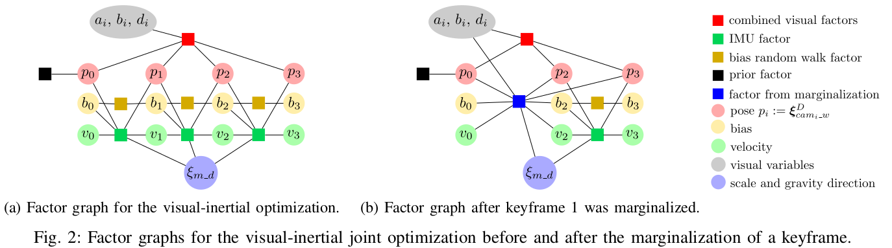
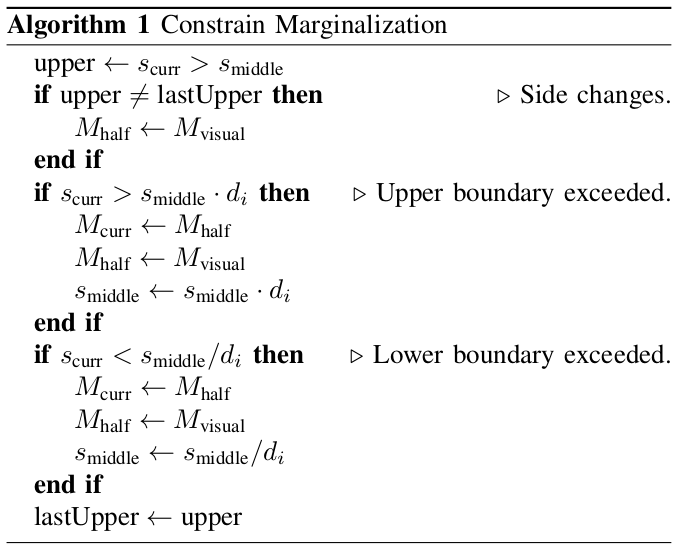
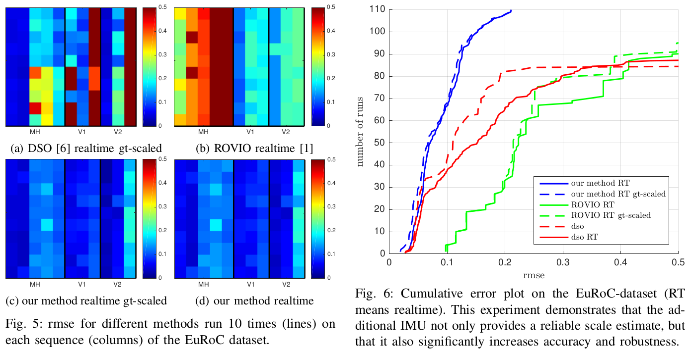
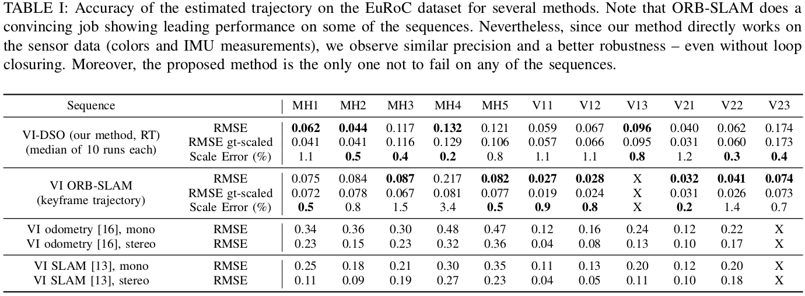
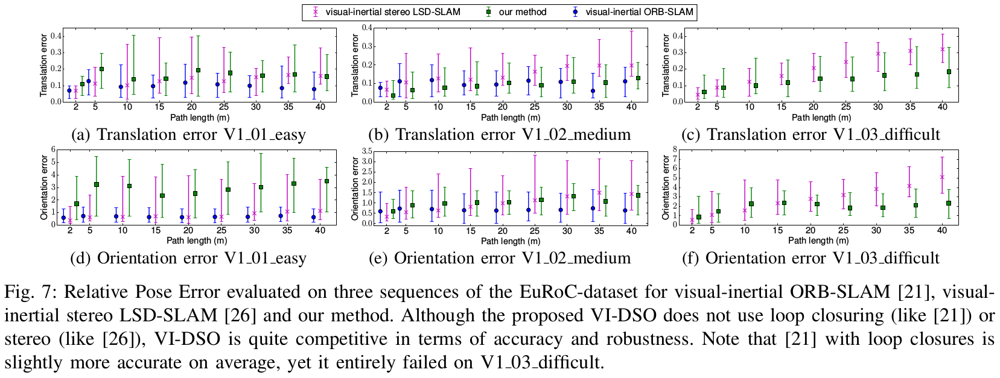
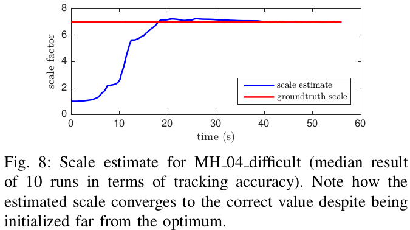
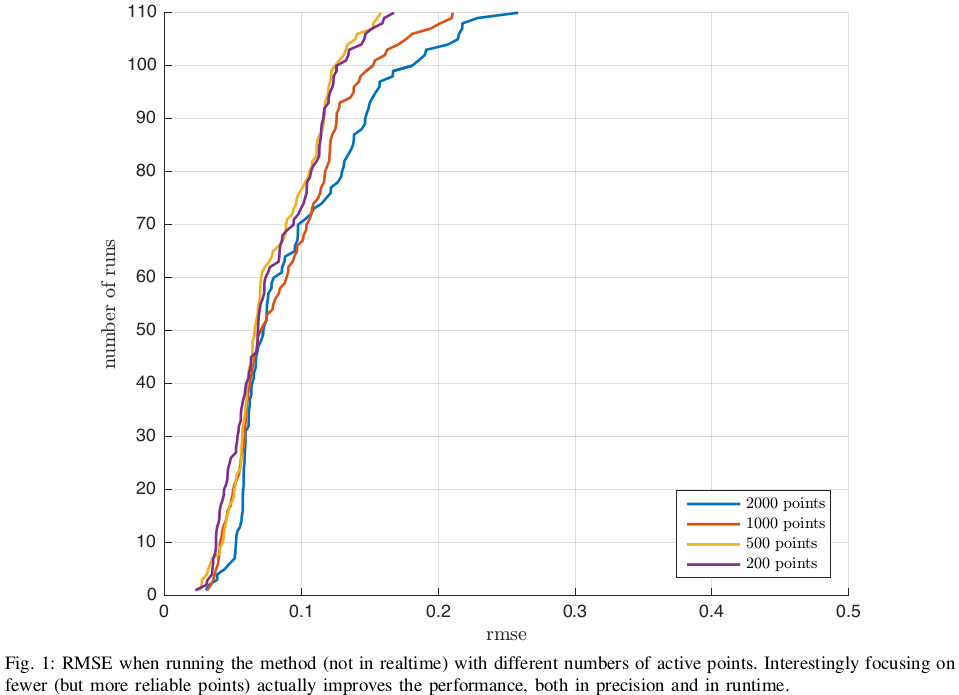
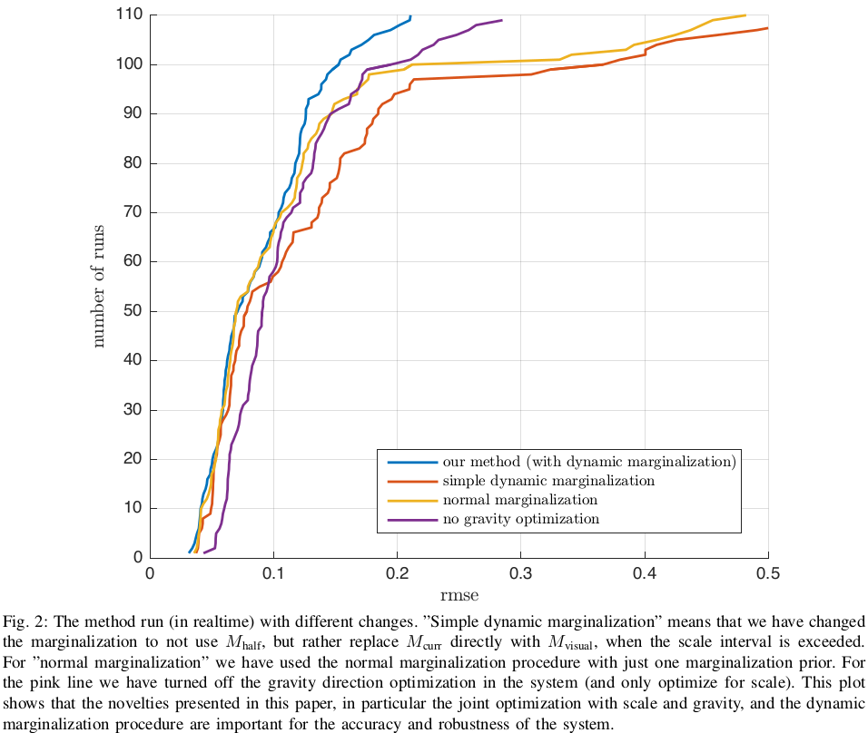
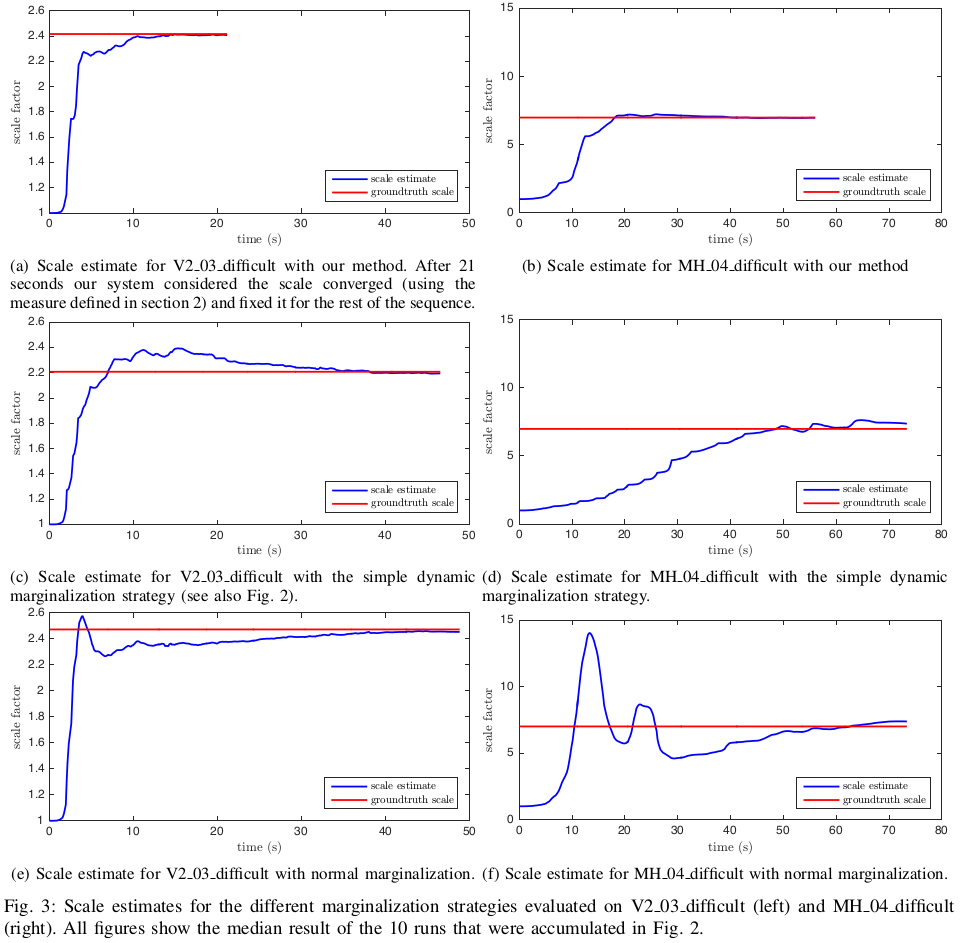
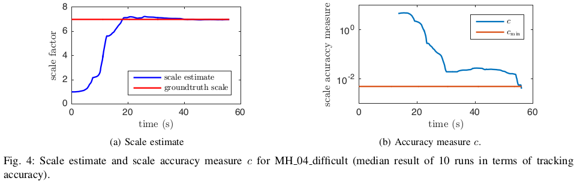

# Direct Sparse Visual-Inertial Odometry using Dynamic Marginalization

## URL  
- [https://arxiv.org/abs/1804.05625](https://arxiv.org/abs/1804.05625)
- [https://github.com/RonaldSun/VI-Stereo-DSO](https://github.com/RonaldSun/VI-Stereo-DSO)
- 项目主页和论文补充材料: [https://vision.in.tum.de/research/vslam/vi-dso?redirect=1](https://vision.in.tum.de/research/vslam/vi-dso?redirect=1)
- 关于Dynamic Marginalization的视频演示: [https://www.bilibili.com/video/av26216965/](https://www.bilibili.com/video/av26216965/)

## Abstract
TUM组基于DSO引入IMU约束，提出了VI-DSO，在能量表达式中通过最小化光度误差和IMU测量误差以联合估计相机位姿和稀疏的几何信息，即视觉约束加上关键帧之间的IMU预积分约束。本文的方案中将尺度和重力方向和例如pose等其他变量一起联合优化。由于尺度并不是立即可观的，本文使用**随机尺度进行初始化**而不是等待所有维度可观以完成初始化。为了保证实时性，本文对于旧的数据进行marg操作，为了保证系统的一致性，提出了**dynamic marginalization**，该方法可以保证即使初始尺度估计和最优值偏差较大也可以进行marg操作。在EuRoC数据上展现了超过the state of the art的性能。

**本文贡献：**

- DSVIO系统
- 关于尺度和重力方向的初始化策略，初始化之后联合优化尺度和重力方向
- 提出dynamic marginalization，保证marg策略能够cover一些变量变化比较大的case
- 基于EuRoC数据集，整个系统和初始化策略表现优秀

## Direct Sparse Visual-Inertial Odometry
当前方法为迭代最小化光度和惯性误差的框架，在单一优化方程中联合优化位姿和3D几何信息，结果表明在一些hard seq上具有更好的精度。能量方程如下：
$$
E_{\text {total }}=\lambda \cdot E_{\text {photo }}+E_{\text {inertial }}
$$
系统主要有两个部分并行执行：
- 对于每一帧图像，和惯性误差对齐以实现初步的跟踪
- 当产生一帧关键帧时，执行visual-inertial BA估计所有激活的关键帧的pose和geometry info
需要说明的是，本系统不需要在初始化之前进行等待，而是直接联合优化参数，这保证了一开始即可使用。

### A. Notation
交代行文的符号约定。

定义*world*系为重力方向在负*Z*轴的惯性坐标系，且假设camera to IMU $T_{\text {imu_cam}}$是标定完毕的。

### B. Photometric Error
reference frame上的点$p \in \Omega_{i}$在第$j$帧被观测到，其光度误差被定义为：
$$
E_{p j}=\sum_{\mathbf{p} \in \mathcal{N}_{p}} \omega_{p}\left\|\left(I_{j}\left[\boldsymbol{p}^{\prime}\right]-b_{j}\right)-\frac{t_{j} e^{a_{j}}}{t_{i} e^{a_{i}}}\left(I_{i}[\boldsymbol{p}]-b_{i}\right)\right\|_{\gamma}
$$
则完整的光度误差可表示为：
$$
E_{\text {photo }}=\sum_{i \in \mathcal{F}} \sum_{\boldsymbol{p} \in \mathcal{P}_{i}} \sum_{j \in \operatorname{obs}(\boldsymbol{p})} E_{\boldsymbol{p} j}
$$

### C. Inertial Error
这里比较常规，预积分得到两帧图像帧之间的IMU预测，然后构建误差方程。$\boldsymbol{s}_i$和$\boldsymbol{s}_j$表示两帧图像帧的状态信息，预积分得到的IMU预测$\widehat{\boldsymbol{s}}_{j}$以及协方差$\widehat{\sum_{s, j}}$。
$$
E_{\text {inertial }}\left(\boldsymbol{s}_{i}, \boldsymbol{s}_{j}\right):=\left(\boldsymbol{s}_{j} \boldsymbol{\boxminus} \widehat{\boldsymbol{s}}_{j}\right)^{T} \widehat{\boldsymbol{\Sigma}}_{s, j}^{-1}\left(\boldsymbol{s}_{j} \boxminus \widehat{\boldsymbol{s}}_{j}\right)
$$

### D. IMU Initialization and the problem of observability
现有VI系统通常启动后需要一段的运动数据进行初始化，以确保所有的变量可观，本文针对该问题提出了新的策略。随机初始化尺度而不是等待其可观，并对尺度和重力方向进行联合优化。各变量的初始化流程如下：
- 采用和DSO一致的视觉初始化
- 基于40次加速度测量的均值计算初始的重力方向，大的加速度(激烈的运动)能够得到较好的估计
- IMU-biases初始为零，尺度为1.0  

以上所有的参数之后均加入到BA优化中。

### E. $\operatorname{SIM}(3)$-based Representation of the World
为了实现基于初始的尺度和重力方向进行跟踪和建图，我们定义了两个坐标系，分别是尺度坐标系和DSO坐标系，两者之间存在一个尺度因子和旋转。从DSO坐标系到尺度坐标系的变换定义为$\mathbf{T}_{m-d} \in\{\mathbf{T} \in \operatorname{SIM}(3) | \text { translation }(\mathbf{T})=0\}$，$\boldsymbol{\xi}_{m\_d}=\log \left(\mathbf{T}_{m\_d}\right) \in \operatorname{sim}(3)$。行文中上标*D*、*M*表示pose所属坐标系。在优化中，光度误差独立工作于DSO坐标系下，与尺度和重力方向无关，而IMU误差项定义在尺度坐标系下。

### F. Scale-aware Visual-inertial Optimization
我们优化固定帧数窗口内的poses、IMU-biases和velocities，因子图如下所示，需要说明的是为了示意简化，将两帧之间的视觉因子抽象为一个大的因子连接所有的关键帧。由于IMU预积分的误差会随着时间间隔变大，因此常规建议关键帧帧间隔小于0.5s，然而本方法允许边缘化操作违背这一约束，以确保关键帧之间长期的关系能够准确地观测。(？)

我们算法很重要的策略是关于poses的优化是基于DSO坐标系的，并不是尺度坐标系，这意味着并不需要依赖于环境的尺度信息。

#### 1) Nonlinear Optimization
对于每一帧关键帧定义状态向量：
$$
\boldsymbol{s}_{i}:=\left[\left(\boldsymbol{\xi}_{c a m_{i\_w}}^{D}\right)^{T}, \boldsymbol{v}_{i}^{T}, \boldsymbol{b}_{i}^{T}, a_{i}, b_{i}, d_{i}^{1}, d_{i}^{2}, \ldots, d_{i}^{m}\right]^{T} \tag{5} \label{e5}
$$
则完整的状态变量被定义为：
$$
\boldsymbol{s}=\left[\boldsymbol{c}^{T}, \boldsymbol{\xi}_{m_{-} d}^{T}, \boldsymbol{s}_{1}^{T}, \boldsymbol{s}_{2}^{T}, \ldots, \boldsymbol{s}_{n}^{T}\right]^{T} \tag{6} \label{e6}
$$
(变量的意义也比较常规，不赘述，详见论文)  

关于$\mathbf{J}$、$\mathbf{H}$的计算：
$$
\mathbf{J}=\left.\frac{d \boldsymbol{r}(s \boxplus \boldsymbol{\epsilon})}{d \boldsymbol{\epsilon}}\right|_{\epsilon=0}, \mathbf{H}=\mathbf{J}^{T} \mathbf{W} \mathbf{J} \text { and } \boldsymbol{b}=-\mathbf{J}^{T} \mathbf{W} \boldsymbol{r}
$$
$$
\delta=\mathbf{H}^{-1} \boldsymbol{b}
$$
需要说明的是视觉能量误差$E_{\mathrm{photo}}$和IMU误差$E_{\mathrm{imu}}$没有共用的残差，因此可以独立定义$\mathbf{H}$和$\boldsymbol{b}$：
$$
\mathbf{H}=\mathbf{H}_{\mathrm{photo}}+\mathbf{H}_{\mathrm{imu}} \text { and } \boldsymbol{b}=\boldsymbol{b}_{\mathrm{photo}}+\boldsymbol{b}_{\mathrm{imu}}
$$
由于IMU残差项需要使用尺度坐标系下的poses，因此这里定义额外的状态向量：
$$
\boldsymbol{s}_{i}^{\prime}:=\left[\boldsymbol{\xi}_{w_\_imu_{i}}^{M}, \boldsymbol{v}_{i}, \boldsymbol{b}_{i}\right]^{T} \text { and } \boldsymbol{s}^{\prime}=\left[\boldsymbol{s}_{1}^{\prime T}, \boldsymbol{s}_{2}^{\prime T}, \ldots, \boldsymbol{s}_{n}^{\prime T}\right]^{T}
$$
IMU残差可由以下得出：
$$
\mathbf{H}_{\mathrm{imu}}^{\prime}=\mathbf{J}_{\mathrm{imu}}^{\prime T} \mathbf{W}_{\mathrm{imu}} \mathbf{J}_{\mathrm{imu}}^{\prime} \text { and } \boldsymbol{b}_{\mathrm{imu}}^{\prime}=-\mathbf{J}_{\mathrm{imu}}^{\prime T} \mathbf{W}_{\mathrm{imu}} \boldsymbol{r}_{\mathrm{imu}}
$$

为了得到基于公式$\eqref{e6}$中的状态向量对应的$\mathbf{H}_{\mathrm{imu}}$和$\boldsymbol{b}_{\mathrm{imu}}$，只要关注两种定义的主要区别即可：
$$
\mathbf{H}_{\mathrm{imu}}=\mathbf{J}_{\mathrm{rel}}^{T} \cdot \mathbf{H}_{\mathrm{imu}}^{\prime} \cdot \mathbf{J}_{\mathrm{rel}} \text { and } \boldsymbol{b}_{\mathrm{imu}}=\mathbf{J}_{\mathrm{rel}}^{T} \cdot \boldsymbol{b}_{\mathrm{imu}}^{\prime}
$$
其中$\mathbf{J}_{\mathrm{rel}}$的计算详见**补充材料**。需要说明的是，除了$\boldsymbol{\xi}_{m\_d}$，我们都使用表示$\operatorname{sim}(3)$变换且尺度固定为1。

#### 2）Marginalization using the Schur-Complement

基于滑动窗口的边缘化操作，图2b中使用因子图进行了展示。边缘化操作中，也采用在marg关键帧之前首先marg点的常规操作，marg操作基于舒尔补。由于marg因子要求所有相连的变量的线性化点保持固定，we apply [6, eq. (15)] to approximate the energy around further linearization points.（？）

为了保证系统的一致性，对于所有和边缘化因子相连的变量，需要Jacobians在相同的值上估计，否则会导致零空间消失，so FEJ安排了。关于视觉因子我们遵循DSO中的操作，并在线性点计算$\mathbf{J}_{\mathrm{photo}}$和$\mathbf{J}_{\mathrm{geo}}$。当计算IMU因子时，我们为所有变量固定和marg因子相连的$\mathbf{J}_{\mathrm{rel}}$估计点，这总是包含$\boldsymbol{\xi}_{m\_d}$。（？）

#### 3) Dynamic Marginalization for Delayed Scale Convergence

在上一小节中提到的marg操作，有两个目的，通过移除老的状态信息以减小优化的复杂度，和保留关于之前状态的信息。这将固定住所有和marg掉的状态相连的状态的线性化点，且他们已经有一个好的估计。但是在我们的方案中，**这并不适用于尺度因子**。

动态marg的思路是同时维护多个marg先验并且当当前使用的尺度因子距离线性化点较远时则重新更新。关于核心思想的理解请移步**b站视频**链接。

本文中使用三个仅关联尺度因子、与视觉因子无关且不会用于推算全局尺度（？）的marg先验：$M_{\text {visual }}$，$M_{\text {curr}}$和$M_{\text {half}}$。$M_{\text {curr}}$包含自线性化点开始的所有信息，$M_{\text {half}}$包含和当前估计在一个接近的范围内的信息。

三个marg先验的更新关系如下图所示，当尺度估计和$M_{\text {curr}}$的线性化点偏离太大时，$M_{\text {curr}}$被设置为$M_{\text {half}}$，$M_{\text {half}}$被设置为$M_{\text {visual}}$，以及更新线性化点。这确保了系统先前的状态具有一直的尺度估计。后文会进一步展开。

其中$d_i$的选择比较重要， 需要兼顾系统的一致性，和保证$M_\text{curr}$包含足够的IMU因子。因此我们使用下式自适应地计算：
$$
d_{i}=\min \left\{d_{\min }^{j} | j \in \mathbb{N} \backslash\{0\}, \frac{s_{i}}{s_{i-1}}<d_{i}\right\}
$$

这保证了不会同时触发替换更新，进而保证了$M_\text{curr}$不会没有IMU因子，保证尺度估计更加可靠。本文的实验中设定$d_{\min }=\sqrt{1.1}$。

### G. Coarse Visual-Inertial Tracking

粗略的VI跟踪快速得到对于每一帧的位姿估计，用于联合优化提供初解。我们对于当前帧和最新的关键帧直接图像对齐，并固定几何和尺度。每当优化完成后，会根据新的尺度、重力方向、bias、速度和新的参考关键帧重新初始化粗解。在对于新帧的变量完成估计后，我们marg除了关键帧位姿和最新变量之外的所有变量。和联合优化不同的是，不需要使用动态marg的策略因为尺度并不包含在这个优化中。（这里的优化是指？为什么没有包含尺度？）

## Results

验证实验基于EuRoC数据集。这篇文章的实验验证部分设计的比较好，值得学习。这里偷懒就简单放一些实验结对比图，详见原文。

### A. Robust Quantitative Evaluation

(gt-scaled: the optimal ground truth scale)

由于未使用IMU数据，DSO在一些seq中不能正常工作，ROVIO也很鲁棒只是由于基于滤波的方法所以无法提供足够的准确性。

由于Vicon room seq(V*)是一个包含很多回环运动的场景，所以带有回环矫正的SLAM系统性能上会优于Odometry方案。

在easy seq上，我们的方案逊于SLAM方案和双目方案，在medium seq上，我们超过了VI stereo LSD-SLAM，和VI ORB-SLAM相当的性能，在hard seq上，我们超过了这两者，且未加入双目和回环。

### B. Evaluation of the Initialization

这里主要是验证当前方案提到的不需要等待初始化的操作，可以立即使用的思路，且联合优化的初始化精度不错。本方法比较适合自动驾驶车辆等不能激烈运动以得到尺度和方向充分可观的场景。关于continuous rescaling问题，可以建议没有尺度的一致性地图，同时尺度测量交给控制器。

（这里，笔者认为这一创新点需要分场景讨论，对于不需要实时绝对位姿且可以接受异步优化的场景可以使用，但是对于要求实时绝对尺度位姿的场景，这种随机初始尺度的思路并不适用，还是得老实等待初始化。）

## Supplementary Material

这部分主要比较细致地研究了三方面内容：

- 对于点的数量选择的深入对比
- 评估尺度的收敛，因为会有收敛并固定的操作
- 如何计算$\mathbf{J}_{\mathrm{rel}}$

### 1. Parameter Studies

由于IMU的引入，可以适当减少点的数目，并不会丢失跟踪精度，且保证实时性。另外，实验表明减少点的数目反而提高精度。

dynamic marginalization大法好，对于本系统来说，是精度和鲁棒性的重要保证。

### 2. Measuring Scale Convergence

关于知道尺度什么时候达到收敛很重要，本文给出一个简单的策略去量化：
$$
c=\frac{\max _{j:=i-n+1}^{n} s_{j}}{\min _{j:=i-n+1}^{n} s_{j}}-1
$$

### 3. Calculating the Relative Jacobian

（略，详见原材料）