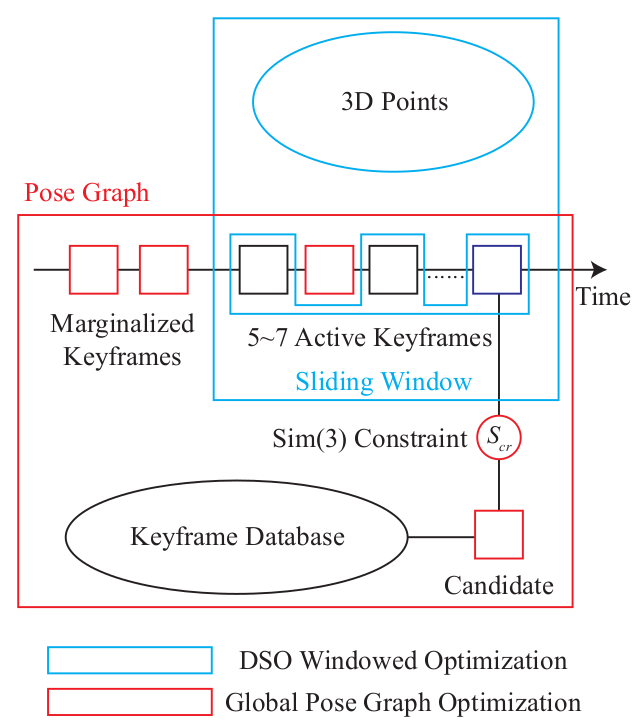

# LDSO: Direct Sparse Odometry with Loop Closure
## URL  
- [https://arxiv.org/abs/1808.01111](https://arxiv.org/abs/1808.01111)
- [https://github.com/tum-vision/LDSO](https://github.com/tum-vision/LDSO)

## Abstract
这篇文章基于DSO基础上增加了回环检测和位姿图优化，保留了DSO即使缺乏纹理场景依旧鲁棒的特点，在前端选择了一些可重复的、更倾向于角点的feature，以基于BoW检测候选闭环，并通过最小化2D-3D几何误差估计Sim(3)相对位姿约束。这些位姿和从DSO滑窗优化中得到的相对位姿构成co-visibility graph。实验证明，保留了DSO准确性和鲁棒性的同时，很大程度减少了累计的旋转、平移和尺度的漂移，且LDSO没有进行GBA。  
**两句话**总结就是：使用DSO作为前端保证local consistency，后端增加回环检测和位姿图优化实现漂移矫正(当然为了适配后端，前端也会有一些比较tricky的操作)。本文就是讲前端如何在DSO基础上为后端管理database，和后端如何检测、优化、矫正。

## Introduction
- DSO中前后端的概念是，前端基于图像的tracking，后端优化关键帧和点的深度(一维逆深度)，在LDSO中将整个DSO定义为前端。
- 关于前端如何选择feature，三条思路，a: 独立取点，单目没有深度且浪费算力；b: 复>用dso选取的点，然而dso的选取策略中并不能保证这些点的repeatable，从而导致较差的回环检测性能，c: 修改dso提点策略，更倾向于选择角点，然后再用梯度大的点补充，依旧保证dso设计的固定总点数。那么很显然，本文在用第三种。
- 本文的主要贡献
  - 保留了DSO的取点策略，并更倾向于选择可重复的角点特征，同时保留了低纹理场景的鲁>棒性。选择的角点通过BoW进行回环检测
  - 利用特征点的深度估计信息，结合位姿图BA和“点对齐”(记得好像存在特征点-特征点、特征点-点两类)计算Sim(3)，和前端并行的，共视图优化
  - 效果贼好，准确性+鲁棒性-漂移，优秀就完了
  - 开源代码

## Related Work
TODO

## Loop Closing In DSO
### Framework
首先简单review一下DSO的主要精神指示，更具体的内容移步**DSO**。
DSO是基于关键帧的滑窗方法，5-7帧的窗口进行联合优化。窗口$\mathcal{W}=\left\{\mathbf{T}_{1}, \ldots, \mathbf{T}_{m}, \mathbf{p}_{1}, \ldots, \mathbf{p}_{n}\right\}$包含$m$个$\mathrm{SE}(3)$关键帧位姿和$n$个点(inverse depth)，光度误差定义为：
$$
\begin{array}{c}
{\min \sum_{\mathbf{T}_{i}, \mathbf{T}_{j}, \mathbf{p}_{k} \in \mathcal{W}} E_{i, j, k}, \quad \text { where }} \\
{\mathbf{T}_{i, j, k}=\sum_{\mathbf{p} \in \mathcal{N}_{\mathbf{p}_{k}}} w_{\mathbf{p}}\left\|\left(I_{j}\left[\mathbf{p}^{\prime}\right]-b_{j}\right)-\frac{t_{j} e^{a_{j}}}{t_{i} e^{a_{i}}}\left(I_{i}[\mathbf{p}]-b_{i}\right)\right\|_{\gamma}}
\end{array}
$$
$$
\mathbf{p}^{\prime}=\Pi\left(\mathbf{R} \Pi^{-1}\left(\mathbf{p}, d_{\mathbf{p}_{k}}\right)+\mathbf{t}\right)
$$
具体变量意义不再赘述，详见DSO。
当新的一帧到来时，DSO通过投影当前窗口内所有active 3D points进行direct image alignment估计初始位姿。如果有必要的话则添加到LBA。窗口内所维护的共视图有点类似ORB-SLAM，但是对于marg掉的窗外信息不会使用。当然LBA还是存在漂移问题的。
那么global opt来了，关于如何实现，作者分析了一些思路过程：
- 当然是希望在GBA中利用光度误差，但是这样存储所有图像的信息，这是不可行的
- 那么考虑一些位姿图优化，那么存在的问题有：
  - 如何将GBA和LBA联合？
  - 如何使用滑窗内的信息添加到GBA的约束里？
  - GBA最小化$\mathrm{Sim}(3)$同时滑窗最小化光度误差？
  - 如何提取闭环候选帧？
  - 既然基于描述子进行回环检测那需要另一个线程独立处理吗？找到回环候选帧之后，求解$\mathrm{Sim}(3)$需要初始值但此时和单位阵已经差很多了所以如何给定初始优化位姿呢？
作者设计如下图所示的回环检测模块，也是很经典很合理的设计了，下文会展开陈述每个环节。  

### Point Selection with Repeatable Features
DSO通过动态栅格从而提取固定数目(2000)的像素点，以保证低纹理场景的鲁棒，本文通过调整策略使得对于角点更加敏感，并遵循数目不变。因此会有两部分组成，一部分是基于易于计算的Shi-Tomasi score[20]方法提取角点，另一部分是DSO方法补充提取保证数目。维持角点的数目小数目，计算ORB并加入database。前端使用角点和非角点tracking，从而保证闭环线程的开销足够低。
### Loop Candidates Proposal and Checking
这部分主体思路比较常规，使用窗口外的数据进行回环检测，对于候选帧进行ORB特征匹配，使用RANSAC PnP计算初始$\mathrm{SE}(3)$，之后使用GN最小化3D-2D几何约束求解$\mathrm{Sim}(3)$。  
$\mathcal{P}=\left\{\mathbf{p}_{i}\right\}$表示回环候选帧的feature，$d_{\mathbf{p}_{i}}$表示逆深度，$\mathcal{Q}=\left\{\mathbf{q}_{i}\right\}$表示当前帧匹配的feature，$\mathbf{D}$表示当前窗口的active point投影到当前关键帧的逆深度图，即包含$\mathcal{Q}$中部分feature对应的逆深度，对于其他点只有2D的像素坐标信息。令$\mathcal{Q}_{1} \subseteq \mathcal{Q}$表示没有深度的feature，$\mathcal{Q}_{2}=\mathcal{Q} \backslash \mathcal{Q}_{1}$表示有深度信息的feature。之后回环候选帧和当前关键帧$\mathbf{S}_{cr}$之间的$\mathrm{Sim}(3)$实际就是最小下面的cost function：
$$
\begin{aligned}
\mathbf{E}_{\text {loop}}=& \sum_{\mathbf{q}_{i} \in \mathcal{Q}_{1}} w_{1}\left\|\mathbf{S}_{c r} \Pi^{-1}\left(\mathbf{p}_{i}, d_{\mathbf{p}_{i}}\right)-\Pi^{-1}\left(\mathbf{q}_{i}, d_{\mathbf{q}_{i}}\right)\right\|_{2}+\\
& \sum_{\mathbf{q}_{j} \in \mathcal{Q}_{2}} w_{2}\left\|\Pi\left(\mathbf{S}_{c r} \Pi^{-1}\left(\mathbf{p}_{j}, d_{\mathbf{p}_{j}}\right)\right)-\mathbf{q}_{j}\right\|_{2}
\end{aligned}
$$
这个比较清晰了，主要就是区分一下有没有深度信息，然后使用3D或者2D信息优化。需要说明的是，尺度信息只在3D部分计算，2D没有，如果尺度有噪声，那么$\mathrm{R}$和$t$必然不准确。
### Sliding Window and $\mathrm{Sim}(3)$ Pose Graph
这里主要讲述如何滑窗内的估计和全局的位姿图相融合。首先就是对于由位姿和点构成的边缘化，比较基本了，稍有不同的是这里点是用逆深度表示。另外，关于优化过程，GBA会fix当前帧的位姿，update老帧的global位姿；窗口内的关键帧的global位姿在位姿图优化之后不会更新，以保证local窗口内的BA不会被GBA影响。
(这里大概了解作者的意思，细节等看完代码再写，感觉表述中的"absolute pose"、"global pose"没太理解)

## Evaluation
论文给出了在TUM-Mono、Euroc MAV和KITTI上的验证评估。这里简单总结实验设计和简要的效果。  
A. TUM-Mono  
对于这种序列结尾会回到起始位置的数据，disable回环检测以评估漂移。
关于提点策略，这里评估了三个策略：随机取点，DSO和本文的方法。对于每个序列**顺序和逆序**运行10次，统计关键帧轨迹[24]的平移、旋转和尺度的漂移。结论是本文提出的前端并没有影响原始DSO的精度，算是持平。最后展示了回环加入前后的效果对比，很显然回环真香。  
B. EuRoC MAV  
LDSO和ORB-SLAM精度相当，LDSO的鲁棒性更好，DSO很显然会差点，VO怎么和完整的SLAM相比岂不是为难胖虎。  
C. KITTI  
同上。  
D. Runtime Evaluation  
简单对比了提取点的环节耗时，对比前面提到的三种策略，很显然LDSO增加了关键帧特征点和描述子的计算导致耗时增加，但这是值得的且不影响实时性。

## Conclusion
DSO+loop closure+global pose map optimization
最后作者给了一些展望：
- A photometric bundle adjustment layer might increase the global map accuracy.
- In order to ensure long-term operation, map maintenance strategies such as keyframe culling and removal of redundant 3D points may be employed.
- Combining the information from 3D points of neighboring keyframes after loop closure may help to further increase the accuracy of the reconstructed geometry.

