# 深度滤波总结

## Reference

1. Semi-Dense Visual Odometry for a Monocular Camera. LSD-SLAM深度滤波的论文
2. [https://www.zybuluo.com/lancelot-vim/note/412293](https://www.zybuluo.com/lancelot-vim/note/412293) 讲解LSD-SLAM中深度滤波的博客
3. https://blog.csdn.net/kokerf/article/details/78006703 也是一篇讲解LSD-SLAM中深度滤波的博客
4. REMODE: Probabilistic, Monocular Dense Reconstruction in Real Time. SVO采用的深度滤波的论文
5. Supplementary matterial Parametric approximation to posterior. SVO的补充材料，推到了高斯--均匀模型到高斯--Beta分布的推导过程
6. https://www.cnblogs.com/ilekoaiq/p/8228324.html. 比较详细的推导了高斯--均匀模型
7. 视觉SLAM十四讲. 第十三章对逆深度基于高斯分布的融合进行了讲解
8. [https://blog.csdn.net/qq_18343569/article/details/49003993](https://blog.csdn.net/qq_18343569/article/details/49003993) 讲解一些像素匹配算法
9. https://towardsdatascience.com/beta-distribution-intuition-examples-and-derivation-cf00f4db57af Beta分布的参考

## 一切的开始——简单的深度滤波

> 这部分主要参考高博的slam十四讲

我们都知道，SLAM中建图是一个很重要的部分，SLAM进行位姿推断也是基于之前建立的地图（即三维空间的坐标点）进行的，目前最流行的方法通常是直接根据两帧或者多帧图像看到同一个特征点，之后对这个特征点直接三角化作为一个初值，之后在后续的优化问题中不断的对这个坐标点进行优化或者剔除；这样的做的优点就是简单、易行，但是缺点也比较明显，如果某个时刻点的生成出现了问题，那么对于系统的稳定性可能是灾难性的；基于此，另一种方法进入人们的视野——深度滤波。

我个人觉得深度滤波其实更偏向于一个后端的技术，前端得到相对正确的位姿，后端根据位姿进行深度值不断的迭代更新，使得深度值收敛到一个稳定的值。

常规来说，深度滤波都会使用以下几个步骤：

1. 根据两帧的位姿计算当前帧上的极线搜索范围；
2. 在要搜算的极线段上通过对比算法获得最佳的匹配位置；
3. 通过得到的最佳匹配点计算深度值；
4. 把该深度值作为观测进行滤波器的迭代；

一种较为简单的方法就是把高斯分布$N(\mu, \sigma^2)$当做待估计深度值的概率密度函数，之后通过迭代使用上面的步骤使得深度值不断的收敛，直到得到的方差小于一个值，我们认为该深度收敛了，可以用来建图指导后续的定位了；当然这个过程中方差也可能会增大或者发散，对于这些深度值直接扔掉就可以了。

下面根据上面的几个步骤分解一下该深度滤波方法：

#### 第一步：根据位姿计算当前帧上的极线搜索范围

该步骤用图表示为如下形式：

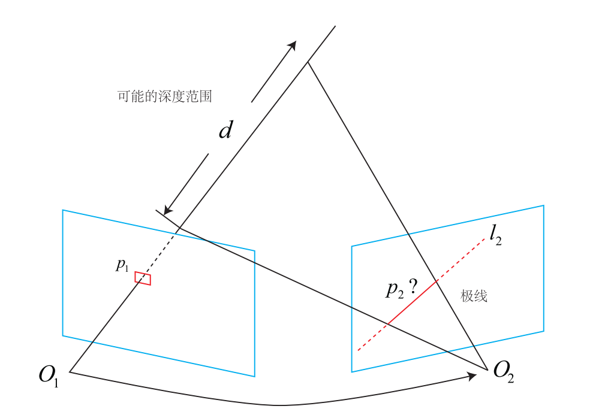

从图中可以看到，在运用深度滤波的时候：

- 通常已经通过前端得到了相对稳定的位姿，记为$T_{ref}=[R_{r}^{w}|t_{r}^{w}]$和$T_{cur}=[R_{c}^{w}|t_{c}^{w}]$；
- 当前深度滤波得到的深度值为$\mu$，标准差为$\sigma$，此时可以得到一个可能的深度范围，记为$[\mu-N\sigma, \mu+N\sigma]$；
- 将可能的深度范围映射到当前帧上，就可以得到极线上的搜索范围；

#### 第二步：在极线搜索段上找到最佳的匹配点

经过上一步之后就可以在当前帧上得到一个大概的搜算范围，算法会认为真实深度所对应的投影点就在这个搜算范围内，这里得到对应投影点的方法并不会使用基于特征的匹配方法（运算量比较大），而是采用基于像素块的匹配方法，具体的做法如下：

1. 从搜算范围的一端一个步长一个步长的向另一端移动；
2. 每在极线方向上移动一步（步长通常设为$\frac{\sqrt{2}}{2}$），就将当前帧的$w\times w$窗口内的像素值与参考帧的窗口内的像素值进行比较，得到一个分数用来表征两者是否相似，最后取最相似的那个位置作为匹配点；

其中相似的方法参考Reference中的[【5】]((https://blog.csdn.net/qq_18343569/article/details/49003993)).

但是这个过程中必然伴随着误匹配（特征点法也无法避免这样的情况！），也就是一个搜索范围内很多地方满足要求，十四讲中给出下面的图，可以看到在整个搜索范围内有较多的点都是峰值，虽然下图中有一个最大值，但是其实这个最大值也不一定就是真正的对应匹配：

在LSD-SLAM中也给出一个例子表示这样的情况，可以看到，基线越小（两个图像间的移动越小），搜索的时候最小值是唯一的，但是不确定性会很大（后面会说为什么），也就是方差会很大；相反，较大的基线，搜索的时候会有较多的最小值，但是不确定性会很小；这也是深度滤波存在的一个重要的理由之一：

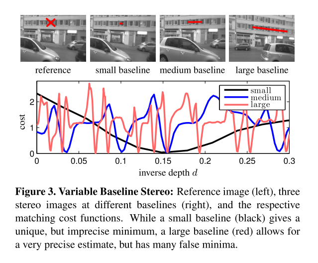

这部分稍微再拓展一下，因为在整个深度滤波中，好的匹配会加快整个滤波的收敛过程，所以SVO在这方面引入了一个仿射矩阵来更好的对比两个像素块，其实在上图中可以看到，reference图像的像素块假设是一个标准的正方形，那到了后面的帧中，这个正方形很可能就可能变作了一个平行四边形，在多视图几何中，这样的变化在2D到2D平面通常被建模成**仿射变换**，公式如下：
$$
\begin{aligned}
\begin{bmatrix}x_c\\y_c\\1\end{bmatrix}&=\begin{bmatrix}a_{11} & a_{12} & t_x\\a_{21} & a_{22} & t_y\\0 & 0 & 1\end{bmatrix}\begin{bmatrix}x_r\\y_r\\1\end{bmatrix}=\begin{bmatrix}A & t\\0 & 1\end{bmatrix}\begin{bmatrix}x_r\\y_r\\1\end{bmatrix} \\
\begin{bmatrix}x_c\\y_c\end{bmatrix} &= A\begin{bmatrix}x_r\\y_r\end{bmatrix}+t
\end{aligned}  \tag{1}
$$
有了公式(1)之后，可以在Reference图像中取三个点，分别设为$p_0^r, p_1^r, p_2^r$，在当前帧上的三个点分别为$p_0^c,p_1^c,p_2^c$，对应关系如下图，注意此时的这些对应点都是通过相对位姿计算得到的：

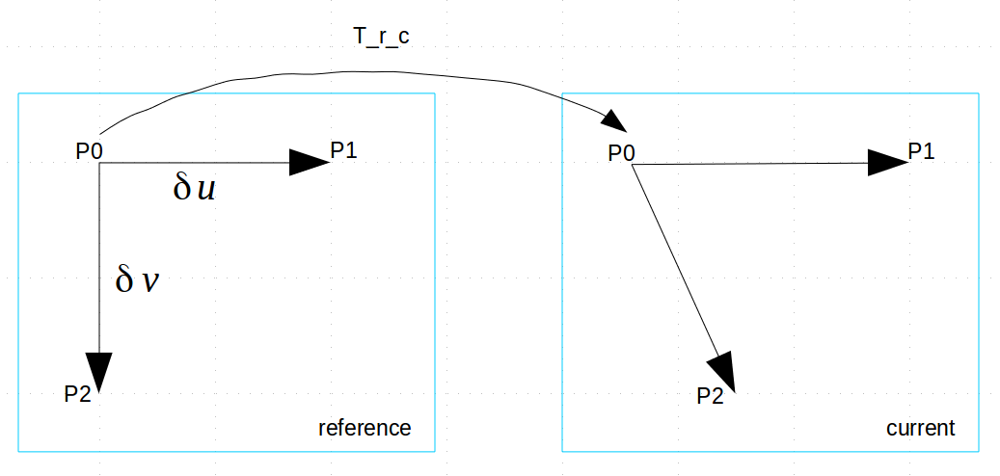

于是可以得到以下关系：
$$
\begin{aligned}
p_1^c&=\begin{bmatrix}x_1^c\\y_1^c\end{bmatrix}=A\begin{bmatrix}x_0^r+\delta{u}\\y_0^r\end{bmatrix}+t \\
p_0^c&=\begin{bmatrix}x_0^c\\y_0^c\end{bmatrix}=A\begin{bmatrix}x_0^r\\y_0^r\end{bmatrix}+t \\
p_2^c&=\begin{bmatrix}x_2^c\\y_2^c\end{bmatrix}=A\begin{bmatrix}x_0^r\\y_0^r+\delta{v}\end{bmatrix}+t \\

\end{aligned} \tag{2}
$$
于是我们可以通过$p_1^c$和$p_2^c$的公式得到：
$$
\begin{aligned}
\begin{cases}
\begin{bmatrix}x_1^c\\y_1^c\end{bmatrix}&=A\begin{bmatrix}x_0^r+\delta{u}\\y_0^r\end{bmatrix}+t \\
\begin{bmatrix}x_0^c\\y_0^c\end{bmatrix}&=A\begin{bmatrix}x_0^r\\y_0^r\end{bmatrix}+t \\
\end{cases}\Rightarrow \begin{bmatrix}x_1^c-x_0^c\\y_1^c-y_0^c\end{bmatrix}=A\begin{bmatrix}\delta{u}\\0\end{bmatrix}
\end{aligned} \tag{3}
$$
于是我们就可以得到A矩阵的第一列了，同样的方法应用到$p_2^c$和$p_0^c$上就可以得到A矩阵的第二列。因为算法只关注这个仿射部分，因此位移部分其实不用考虑；在实际的运行过程中需要有两个地方注意：

1. 在求解对应关系的时候，以$p_1^c$为例，有$p_1^c=\pi(T_r^c(\pi^{-1}(p_0^r+\delta{u})*d))$，这里的d一定使用的是中心点$p_0^r$的d；
2. 通常算法会反过来使用A，即认为当前帧上的是标准的正方形，参考帧上有对应的仿射变换，这样可以节约很多计算量；
3. 求解出A之后，算法通常还会根据A的行列式（表示仿射变换对于图像影响的程度），找到最佳的图像金字塔层来更好的进行匹配点的搜索；

#### 第三步：通过得到的最佳匹配点计算深度值

这部分比较简单，通常就是正常的三角化，这里不再多进行赘述。

但是这里记录一下三角化中比较著名的矛盾问题，同时也是解释上面说的为什么较小的视差会引入较大的不确定性：

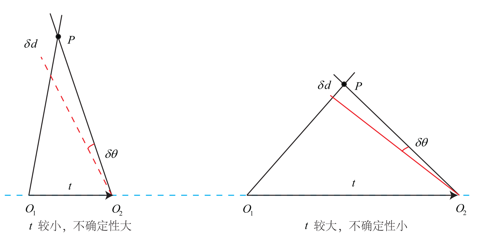

这个关系上图体现的比较清晰，当引入一个观测角度误差$\delta{\theta}$之后，当视差（与t正相关）较小的时候，计算出来的深度与原先的深度差别较大；而视差较大的时候不会有这个问题；个人在实现的过程中觉得这个地方还是很重要的，特别是对于SLAM初始化的时候，尽量要有一个较大的视差，这样能得到更好的初始的位姿估计和初始的三维坐标点。

在简单的深度滤波中，因为深度估计被建模为高斯分布，因此观测值也要符合高斯分布才可以，至此需要观测的不确定度，也就是方差，通常算法会认为当前帧的观测点（在图像坐标系下）有一个像素的误差，然后根据差了这一个像素的匹配位置来估计深度$\hat{d}$，使用$|d-\hat{d}|$表示标准差，具体的图示见下图：

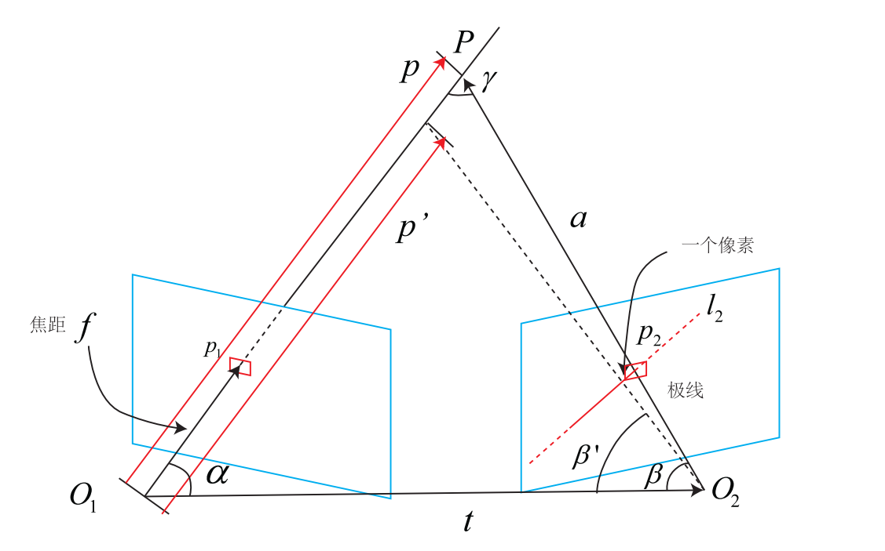

可以看到，当引入一个像素的误差之后，整个误差分析建立在极平面上，从而把整个三维的问题映射到了二维平面上，这里的最后的误差具体的计算方式就不详细展开了，主要是求解出上图中的$\gamma$角之后根据相同三角形的面积相同得到新的深度值，感兴趣的可以看一下十四讲中的第13章中的部分（感觉这部分书中的公式和这个图不是很对应），然后特别的说明的是：使用不同的相机模型会得到不同的**一个像素值引起的角度误差**，比如常用的建模方式如下：

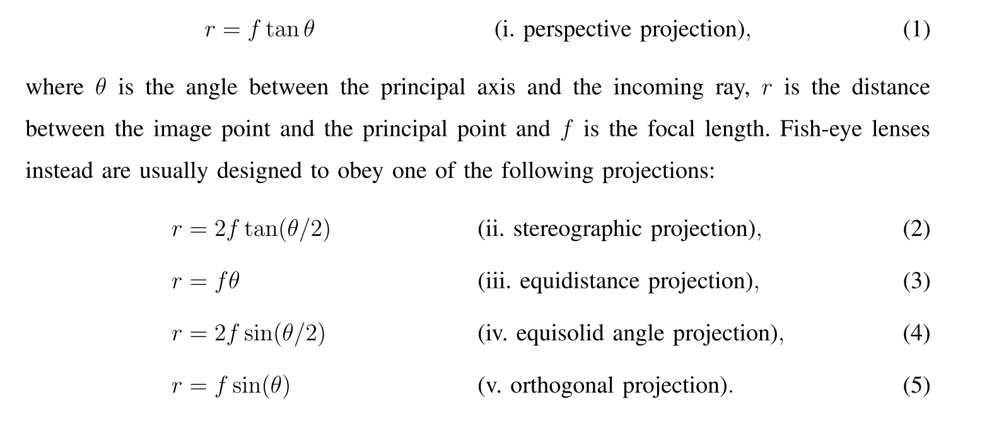

#### 第四步：把该深度值作为观测进行滤波器的迭代

根据上面的三个步骤，算法就已经得到了符合高斯分布的观测模型$N(d_{obs}, \sigma_{obs}^2)$，同时如果估计值也有一个初始观测值的话$N(d, \sigma^2)$，就可以使用贝叶斯公式估计最佳的后验分布了，公式如下：
$$
p_{post}(d | d_{obs})=\frac{p(d_{obs}|d)p_{prior}(d)}{p(d_{obs})}=\frac{p(d_{obs},d)}{p(d_{obs})}\propto p(d_{obs}, d) \tag{4}
$$
两个高斯分布的联合分布（个人理解也可以认为就是加权平均）公式如下，其中不加下标的表示联合分布的期望与方差，下标为1和2表示两个不同的分布：
$$
\begin{array}{l}
\boldsymbol{\Sigma}^{-1}=\boldsymbol{\Sigma}_{1}^{-1}+\boldsymbol{\Sigma}_{2}^{-1} \\
\boldsymbol{\Sigma} \boldsymbol{\mu}=\boldsymbol{\Sigma}_{1}^{-1} \boldsymbol{\mu}_{1}+\boldsymbol{\Sigma}_{2}^{-1} \boldsymbol{\mu}_{2}
\end{array}  \tag{5}
$$

---

## 更进一步——对方差进行更精细的建模

> 这部分主要参考论文Semi-Dense Visual Odometry for a Monocular Camera

上面的过程中可能不少读者都发现一个问题：算法将观测的方差简单的认为是一个像素偏差引起的误差。这个近似对于学者来说当然是不能苟同的，参考【1】就对这个问题进行了深入的分析，对方差进行了更精细的建模。

### 影响深度计算的因素有哪些？

作者首先梳理了什么因素会影响最终的匹配正确性，作者认为**影响深度计算的主要是在极线上找到的最佳匹配点，也可以认为是视差的长度$\lambda$ **，所以作者把这个过程建模如下（这里面$d$表示一个函数，$d^{*}$表示最优的深度值）：
$$
d^{*}=d\left(I_{0}, I_{1}, \xi, \pi\right) \tag{6}
$$
作者最终分析认为影响最终深度值的主要因素有（就是公式（6）中的括号内的输入变量）：

1. 旋转$\xi$的估计误差和相机内参$\pi$的误差；
2. 图像的光度差异引起的误差，记为$I_0, I_1$；

这个函数$d(.)$表示我们给这个函数必要的输入变量，那么函数就可以输出最优的深度值$d^{*}$。我们先不管这个函数内部具体是如何的，假设现在有了这样的函数，则最佳的深度$d^{*}$的方差可以表示为：
$$
\sigma_{d}^{2}=J_{d} \Sigma J_{d}^{T} \tag{7}
$$
公式（7）表示输入的误差是如何影响最终的输出误差的（这个公式在KF中也有），**其中$J_d$是函数$d(.)$关于各个输入变量的Jacobian**，$\Sigma$则是各个输入变量的方差，这里不过多叙述，感兴趣可以参考[wiki](https://en.wikipedia.org/wiki/Propagation_of_uncertainty)。

下面详细说明笔者对这两个地方是如何影响最终的匹配的理解：

#### 1. 旋转和相机内参的误差如何影响匹配

我们都知道，一个不准确的位姿和内参参数会造成映射的不准确，，因而引起极线不准确，就像下面的例子一样：

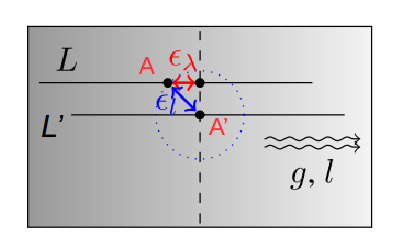

其中：

- A和L表示根据估计的位姿映射得到的极线和无穷远映射点，而L'和A'是真实的极线和无穷远点所在的位置；
- 蓝色的点线表示各项同向误差$\epsilon_{l}$对于错误映射点的约束，这个误差值使得错误的映射点必须是极线和点线圆的交点；
- 黑色的虚线表示等势线，与下面的波浪线垂直；

如果算法沿着估计的极线进行搜索，那么对于一个很小的图像部分（因为图像是非线性的，这里取小部分图像以获取图像的线性特性）而言，**算法最多可以搜索到真值的等值线上**，所以作者对这个过程建模的如下（上图中除了A和A‘的点就是在极线上能搜索到的等势线上的点）：
$$
l_{0}+\lambda^{*}\left(\begin{array}{l}
l_{x} \\
l_{y}
\end{array}\right) \stackrel{!}{=} g_{0}+\gamma\left(\begin{array}{l}
-g_{y} \\
g_{x}
\end{array}\right), \quad \gamma \in \mathbb{R}  \tag{8}
$$
上式表示：最佳的匹配点是极线和映射真值点等势线的交点。

其中：

- $l_0$表示无穷远点的映射点，$(l_x, l_y)^T$表示极线的方向向量，是被归一化之后的；
- $g_0$理论上表示在真值的等势线上的任意一点，但是实际中取真值点，所以这个点其实是不知道的！因此这里作者用$\stackrel{!}{=}$表示期望等于的意思；
- $(g_x, g_y)^T$表示图像的梯度方向，$(-g_y, g_x)^T$表示等势线的方向；

我们先不管实际代码中怎么实现的，单纯对公式（6）进行求解（两边乘图像梯度），可以得到最佳的匹配为：
$$
\lambda^{*}=\lambda^{*}\left(l_{0}\right)=\frac{\left\langle g, g_{0}-l_{0}\right\rangle}{\langle g, l\rangle} \tag{9}
$$
对于公式（9），逐个看其中的变量：

- $l_0$是无穷远的映射点，因此必然受到旋转误差和内参误差的影响；
- $g_0$是真值的等势线上的一点，这个点虽然不知道，但这个点是不会受到任何因素的影响的，毕竟真值；
- $l$是极线的方向向量，这个是确定的，不会受到干扰的，或者说这部分干扰都归入了第一项中；
- $g$是等势线的方向向量，也不会受到位姿的影响；

综合下来，最佳匹配中的误差来源主要是$l_0$带入的，因此作者直接写作$\lambda^{*}(l_0)$。

公式（9）里面涉及到了向量的内积，因此和角度息息相关，所以作者在这个地方给出如下两个图对角度的影响进行说明，笔者这里也说一下自己的理解：

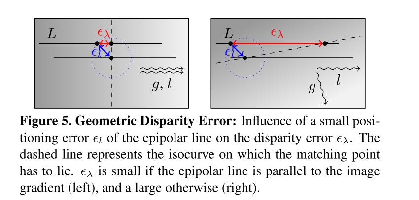

图中$\epsilon_{l}$表示$g_0-l_0$，$\epsilon_{\lambda}$表示由这个误差所引起的误差，也是公式（9）得到的值。这里有读者可能会问说：算法会在极线L上滑动寻找最佳的匹配，完全有可能搜索到等势线上啊？没错，正是因为是有可能，而不是一定，因此这里作者认为误差就是$\epsilon_{\lambda}$。

然后我们从公式和图示上可以看出，当图像的梯度$g$和极线的方向$l$之间的夹角较小的时候，误差$\epsilon_{\lambda}$是比较小的；而当两个夹角比较大的时候，所引起的误差也会很大；

仿照公式（7），可以得到最佳的视差$\lambda^{*}$由于旋转和相机内参误差引起的方差为：
$$
\sigma_{\lambda(\xi, \pi)}^{2}=J_{\lambda^{*}\left(l_{0}\right)}\left(\begin{array}{c}
\sigma_{l}^{2} & 0 \\
0 & \sigma_{l}^{2}
\end{array}\right) J_{\lambda^{*}\left(l_{0}\right)}^{T}=\frac{\sigma_{l}^{2}}{\langle g, l\rangle^{2}} \tag{10}
$$
其中：

- $J_{\lambda^{*}\left(l_{0}\right)}=\frac{\partial \lambda^{*}(l_0)}{\partial{l_0}}=\frac{1}{<g, l>}$，也是表示函数$\lambda^{*}(.)$对于输入变量$l_{0}$的求导；
- $ \left(\begin{array}{c}\sigma_{l}^{2} & 0 \\0 & \sigma_{l}^{2}\end{array} \right) $表示输入变量$l_0$的方差矩阵；

#### 2. 图像的光度差异引起的误差

这部分对于深度值的影响其实比较明显，因为图像的像素差异直接影响滑动窗口评分，因而影响到最好的匹配点，所以这部分的误差还是很有必要去分析的。

这部分建模为如下公式：
$$
\lambda^{*}=\min _{\lambda}\left(i_{\mathrm{ref}}-I_{p}(\lambda)\right)^{2} \tag{11}
$$
使用泰勒展开并进行迭代的方式可以获得：
$$
\lambda^{*}=\lambda^{*}(I)=\lambda_0 + \left(i_{\mathrm{ref}}-I_{p}(\lambda_0)\right)g_p^{-1} \tag{12}
$$
其中：

- $\lambda_{0}$表示迭代的初始值，这部分不受图像光度差异的影响；
- $i_{ref}$表示参考帧上的像素值，$I_p(\lambda_0)$表示迭代初值在当前帧的像素值，这两个部分是受到图像光度差异影响的主要部分；
- $g_p$表示在当前帧上极线p上的梯度，这部分也不受到两个图像光度差异的影响；

综上所述，两个图像光度差异$\left(i_{\mathrm{ref}}-I_{p}(\lambda_0)\right)$会将误差引入到最佳视差$\lambda^{*}$的计算中，而这部分误差会除以极线上的梯度$g_{p}$，因此$g_p$也是影响最终误差的一个因素，有如下图示：

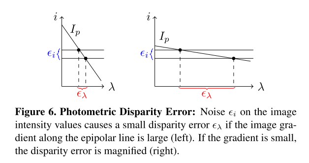

可以看到，当极线部分的梯度$I_p$较大的时候，误差$\epsilon_{i}$引起的误差就会小一些，反之则反之；

同样仿照公式（7），可以得到最佳的视差$\lambda^{*}$由于两帧图像的光度误差引起的方差为：
$$
\sigma_{\lambda(I)}^{2}=J_{\lambda^{*}(I)}\left(\begin{array}{cc}
\sigma_{i}^{2} & 0 \\
0 & \sigma_{i}^{2}
\end{array}\right) J_{\lambda^{*}(I)}=\frac{2 \sigma_{i}^{2}}{g_{p}^{2}} \tag{13}
$$
其中：

- $J_{\lambda^{*}(I)}=\frac{\partial{\lambda^{*}(I)}}{\partial{I}}=\frac{1}{g_p}$，表示函数$\lambda^{*}(.)$对输入变量$(i_{ref}-I_p)$的求导；
- $\left(\begin{array}{cc}\sigma_{i}^{2} & 0 \\0 & \sigma_{i}^{2}\end{array}\right)$表示输入变量$(i_{ref}-I_p)$的方差矩阵；

#### 3. 逆深度计算的误差

现在回过头去看公式（10）和（13），发现得到的方差都是视差关于输入变量的方差，但是最终需要的是逆深度（注意不是深度哈，公式是不一样的，但是可以相互转换）对于输入变量的误差，因此其实我们还差一步；

根据求导的链式法则：
$$
J_d = \frac{\partial{d(.)}}{\partial{U}}=\frac{\partial{d(.)}}{\partial{\lambda(.)}}\frac{\partial{\lambda(.)}}{\partial{U}}=\alpha \frac{\partial{\lambda(.)}}{\partial{U}}  \tag{14}
$$
这里论文特地加了一句话：因为旋转量比较小，所以逆深度$d$和视差$\lambda $成正相关了。因此上式中的$ \alpha$可以用斜率进行代替，即：
$$
\alpha = \frac{\partial{d(.)}}{\partial{\lambda(.)}}=\frac{\delta{d}}{\delta{\lambda}} \tag{15}
$$
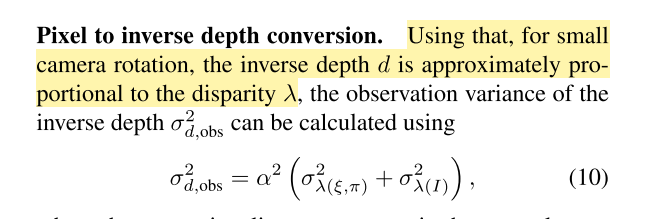

这里简单的推导一下：
$$
P_{r}=\begin{bmatrix}X \\ Y \\ Z\end{bmatrix}=R_k^rP_k+t_k^r=\begin{bmatrix}d R_0 f_k + t_0 \\ d R_1 f_k + t_1 \\ d R_2 f_k + t_2\end{bmatrix} \tag{16}
$$
上式中$f_k$表示在keyframe上点的方向向量，$r$表示参考帧（主要参考LSD-SLAM中的定义方式），$k$表示当前的关键帧，也是深度滤波要更新的帧。
$$
\begin{bmatrix}x_{r} \\ y_{r} \end{bmatrix}=\begin{bmatrix}\frac{dR_0f_k+t_0}{dR_2f_k+t2} \\ \frac{dR_1 f_k+t_1}{dR_2f_k+t2}\end{bmatrix}  \tag{17}
$$
上式中$x, y$是在当前参考帧中搜索到的最佳匹配在归一化平面上的点。

可以看到，两个等式求解一个未知量$d$，在LSD-SLAM使用极线方向较大的方向来计算d，保证视差比较大，比如使用x方向的等式进行计算，有：
$$
\frac{1}{d} = \rho = \frac{x_r R_2 f_k- R_0f_k}{t_0-x_r t_2} \tag{18}
$$
得到了上述的公式，就可以使用斜率的公式进行求解$\alpha$：
$$
\begin{aligned}
\alpha&=\frac{\delta{\rho}}{\delta{\lambda}}=\frac{\rho(x+l_x) - \rho(x)}{1}\\
&=\frac{(x_r+l_x) R_2 f_k- R_0f_k}{t_0-(x_r+l_x) t_2} - \frac{x_r R_2 f_k- R_0f_k}{t_0-x_r t_2} \\
&=\frac{l_x\left(R_0f_kt_{2}-R_2 f_k t_{0}\right)}{\left(t_{0}-x_r t_{2}-l_x t_{2}\right)\left(t_{0}-x_r t_{2}\right)}\\
&\approx \frac{l_x\left(R_0f_kt_{2}-R_2 f_k t_{0}\right)}{\left(t_{0}-x_r t_{2}\right)\left(t_{0}-x_r t_{2}\right)}
\end{aligned} \tag{19}
$$
其中$l_x=l_u (1-c_x)/f_x=l_uf_{xi}$，表示将图像上的搜索步长映射到归一化平面上。

#### 小结

至此整个对匹配方差的建模就结束了，整个公式其实推导起来不算太难，而且作者的思路其实也很清晰，小结两个部分，第一部分是LSD-SLAM中是如何实现这部分的；第二部分是笔者自己没有思考明白的问题；

1. 在LSD-SLAM的实现中，笔者主要想记录的其实是**旋转和内参对于视差的影响**（下面简称误差的第一部分），因为其他部分其实都按照公式在走，也都比较好看懂，但是这个第一部分作者的做法是不在参考帧上计算，而是在关键帧上计算，个人理解有两个原因：一是因为旋转和内参其实都会影响两帧上的极线位置，且影响的程度是一样的，所以这样做个人觉得是没有问题的；二是因为在推导的时候，算法确实需要真值的梯度，在关键帧上计算刚好满足这一点；
2. 论文在做误差第一部分的分析的时候，直接用了无穷远点，但是感觉在做匹配的时候，其实很大程度上跟无穷远点没有关系，通常还是与位移有关系的，这个地方其实不算是特别明白这样的分析是否符合常理；

最后就是感觉LSD-SLAM对深度滤波这块儿真的是狠下功夫，不仅仅是这个方差的建模，后面还考虑了深度图的传播、平滑（代码中称为正则化，个人感觉就是高斯分布的加权平均，跟求联合分布一样），这部分确实要比SVO好太多。

---

## 改进深度模型——均匀-高斯逆深度模型

> 这部分主要参考REMODE: Probabilistic, Monocular Dense Reconstruction in Real Time.

至此我们已经可以得到较好的方差了，那接下来一个问题：如果得到的匹配是错的怎么办？

其实滤波本质上就是想通过滤波算法滤出野值，可是按照上述的方法来做的话，其实仅仅是减缓了野值的影响，但是还是添加进来的野值，虽然权重（方差）可能比较小。

所以作者把逆深度模型建模为均匀-高斯模型，先祭出建立的模型如下：
$$
p\left(x_{n} | Z, \pi\right)=\pi N\left(x_{n} | Z, \tau_{n}^{2}\right)+(1-\pi) U\left(x_{n}\right|d_{min}, d_{max})  \tag{20}
$$
其中：

- $x_n$表示根据极线搜索出来的逆深度，是滤波中的测量；
- $Z$表示逆深度的估计值，是滤波中的一个状态变量；
- $\pi$表示当前估计是可用的估计（内点）的概率，是滤波中的一个状态变量；

该模型是说测量逆深度的概率密度是均匀概率密度和高斯概率密度的加权，可以看出当我们知道当前估计是内点的时候（$\pi=1$），则认为测量满足高斯分布，就像最上面的简单的深度滤波一样；如果当次测量是不可用的时候（$\pi=0$），则测量满足均匀概率分布，范围是$[d_{min}, d_{max}]$。

所以根据上述的似然，由贝叶斯公式可以得到后验概率为：
$$
p(Z,\pi|x_1, x_2,...,x_n) \propto p(x_1, x_2,...,x_n|Z,\pi)p(Z,\pi) \propto \prod_{i=1}^np(x_i|Z,\pi) \tag{21}
$$
公式里面因为$p(Z,\pi)=p(Z)p(\pi)$是先验部分，而对于这个问题而言，先验是一个均匀的分布，因此乘积为0。针对公式（21），如果我们期望通过每个测量得到最终的估计值——真实的逆深度以及该点是内点的概率，那么我们可以通过最大化似然来得到，一个方法可以是穷举法，简单说就是穷举所有的$Z$和$\pi$，使得最终的似然极大，这个太逆天了，这里根本无法做朋友，就不讨论了。

#### 引入隐变量

上面说道穷举法实在太逆天，一般根本无法使用，那么作者在公式（20）的基础上想：如果引入一个变量表示当次的测量是好是坏呢？于是作者引入了一个隐变量$y_n=0/1$，如果$y_n=1$，则表示该次测量是好的；$y_n=0$表示该次测量是不好的；这样有什么好处呢？看下图：

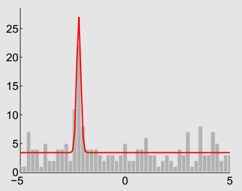

该图是统计了150副图像的测量深度的直方图（我比较迷为啥还有负值），可以看到两个事情：

1. 测量深度的模型确实更加满足均匀--高斯分布；
2. 如果给出了某次测量是好是坏，那么确实可以帮助算法更好的计算，比如在峰值附近告诉算法这是好的测量，那么算法可以直接更新高斯部分；如果是坏的分布，那么就不更新高斯部分；

所以引入了隐变量之后的模型变做：
$$
\begin{cases}
p\left(x_{n} | Z, \pi, y_{n}\right)=N\left(x_{n} | Z, \tau_{n}^{2}\right)^{y_{n}} U\left(x_{n}\right)^{1-y_{n}} \\
p\left(y_{n} | \pi\right)=\pi^{y_{n}}(1-\pi)^{1-y_{n}}
\end{cases} \tag{22}
$$
其中所有的变量上面都介绍过了，不过对于第二个公式笔者并没有特别的理解，不过这个公式是正确的，推导如下：
$$
\begin{aligned}
p(x_n,y_n|Z,\pi) &= \frac{p(x_n,y_n,Z,\pi)}{p(Z,\pi)} \\
&= \frac{p(x_n|y_n,Z,\pi)p(y_n,\pi)p(Z)}{p(Z)p(\pi)} \\
&= p(x_n|y_n,Z,\pi)p(y_n|\pi) \\

p(x_n|Z,\pi) &= \int_{y_n}p(x_n,y_n|Z,\pi)d{y_n} \\
&= p(x_n,y_n=1|Z,\pi)+p(x_n,y_n=0|Z,\pi)  
\end{aligned}  \tag{23}
$$
读者可以把公式（22）带入公式（23）中就可以得到公式（20），那么目前得到了添加进来隐变量之后的模型，此时求解联合概率分布：
$$
p(\mathcal{X} \mathcal{Y}, Z, \pi)=\left[\prod_{n=1}^{N} p\left(x_{n} | Z, \pi, y_{n}\right) p\left(y_{n} | \pi\right)\right] p(Z) p(\pi) \tag{24}
$$
其中：

- $\mathcal{X}$表示所有观测量组成的向量；
- $\mathcal{Y}$表示所有隐变量组成的向量；
- $\mathcal{X}\mathcal{Y}$表示完全数据，分开写的话表示不完全数据；

到这里因为涉及到了隐变量，这里作者就用KL散度求了近似的分布，然后求解最近的分布来代替求解估计的参数，有点类似于EM中的E步，但是公式上笔者没有对上，后来看参考【6】中大佬自己硬推了一遍，内心无比佩服，总之近似的公式如下：
$$
\begin{aligned}
\ln q_{Z, \pi}(Z, \pi)&=E_{\mathcal{Y}}[\ln p(\mathcal{X}, \mathcal{Y}, Z, \pi)]+\text { const.} 
\end{aligned} \tag{25}
$$
其中q分布就是近似的分布。

可以看到我们刚好有内部的联合分布，因此带入之后得到：
$$
\begin{aligned}
\ln p(Z,\pi|\mathcal{X}) = \ln q_{Z, \pi}(Z, \pi)=& \sum_{n=1}^{N} E_{\mathcal{Y}}\left[y_{n}\right]\left(\ln N\left(x_{n} | Z, \tau_{n}^{2}\right)+\ln \pi\right) \\
&+\sum_{n=1}^{N}\left(1-E_{\mathcal{Y}}\left[y_{n}\right]\right)\left(\ln U\left(x_{n}\right)+\ln (1-\pi)\right) \\
&+\ln p(Z)+\ln p(\pi)+\text { const.}
\end{aligned} \tag{26}
$$
两边同时把$\ln$去掉，得：
$$
q_{Z, \pi}(Z, \pi)=\left[\prod_{n=1}^{N} N\left(x_{n} | Z, \tau_{n}^{2}\right)^{y_{n}}\right] \pi^{S}(1-\pi)^{N-S} U^{N-S} p(Z) p(\pi) \\
r_{n}=E_{\mathcal{Y}}\left[y_{n}\right] \\
\text{ }  S=\sum_{n=1}^{N} r_{n}  \tag{27}
$$

可以看到公式（27）有几个部分组成，分别是：

- 多个高斯分布的乘积部分：
  $$
  \left[\prod_{n=1}^{N} N\left(x_{n} | Z, \tau_{n}^{2}\right)^{y_{n}}\right]
  $$

- 内点概率部分，这部分其实就是一个Beta分布，注意不是伯努利分布，伯努利分布的是已知概率求情况的概率，Beta分布是已知情况求概率：
  $$
  \pi^{S}(1-\pi)^{N-S}
  $$

- 平均分布的累计：
  $$
  U^{N-S}
  $$

- 先验部分：
  $$
  p(Z) p(\pi) 
  $$

可以看到最后的后验概率等于高斯分布、Beta分布、均分分布的乘积、先验分布的乘积，除去一些常量之后（均匀分布和先验分布，这里先验分布其实也是均匀的，因为不知道$Z$和$\pi$的分布，所以只能假设是均匀分布的），可以得到最后的公式为：
$$
\begin{aligned}
p(Z,\pi|\mathcal{X})\propto q_{Z,\pi}(x_1,...,x_n) &\propto \left[\prod_{n=1}^{N} N\left(x_{n} | Z, \tau_{n}^{2}\right)^{y_{n}}\right] \pi^{S}(1-\pi)^{N-S} \\
& \propto \frac{(N+1)!}{(N-S)!(S)!}\pi^{S}(1-\pi)^{N-S} \left[\prod_{n=1}^{N} N\left(x_{n} | Z, \tau_{n}^{2}\right)^{y_{n}}\right]  \\
&= \frac{\Gamma(N+2)}{\Gamma(N-S+1) \Gamma(S+1)} \pi^{S}(1-\pi)^{N-S} \prod_{n=1}^{N} N\left(x_{n} | Z, \tau_{n}^{2}\right)^{y_{n}}  \\
&= Beta(\pi, S+1, N-S+1)N(Z|u, \sigma^2)
\end{aligned}  \tag{28}
$$
其中最后的高斯分布$N(Z|u, \sigma^2)$是前面所有的$y_n=1$的联合分布（平均值）。

按照上面的递推公式的话，可以预想到下一次测量来了之后迭代的过程：
$$
q_{Z,\pi}(x_1,...,x_n,x_{n+1})=Beta(\pi,S+1+y_{n+1},N-S+1+(1-y_{n+1}))N(Z|u,\sigma^2)N(x_{n+1}|d,\tau_{n+1}^2)^{y_{n+1}} \tag{29}
$$
这里就不多进行推导了，总之上式还是和隐变量$y$挂钩！

#### 去除隐变量

可以看到，公式（29）还是与隐变量有关，这怎么能行，这个隐变量在迭代过程中可是不知道的，因此我们还是需要把这个隐变量去掉，数学化一点来说，我们需要把隐变量从公式中边缘化掉。
$$
\begin{aligned}
p(Z,\pi|x_1,...x_n,x_{n+1})& \propto p(x_{n+1}|Z,\pi) \prod_{n=1}^{N}p(x_n|Z,\pi) \\
&=\left[\sum_{y_{n+1}}p(x_{x+1},y_n|Z,\pi)\right]\prod_{n=1}^{N}p(x_n|Z,\pi) \\
&=\left[\sum_{y_{n+1}}p(x_{x+1}|y_{n+1},Z,\pi)p(y_{n+1}|\pi)\right]\prod_{n=1}^{N}p(x_n|Z,\pi) \\
\end{aligned} \tag{30}
$$
嗯，看到公式（30）的前半部分，我们可以迅速想到公式（23）了，所以接着往下继续化简：
$$
\begin{aligned}
p(Z,\pi|x_1,...x_n,x_{n+1})& \propto p(x_{n+1}|Z,\pi) \prod_{n=1}^{N}p(x_n|Z,\pi) \\
&=(\pi N\left(x_{n+1} | Z, \tau_{n}^{2}\right)+(1-\pi) U\left(x_{n+1}\right))Beta(\pi,a_n,b_n)N(Z|u,\sigma^2) \\
&= \underbrace{\pi N\left(x_{n+1} | Z, \tau_{n}^{2}\right)Beta(\pi,a_n,b_n)N(Z|u,\sigma^2)}_{y_{n+1}=1} \\&+ \underbrace{(1-\pi) U\left(x_{n+1}\right)Beta(\pi,a_n,b_n)N(Z|u,\sigma^2)}_{y_{n+1}=0}  \\
&=\frac{a_n}{a_n+b_n}N\left(x_{n+1} | Z, \tau_{n}^{2}\right)Beta(\pi,a_n+1,b_n)N(Z|u,\sigma^2) \\&+ \frac{b_n}{a_n+b_n}U\left(x_{n+1}\right)Beta(\pi,a_n,b_n+1)N(Z|u,\sigma^2) \\
\end{aligned}   \tag{31}
$$
其实可以看到最后化简出来了两个Beta$\times$Gaussian的加权！这部分可以通过近似来得到说加权之后还是一个其实还是一个Beta$\times$Gaussian。不过这仅仅是近似，这里引入一个概率中的东西——共轭先验。

本文不打算过多涉及这部分，仅仅给出概念和一些结论：

1. 如果先验分布是似然分布的共轭分布的话，那么这两个分布做了贝叶斯推导的话，其后验概率与先验概率满足一样的分布特点。
2. Beta分布是伯努利分布、二项分布、负二项分布以及几何分布的共轭先验；
3. Guassian分布是Guassian分布的共轭先验；

说回来，这里的先验$p(Z,\pi|x_1...x_n)=Beta(\pi,a_n,b_n)N(Z|u, \sigma^2)$是Beta分布与Gaussian分布，而实验过程可以看做是伯努利实验，就如同抛硬币一样，正面（概率为$\pi $）表示当前的观测是好的（服从Guassian分布），反面（概率为$1-\pi $）表示当前观测是不好的（服从均匀分布）。

所以运用这个性质可以快速的得到后验分布其实也是一个Beta分布和Gaussian分布，因此可以直接往这个方向去推导，之后的过程太过繁琐，这里就不涉及了，想了解的就去看参考【6】，个人感觉这之前的过程理解了就可以了，后面的过程就不必太过纠结了。

---

## 总结

到这里整个深度滤波就算是告一段落，这里稍微小结一下。

- 首先需要强调的还是整个深度滤波的过程，即：
  1. 根据两帧的位姿计算当前帧上的极线搜索范围；
  2. 在要搜算的极线段上通过对比算法获得最佳的匹配位置；
  3. 通过得到的最佳匹配点计算深度值；
  4. 把该深度值作为观测进行滤波器的迭代；
- 其次因为**步骤2**中，算法估计的位姿和相机内参不准确导致极线段会和真实的极线段有位置误差，这部分误差会最终影响到深度或者逆深度的计算，我们称为$\sigma_{d(\xi,\pi)}$；
- 依旧在**步骤2**中，同时在搜索的过程中，因为两帧图像的光度差异也会导致计算最佳匹配时候产生误差，因而影响深度或逆深度的计算，我们称为$\sigma_{d(I)}$；
- 最后，在**步骤4**中，如果简单的认为每次的观测都是好的，那么就一直使用Gaussian分布的平均作为最终估计的分布，但是如果考虑了有误匹配的现象，那么可以把这个过程考虑为一个伯努利实验，如果是硬币正面，则更新Guassian分布；如果是硬币反面，则使用均匀分布