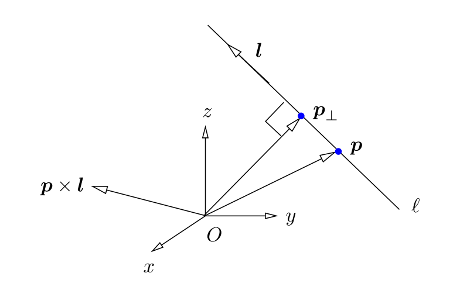
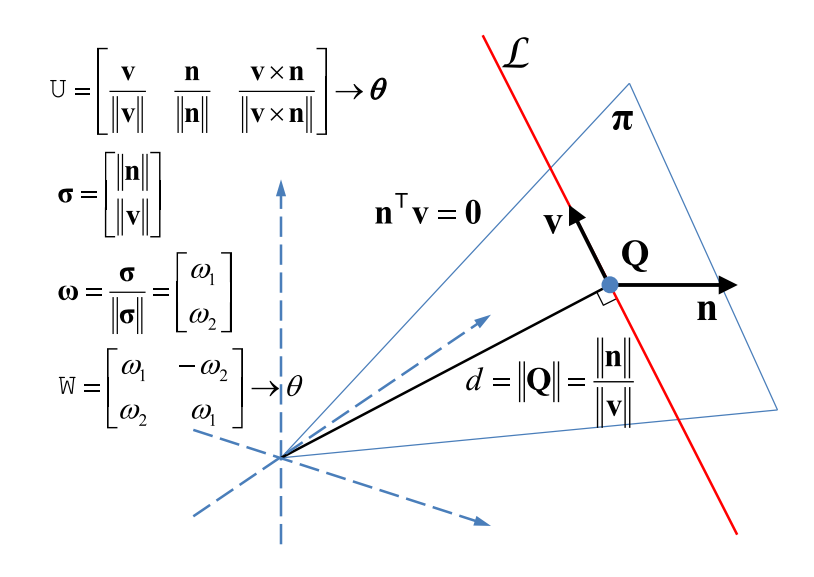
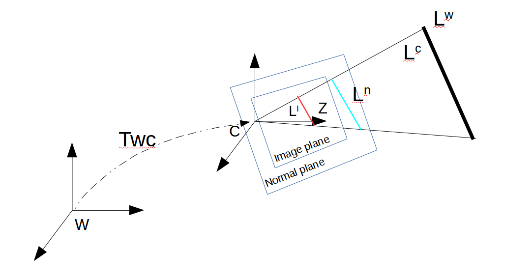
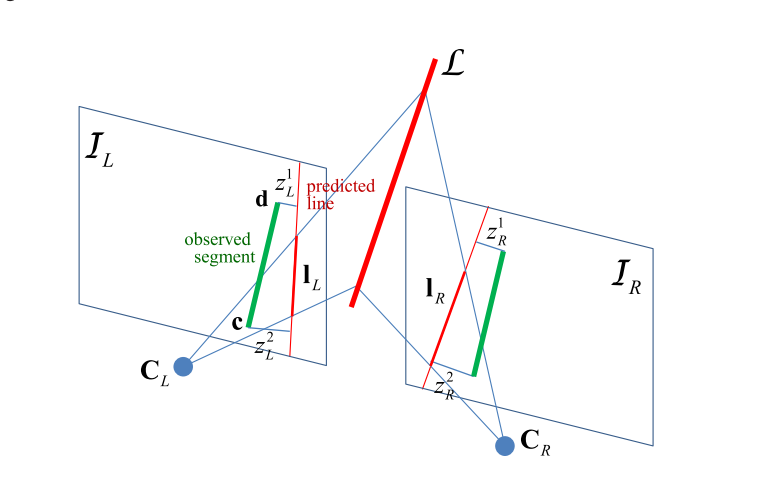

# Line representation

## Reference

1. Plucker Coordinates for Lines in the Space.
2. Structure-From-Motion Using Lines: Representation, Triangulation and Bundle Adjustment. 本文深度参考这篇论文
3. 多视图几何.
4. [https://zhuanlan.zhihu.com/p/65674067](https://zhuanlan.zhihu.com/p/65674067) 关于线特征很好的解读.

&nbsp;

----

## 直线的自由度

3D空间中的直线有4个自由度，通常认为一条线由两个点或者面组成，所以自由度有2x3=6个，但是由于直线绕着自身的方向轴旋转和移动的话，直线还是这个直线，所以真实自由度为6-2=4个。

&nbsp;

---

## Plucker坐标系

Plucker坐标系是一种比较重要的表示方法，后面很多的表示方法也能和该方法进行互换

Plucker坐标系使用两个向量表示，$L:=(\hat{l},m)$，其中：

- $\hat{l}$表示直线的方向向量，模长为1；
- $m=l\times p$, $p$为直线上的一点，可以看到这部分也表示线与原点组成平面的法线；
- $\frac{\|m\|}{\|l\|}$表示原点到直线的距离；

所以，这个直线的表示形式基本上是方向向量和法向量的表示方法，如下图：

另一点，$m$表示了原点到直线的距离，公式推导如下：
$$
\begin{aligned}
\boldsymbol{p}_{\perp} &=\boldsymbol{p}-(\hat{\boldsymbol{l}} \cdot \boldsymbol{p}) \hat{\boldsymbol{l}} \\
&=(\hat{\boldsymbol{l}} \cdot \hat{\boldsymbol{l}}) \boldsymbol{p}-(\hat{\boldsymbol{l}} \cdot \boldsymbol{p}) \hat{l} \\
&=\hat{\boldsymbol{l}} \times(\boldsymbol{p} \times \hat{\boldsymbol{l}}) \\
&=\hat{\boldsymbol{l}} \times \boldsymbol{m}
\end{aligned}  \tag{1}
$$
$\hat{l}\cdot p$表示把$p$向量映射到直线方向上的长度，也就是上图看到的$p_{\perp}-p$的长度；所以$\boldsymbol{p}_{\perp}$的模长就是远点到直线的最短距离，因为$\hat{l}$与$m$垂直，因此：
$$
||p_{\perp}||=||\hat{l}|| \cdot ||m||sin(90)=||m|| \tag{2}
$$

### 两种特殊的情况

自然而然的想到，如果直线过原点怎么表示？如果直线是无穷远点怎么表示？

#### 过原点的直线

因为直线过原点，那么就把p设为原点，则$m=\overrightarrow{0}\times l=\overrightarrow{0}$，跟它的实际意义也相符；

#### 过无穷远点的直线

直线过无穷点时，那么就把p设为无穷远点，有$p=t\overline{p}$，则坐标可以写作：
$$
L:=(l, t\overline{p}\times l):=(\frac{l}{t}, \overline{p}\times l)=(0, m) \tag{3}
$$

&nbsp;

### 在空间中的表示方法

#### 使用两个点进行表示

给定两个3D空间中的点，有：$M^T=(\overline{M}, m)^T, N^T=(\overline{N}, n)^T$，其中$m,n$一方面使得直线变为其次坐标的表示，另一方面表示该点的逆深度，所以根据上面的Plucker坐标的表示，有：
$$
L=\left(\begin{array}{c}\overline{l} \\ m\end{array}\right)=\left(\begin{array}{c} \frac{\overline{M}}{m}-\frac{\overline{N}}{n} \\ \overline{M}\times \overline{N} \end{array} \right) = \left(\begin{array}{c} n\overline{M}-m\overline{N} \\ \overline{M}\times \overline{N} \end{array} \right) = \left(\begin{array}{c} a \\ b \end{array} \right) \tag{4}
$$
这里简单分析一下自由度，由上可知，Plucker的表示下一条直线有6个参数表示，是5维齐次坐标系下的齐次表示，同时，因为Plucker坐标中的$a, b$分别表示线的方向以及线和原点组成的法向量，因此有约束$a^Tb=0$的约束，所以最终Plucker表示下的直线就有4个自由度，和空间直线的自由度一致。

#### 使用两个平面的交表示

这部分属于空间中点和线的对偶形式，给定3D空间中的两个平面，有：$M^T=(\overline{M}, m)^T, N^T=(\overline{N}, n)^T$，这里$m, n$就不表示逆深度了，而是表示截距，同样按照Plucker坐标的表示，有：
$$
L=\left(\begin{array}{c}\overline{l} \\ m \end{array}\right)=\left(\begin{array}{c} \overline{M}\times \overline{N} \\ \frac{\overline{M}}{m}-\frac{\overline{N}}{n} \end{array} \right) = \left(\begin{array}{c} \overline{M}\times \overline{N} \\ n\overline{M}-m\overline{N} \end{array} \right) = \left(\begin{array}{c} a \\ b \end{array} \right) \tag{5}
$$

> 简单的说一下上个公式中的b是怎么得来的，假设点$X$在直线上，则有：
> $$
> \begin{aligned}
> \begin{cases}
> \overline{M}X+m=0 \\
> \overline{N}X+n=0 
> \end{cases} \rightarrow (n\overline{M}-m\overline{N})X=0
> \end{aligned}
> $$
> 所以可以看到$b=(n\overline{M}-m\overline{N})$垂直于直线上一点，同时$b$也垂直于直线的方向向量$(\overline{M}\times \overline{N})$，因此$b$就是直线与原点构成平面的法向量。

&nbsp;

---

## 投影模型

对于投影矩阵$P=[\overline{P}, p]_{3\times4}$，那么经过投影之后的点而言，有：
$$
\begin{aligned}
l_{image}&=m_{image}\times n_{image} \\
&=(PM^w) \times (PN^w) \\
&=(\overline{P}\overline{M}+pm)  \times (\overline{P}\overline{N}+pn) \\
&=\overline{P}\overline{M} \times \overline{P}\overline{N}+pm \times \overline{P}\overline{N}+\overline{P}\overline{M} \times pn+ pm \times pn \\
&=det(\overline{P})\overline{P}^{-T}(\overline{M} \times \overline{N})+[p]_{\times}\overline{P}(m\overline{N}-n\overline{M}) \\ 
&=[det(\overline{P})\overline{P}^{-T}, [p]_{\times}\overline{P}]
\begin{bmatrix} \overline{M} \times \overline{N} \\ m\overline{N}-n\overline{M} \end{bmatrix} \\
&=\tilde{P}_{3\times 6}\mathbf{L}_{6\times1}
\end{aligned}  \tag{6}
$$
对于由两个面相交而得到的直线表示来说，把直线表示替换掉为面表示就可以了（对偶赛高）。

根据上面的推导很容易扩展出世界坐标系到相机坐标系的转移矩阵有：
$$
\left[\begin{array}{c}
\mathbf{n}_{c} \\
\mathbf{b}_{c}
\end{array}\right]=
\left[\begin{array}{cc}
\mathrm{R}_{cw} & {\left[\mathbf{t}_{cw}\right]_{\times} \mathrm{R}_{cw}} \\
\mathbf{0} & \mathrm{R}_{cw}
\end{array}\right]\left[\begin{array}{c}
\mathbf{n}_{w} \\
\mathbf{b}_{w} 
\end{array}\right]=
\left[\begin{array}{cc}
\mathrm{R}_{wc}^{T} & {\left[-\mathrm{R}_{wc}^{T}\mathbf{t}_{wc}\right]_{\times} \mathrm{R}_{wc}^T} \\
\mathbf{0} & \mathrm{R}_{wc}^T
\end{array}\right]\left[\begin{array}{c}
\mathbf{n}_{w} \\
\mathbf{b}_{w} 
\end{array}\right]=
\left[\begin{array}{cc}
\mathrm{R}_{wc}^{T} & {\mathrm{R}_{wc}^{T}\left[\mathbf{t}_{wc}\right]_{\times} } \\
\mathbf{0} & \mathrm{R}_{wc}^T
\end{array}\right]\left[\begin{array}{c}
\mathbf{n}_{w} \\
\mathbf{b}_{w} 
\end{array}\right] \tag{7}
$$
简单说一下上述公式：第一行由公式（6）得到，把其中的$P$用$R,t$替换就可以了；第二行也很好理解，就是简单的把直线的方向进行了旋转。后面之所以把整个公式变换为camera->world主要是因为这是位姿的表示方法。其中的一步推导用到了一个性质，该性质在李群中比较常见，即：当$M\in\mathbf{SO(3)}$时，有$[Mu]_{\times}=M[u]_{\times}M^T$。

&nbsp;

---

## 三角化

这里主要涉及两个方法：第一个方法是解耦的方法，即先获取表达式的初值，再对初值进行正交补偿；第二个方法是耦合的来解，即**使用迭代的方法得到一个即满足优化函数，又能满足正交要求的解**。下面简单的说明一下这两个方法。

### 获取直线表示的初值

这部分比较简单，优化的目标函数就是投影误差。假设直线$\mathbf{L}$被相机$P_i,i=1...n$观测到，那么对于每一次的观测，可以定义误差：
$$
E=\left(\mathbf{x}^{i \top} \widetilde{\mathbf{P}}^{i} \mathbf{L}\right)^{2}+\left(\mathbf{y}^{i^{\top}} \widetilde{\mathbf{P}}^{i} \mathbf{L}\right)^{2}  \tag{8}
$$
可以看到基本上就是在第 i 帧上的图像上的两个对应点到投影直线的距离。所以所有的观测都考虑之后有：
$$
\begin{aligned}
\mathcal{B}(\mathbf{L}, \mathcal{M}) &=\sum_{i=1}^{n}\left(\left(\frac{\mathbf{x}^{i \top} \widetilde{\mathbf{P}}^{i} \mathbf{L}}{\sqrt{(l_1)^2+(l_2)^2}}\right)^{2}+\left(\frac{\mathbf{y}^{i^{\top}} \widetilde{\mathbf{P}}^{i} \mathbf{L}}{\sqrt{(l_1)^2+(l_2)^2}}\right)^{2}\right) \\
&=\left\|A_{(2 n \times 6)} \mathbf{L}\right\|^{2} \quad \text { with } \quad \mathrm{A}=\left(\begin{array}{c}
\cdots \\
\mathbf{x}^{i^{\top}} \widetilde{\mathbf{P}}^{i} \\
\mathbf{y}^{i^{\top}} \widetilde{\mathbf{P}}^{i} \\
\ldots
\end{array}\right)
\end{aligned} \tag{9}
$$
其中：

- 设$l_{3\times 1}=\widetilde{\mathbf{P}}^{i} \mathbf{L}$，那么$l_1=l(1), l_2=l(2)$；

该方程有很多的解法，这里就不赘述了。需要注意的是这个部分只是求解了方程，并没有考虑Plucker约束，即$\mathbf{a}^T\mathbf{b}=0$。

&nbsp;

### 对Plucker约束进行补偿

这部分可以着重参考论文【2】，基本思路是把这个问题当做纯数学问题进行求解，获取与初值最接近且正交的向量，但是这个解就不一定满足公式（9）的最优解了。

&nbsp;

### 类线性算法（Quasi-linear algorithm）

这个算法主要是使用迭代的思路使得解既能满足公式（9）的优化函数，又能满足Plucker正交关系的解，主要的思路如下：

1. 先按照公式（9）求得一个初始$L_0$；

2. 构建一个迭代公式：
   $$
   C_k(L_{k+1})=L_k^T\underbrace{\begin{bmatrix}0 & I_{3\times3} \\ I_{3\times3} & 0\end{bmatrix}}_{G}L_{k+1}=b_k^Ta_{k+1}+a^T_kb_{k+1}=0
   $$
   可以看到这个思路主要想使得**迭代前后两次的方向向量和法向量是正交的**；

3. 为了求解上述公式，显然可以得到最优的$L_{k+1}$是在$L_{k}^TG$的零空间中，所以对$L_{k}^TG$进行了SVD分解：
   $$
   L_{k}^TG=U_{1\times1}^T\Sigma_{1\times6}V_{6\times6}^T=U_{1\times1}^T\Sigma_{1\times6}(v_{6\times1}, \overline{V}_{6\times5})^T
   $$
   上述公式中，$v_{6\times 1}$是唯一一个特解，而$V_{6 \times 5}$就是$L_{k+1}$所在的零空间，所以$L_{k+1}$可以被$V_{6\times 5}$的五个列向量组成的空间基底线性表示；

4. 那么现在的问题变为如何求解这个线性表示了，或者说变为求解$\gamma_{5\times 1}$这个向量。其实也简单，经过第三步其实已经得到了$V_{6\times 5}$，那么设$L_{k+1}=\overline{V}_{6\times 5}\gamma_{5\times 1}$，代入公式（9）后得到：
   $$
   \mathcal{B}(\mathbf{L_{k+1}}, \mathcal{M})=\|A_{2n\times 6}\overline{V}_{6\times 5}\gamma_{5\times 1}\|^2=0
   $$
   这个时候就比较明了了，构建优化目标函数为：
   $$
   \begin{aligned}
   \mathrm{min}_{r} &\|A\overline{V}\gamma\|^2 \\
   s.t. &\|\gamma\|^2=1
   \end{aligned}
   $$
   这里其实没有特别想明白为什么约束条件是$\|\gamma\|^2=1$而不是$\sum\gamma_i=1$，私以为可能是为了方便运算，因为上式直接用拉格朗日乘子法解的话，用$\|\gamma\|^2=1$的约束显然比$\sum\gamma_i=1$要容易的多；

5. 经过这个之后，还有一个步骤是要更新公式（9）中的A，因为每个直线与观测线之间的误差都与直线表示${L_{k+1}}$有关，因此当获得了新的直线表示之后记得更新这个地方；

6. 重复2、 3、 4、 5步骤直到得到的$L_{k+1}$收敛；

&nbsp;

----

## 线特征的正交表示（Orthonormal Representation）

正交表示主要的贡献点在于可以使得整个表示的未知数与自由度是对应的，也就是可以用最小表示进行线特征的表示，这样的好处对于优化问题是不言而喻的，就和李群和李代数的关系一样。下面就简单的介绍一下这个表示方法。

### 正交表示的推导

假设直线的表示为：$\mathcal{L}=[n^T, d^T]^T$，写作矩阵形式为$\mathbf{C}=\left[\mathbf{a}, \mathbf{b}\right]_{3\times2}$，其中：

- $\mathbf{n}$表示直线的法向量，$\mathbf{d}$表示直线的方向向量；
- $\mathbf{a}=\mathbf{n}, \mathbf{b}=\mathbf{d}$；

将矩阵$\mathbf{C}$进行QR分解有：
$$
C \sim \underbrace{\left(\frac{a}{\|a\|} \frac{b}{\|\mathbf{b}\|} \frac{a \times b}{\|\mathbf{a} \times \mathbf{b}\|}\right)}_{S O(3)} \underbrace{\left(\begin{matrix}\|\mathbf{a}\| & 0 \\ 0 &  \|\mathbf{b}\| \\ 0 & 0\end{matrix}\right)}_{(\|\mathbf{a}\|\|\mathbf{b}\|)^{\top} \in \mathbb{P}^{1}} \tag{10}
$$
整个分解之后由两部分组成，一部分是旋转矩阵，另一部分是一个一维的齐次坐标的表示。

> 简单的说一下这个部分：
>
> 1. 第二部分的右上角的元素为0是必然的，因为$\mathbf{a}\perp\mathbf{b}$；
>
> 2. 因为第二个部分本质上只有两个变量，都除以$\|\mathbf{b}\|$之后，其实可以得到两个元素为$(d=\|\mathbf{a}\|/\|\mathbf{b}\|, 1)$，其中第一个元素根据公式（1）可以知道这部分就是直线到原点的距离。

所以看到，经过QR分解之后的整个直线表示的状态量刚好是4个（第一部分有3个，第二部分有1个），因此说正交表示可以最小表示直线。

到这里其实还并没有完成正交表示，因为作者认为第二部分并不容易进行优化和更新，所以做了一个变化，把这部分变作了一个$\mathbf{SO(2)}$的表示，毕竟相比于这个$3\times 2$的矩阵来说，$\mathbf{SO(2)}$的更新更加稳定且容易，最重要的是并没有造成信息的缺失，有如下的过程：
$$
W=\begin{bmatrix} \frac{1}{\sqrt{1+d^2}} & \frac{d}{\sqrt{1+d^2}} \\ \frac{-d}{\sqrt{1+d^2}} & \frac{1}{\sqrt{1+d^2}} \end{bmatrix} = \begin{bmatrix} \frac{\|a\|}{\sqrt{\|a\|^2+\|b\|^2}} & \frac{\|b\|}{\sqrt{\|a\|^2+\|b\|^2}} \\ -\frac{\|b\|}{\sqrt{\|a\|^2+\|b\|^2}} & \frac{\|a\|}{\sqrt{\|a\|^2+\|b\|^2}} \end{bmatrix} = \begin{bmatrix} cos(\phi) & -sin(\phi) \\ sin(\phi) & cos(\phi)\end{bmatrix} = \begin{bmatrix}w1 & -w2 \\ w2 & w1\end{bmatrix} \in \mathbf{SO(2)} \tag{11}
$$
在公式（10）中，比较容易看到，当对$\theta$进行更新了之后，可以通过$cos(\phi)/sin(\phi)$的公式来得到直线到原点的距离。

综上所述，直线的正交表示可以写作如下形式：
$$
C \sim (U, W) \in \mathbf{SO(3)} \times \mathbf{SO(2)}
$$
这部分用下图表示十分合适：

&nbsp;

### 正交表示与Plucker坐标系的转换

正交表示可以最小的表示直线，但是该表示方法的投影方程并没有线性的表示，即该方法并不能像Plucker坐标系表示方法一样，通过公式（7）得到一个线性的映射关系，但是我们又特别的看重该表示方法的最小表示的性质，好在两者之间的互换关系还是十分简单的，如下：
$$
\underbrace{\mathcal{L}_{6\times1}}_{Plucker表示}=\sqrt{\|a\|^2+\|b\|^2} \underbrace{\begin{bmatrix} w1\mathbf{u_1} \\ w2\mathbf{u_2} \end{bmatrix}}_{正交表示} \tag{12}
$$
这里面差了一个归一化参数，这部分其实可以不用管，因为可以在算$(\mathbf{a}, \mathbf{b})$的时候稍微进行一下归一化或者其他的方式限制这个值。

&nbsp;

----

## 优化问题

这部分其实跟点的过程一样，也主要是**观测方程**和**误差函数**，上面谈到的公式（6）和公式（8）其实已经简单的涉及到了这部分，下面的内容主要是从头到尾的串一遍了。

这部分用下面的一张图表示：

其中：

-  $L^W$表示在世界坐标系的表示，$L^{C}$表示在相机坐标系下的表示；
- $L^n$表示归一化平面上的线，$L^I$表示在图像坐标系下的线；
- 这里故意把归一化平面与图像平面分开画，两个平面之间其实差了一个内参矩阵，不过这个矩阵与常见的K不同，这里需要稍微进行推导。

所以这里进行从世界坐标系到图像坐标系的整个投影可以表示为：
$$
l^{iamge} = \mathcal{K} \mathbf{l^{normal}}=\mathcal{K}\tilde{P}_{3\times 6}\mathbf{^wL}_{6\times1}=\mathcal{K}\mathbf{m}^{\prime}  \tag{13}
$$
其中：

- $\mathcal{K}$表示直线的内参矩阵；
- $\tilde{P}_{3\times 6}\mathbf{^wL}_{6\times1}$参考公式（６）；
- 这里的$\mathbf{m}^{\prime}$表示在相机的归一化坐标系下的法向量；

> 简单的说一下$\mathcal{K}$的推导：
>
> 1. 在归一化平面上，假设直线的点为：$^nC, {^n}D$；
> 2. 在图像平面上，经过内参映射之后的点为：${^i}c, {^i}d$，其中两者的关系为${^i}c=K^nC, {^i}d=K{^n}D$，其中K就是熟悉的相机内参矩阵；
>
> 对于归一化平面和相机平面，两者其实都是2维的射影平面，所以在归一化平面和归一化平面上的直线的表示为：
> $$
> \begin{aligned}
> {^i}c \times {^i}d &= (K{^n}C) \times (K{^n}D) \\
> &=\begin{bmatrix}fxX_C+cx \\ fyY_C+cy \\ 1\end{bmatrix}_{\times}\begin{bmatrix}fxX_D+cx \\ fyY_D+cy \\ 1\end{bmatrix} \\
> &=\begin{bmatrix}0 & -1 & (fyY_C+cy) \\ 1 & 0 & -(fxX_C+cx) \\ -(fyY_C+cy) & (fxX_C+cx) & 0 \end{bmatrix}\begin{bmatrix}fxX_D+cx \\ fyY_D+cy \\ 1\end{bmatrix} \\
> &=\begin{bmatrix}fy(Y_C-Y_D) \\ fx(X_C-X_D) \\ fxfy(X_CY_D-Y_CX_D)+fxcy(X_D-X_C)+fycx(Y_D-Y_C) \end{bmatrix} \\ 
> &=\begin{bmatrix}fy & 0 & 0 \\ 0 & fx & 0 \\ -fycx & -fxcy & fxfy \end{bmatrix}\begin{bmatrix}Y_D-Y_C \\ X_D-X_C \\ X_CY_D-Y_CX_D \end{bmatrix} \\ 
> &=\begin{bmatrix}fy & 0 & 0 \\ 0 & fx & 0 \\ -fycx & -fxcy & fxfy \end{bmatrix}
> \begin{bmatrix}X_C \\ Y_C \\ 1 \end{bmatrix}_{\times} \begin{bmatrix}X_D \\ Y_D \\ 1 \end{bmatrix} \\ 
> &=\mathcal{K}({^n}C \times {^n}D) \\
> &=\mathcal{K}\mathbf{m}^{\prime}
> \end{aligned}\tag{14}
> $$
> 上述的推导其实很容易看出，因为两个归一化平面的点的叉乘就是在相机坐标系下的Plucker表示中的法向量，因此可以看到在归一化坐标系到图像坐标系的转换中，仅仅涉及到了直线表示中的法向量部分。

&nbsp;

### 误差函数

用下面这张图表示误差量，如下：

图中的$I_L$表示直线$\mathcal{L}$在图像平面的投影，所以定义误差项为（就是简单的两个点到直线的距离）：
$$
\mathbf{r_L}=\begin{bmatrix}\mathbf{r_1} \\ \mathbf{r_2} \end{bmatrix} = \begin{bmatrix}\frac{c^TI}{\sqrt{l_1^2+l_2^2}} \\ \frac{d^TI}{\sqrt{l_1^2+l_2^2}} \end{bmatrix} \tag{15}
$$
&nbsp;

### 求解Jacobian

跟对3D点的优化问题一样，就是从误差不停的递推到位姿以及直线表示上，用到最最最基本的求导的链式法则：

通用的公式如下：
$$
\frac{\partial \mathbf{r_L}}{\partial X}=
\frac{\partial \mathbf{r_L}}{\partial L^{I}} \frac{\partial L^{I}}{\partial L^{n}} \frac{\partial L^{n}}{\partial L^{c}} 
\begin{aligned}
\begin{cases} 
\frac{\partial L^{c}}{\partial \theta}  &\text{  X=}\theta \\
\frac{\partial L^{c}}{\partial t}  &\text{  X=t} \\
\frac{\partial L^{c}}{\partial L^{w}}\frac{\partial L^{w}}{\partial{(\theta,\phi)}}  &\text{  X=}L^{w}
\end{cases} 
\end{aligned}\tag{16}
$$
先对前面最通用的部分进行求解：

第一部分：
$$
\begin{aligned}
\frac{\partial \mathbf{r_L}}{\partial L^{I}} &= \begin{bmatrix}\frac{\partial{\mathbf{r1}}}{\partial{l_1}} & \frac{\partial{\mathbf{r1}}}{\partial{l_2}} & \frac{\partial{\mathbf{r1}}}{\partial{l_3}} \\ \frac{\partial{\mathbf{r2}}}{\partial{l_1}} & \frac{\partial{\mathbf{r2}}}{\partial{l_2}} & \frac{\partial{\mathbf{r2}}}{\partial{l_3}}\end{bmatrix} \\
&=\begin{bmatrix}\frac{-l_1 c^TL^{I}}{(l_1^2+l_2^2)^{\frac{3}{2}}}+\frac{u_c}{(l_1^2+l_2^2)^{\frac{1}{2}}} & \frac{-l_2 c^TL^{I}}{(l_1^2+l_2^2)^{\frac{3}{2}}}+\frac{v_c}{(l_1^2+l_2^2)^{\frac{1}{2}}} & \frac{1}{(l_1^2+l_2^2)^{\frac{1}{2}}} \\ 
\frac{-l_1 d^TL^{I}}{(l_1^2+l_2^2)^{\frac{3}{2}}}+\frac{u_d}{(l_1^2+l_2^2)^{\frac{1}{2}}} & \frac{-l_2 d^TL^{I}}{(l_1^2+l_2^2)^{\frac{3}{2}}}+\frac{v_d}{(l_1^2+l_2^2)^{\frac{1}{2}}} & \frac{1}{(l_1^2+l_2^2)^{\frac{1}{2}}}  \end{bmatrix}_{2\times 3}
\end{aligned} \tag{17}
$$
其中：

- $l1, l2, l3$表示图像坐标系下直线的三个参数；
- $u_c, v_c$表示点c的xy坐标值，$u_d, v_d$同理；

第二部分：

根据公式（13）可知：
$$
\frac{\partial L^{I}}{\partial L^{n}}=\mathcal{K}_{3\times3}  \tag{18}
$$
第三部分：

由公式（6）和（13）可知，直线的Plucker表示在归一化平面上只用了其中的法向量部分，因此若有$\mathcal{{^c}L}=\left[\mathbf{{^c}n}, \mathbf{{^c}d}\right]^T$，那么$\mathcal{{^n}L}=\mathbf{{^c}n}$，所以求导有：
$$
\frac{\partial L^{n}}{\partial L^{c}}=\begin{bmatrix}\mathbf{I}_{3\times3} & 0_{3\times3}\end{bmatrix}_{3\times6}  \tag{19}
$$
第四部分就分这几种情况进行讨论：

#### 对于位姿的姿态部分

根据公式（7）有：
$$
\frac{\partial {^c}L}{\partial \theta} = \begin{bmatrix}\frac{\partial n_c}{\partial \theta} \\ \frac{\partial d_c}{\partial \theta}\end{bmatrix} = \begin{bmatrix}\frac{\partial{(R_{wc}^T(n_w+[t_{wc}]_{\times}b_w))}}{\partial \theta} \\ \frac{\partial{R_{wc}^Tb_w}}{\partial \theta}\end{bmatrix}=\begin{bmatrix} [R_{wc}^T(n_w+[t_{wc}]_{\times}b_w)]_{\times} \\ [R_{wc}^Tb_w]_{\times} \end{bmatrix}_{6\times3} \tag{20}
$$

上述的推导使用了李群的右扰动模型，即$(R_{wc}Exp(\theta))^T=Exp(-\theta)R_{wc}^T$。

#### 对于位姿的位移部分

同样根据公式（7）有：
$$
\frac{\partial {^c}L}{\partial t} = \begin{bmatrix}\frac{\partial n_c}{\partial t} \\ \frac{\partial d_c}{\partial t}\end{bmatrix} = \begin{bmatrix}\frac{\partial{(R_{wc}^T(n_w+[t_{wc}]_{\times}b_w))}}{\partial t} \\ \frac{\partial{R_{wc}^Tb_w}}{\partial t}\end{bmatrix}=\begin{bmatrix} -R_{wc}^T[b_{w}]_{\times} \\ \mathbf{0} \end{bmatrix}_{6\times3}  \tag{21}
$$

#### 对于世界坐标系下直线表示部分

这部分按照公式（16）的步骤，依旧分两个部分：

1. $\frac{\partial L^{c}}{\partial L^{w}}$部分：
   $$
   \frac{\partial L^{c}}{\partial L^{w}}=
   \begin{bmatrix}
   \frac{\partial{\mathbf{n^C}}}{\partial{\mathbf{n^W}}} & \frac{\partial{\mathbf{n^C}}}{\partial{\mathbf{b^W}}} \\ \frac{\partial{\mathbf{d^C}}}{\partial{\mathbf{n^W}}} & \frac{\partial{\mathbf{d^C}}}{\partial{\mathbf{b^W}}}
   \end{bmatrix} =
   \left[\begin{array}{cc}
   \mathrm{R}_{wc}^{T} & {\mathrm{R}_{wc}^{T}\left[\mathbf{t}_{wc}\right]_{\times} } \\
   \mathbf{0} & \mathrm{R}_{wc}^T
   \end{array}\right]  \tag{22}
   $$

2. $\frac{\partial L^{w}}{\partial(\theta, \phi)}$部分，这部分其实还可以继续分，如下：
   $$
   \frac{\partial L^{w}}{\partial(\theta, \phi)}=
   \left[\frac{\partial L^{w}}{\partial \theta}, \frac{\partial L^{w}}{\partial \phi}\right]=
   \left[\frac{\partial L^{w}}{\partial{U}}\frac{\partial{U}}{\partial \theta}, \frac{\partial L^{w}}{\partial{W}}\frac{\partial{W}}{\partial \phi}\right]
   $$

   ##### 第一部分

   $$
   \begin{aligned}
   \frac{\partial L^{w}}{\partial{U}}\frac{\partial{U}}{\partial \theta}&=\frac{\partial{\begin{bmatrix} w1\mathbf{u_1} \\ w2\mathbf{u_2} \end{bmatrix}}}{\partial{[\mathbf{u_1},\mathbf{u_2}, \mathbf{u_3}]}}\frac{\partial{[\mathbf{u_1},\mathbf{u_2}, \mathbf{u_3}]}}{\partial{\theta}} \\
   &=\begin{bmatrix}w1 & 0 & 0 \\ 0 & w2 & 0 \end{bmatrix}_{6\times9}
   \begin{bmatrix}0 & -\mathbf{u3} & \mathbf{u2} \\ \mathbf{u3} & 0 & -\mathbf{u1} \\ -\mathbf{u2} & \mathbf{u1} & 0 \end{bmatrix}_{9\times3} \\
   &= \begin{bmatrix} 0 & -w1\mathbf{u3} & w1\mathbf{u2} \\ -w2\mathbf{u3} & 0 &  -w2\mathbf{u1} \end{bmatrix}_{6\times3}
   \end{aligned} \tag{23}
   $$

   ##### 第二部分

   $$
   \begin{aligned}
   \frac{\partial L^{w}}{\partial{W}}\frac{\partial{W}}{\partial \phi}&=\frac{\partial{\begin{bmatrix} w1\mathbf{u_1} \\ w2\mathbf{u_2} \end{bmatrix}}}{\partial{[w1, w2]^T}}\frac{\partial{[w1, w2]^T}}{\partial{\phi}} \\
   &=\begin{bmatrix}\mathbf{u1} & 0 \\ 0 & \mathbf{u2} \end{bmatrix}_{6\times2}
   \begin{bmatrix} -w2 \\ w1 \end{bmatrix}_{2\times1} \\
   &= \begin{bmatrix} -w2\mathbf{u1} \\ w1\mathbf{u2}\end{bmatrix}_{6\times1}
   \end{aligned} \tag{24}
   $$

   其中$w1=cos(\phi), w2=sin(\phi)$。

3. 两个部分合起来为：
   $$
   \frac{\partial L^{w}}{\partial(\theta, \phi)}=
   \left[\begin{array}{cc}
   \mathrm{R}_{wc}^{T} & {\mathrm{R}_{wc}^{T}\left[\mathbf{t}_{wc}\right]_{\times} } \\
   \mathbf{0} & \mathrm{R}_{wc}^T
   \end{array}\right]_{6\times6}
   \begin{bmatrix} 0 & -w1\mathbf{u3} & w1\mathbf{u2} & -w2\mathbf{u1} \\ -w2\mathbf{u3} & 0 &  -w2\mathbf{u1} & w1\mathbf{u2} \end{bmatrix}_{6\times4} \tag{25}
   $$
   

&nbsp;

----

## 总结

线特征这部分确实比点特征要复杂很多，表示方法就很不同（这部分也是笔者花了很久才接受的一部分），但是好在整个推导过程都可以借助点的转移方程逐步进行推导。