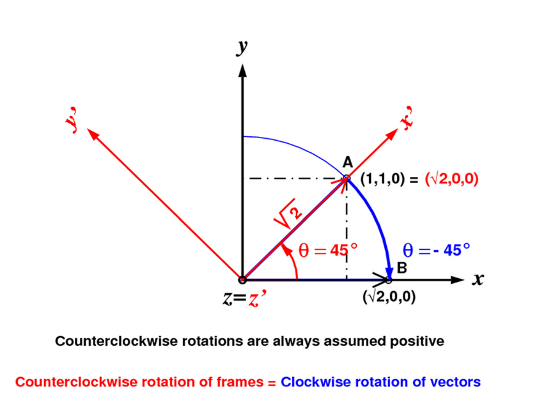
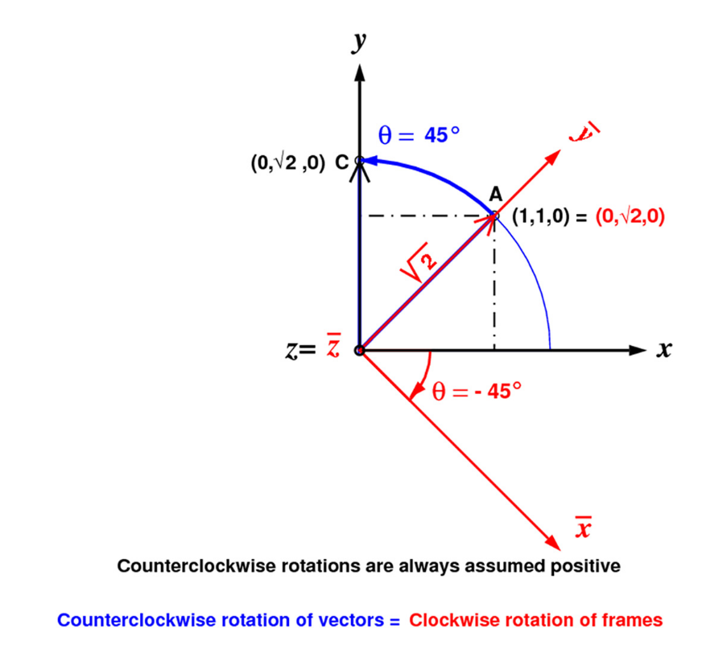
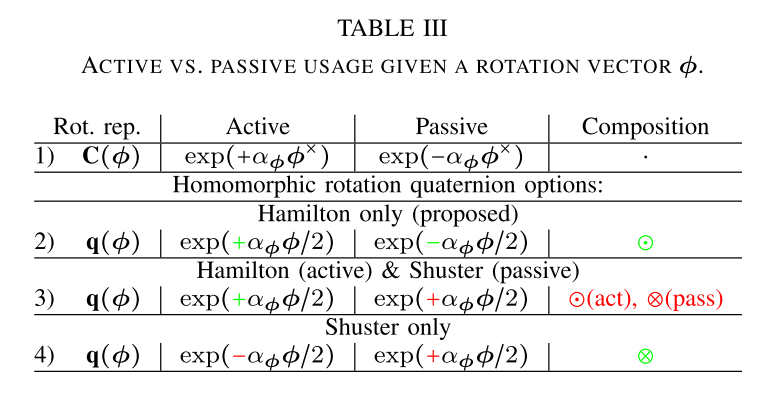

# MSCKF（一）——四元数的两种表示

----

[toc]

&nbsp;

-----

## 写在前面

最近看MSCKF方法，发现里面的旋转表示与笔者先前理解的非常不同，也让笔者重新审视了一下自己对于旋转向量、旋转矩阵与四元数的关系，通过查找一些资料，也算是把这些关系理得比较清楚，该文章就是对自己理解过程的一次总结，希望能帮助更多的小伙伴。

&nbsp;

-----

## Reference

1. Active versus Passive Rotations. 该论文比较清晰的解释了“主动旋转”和“被动旋转”；
2. Why and How to Avoid the Flipped Quaternion Multiplication. 该论文比较系统的总结了Hamilton和Shuster两种四元数的运用，然后作者提出了一种四元数到旋转矩阵的映射，可以保持使用Hamilton四元数的同时，保持乘法的Homogeneous；
3. Quaternion kinematics for the error-state Kalman filter. ESKF中的前4章也都是在讲四元数和旋转的事情，该篇文章主要使用Hamilton表示法的四元数；
4. Indirect Kalman Filter for 3D Attitude Estimation. MARS LAB关于四元数表示旋转的一篇文章，里面详细推导了JPL表示下的四元数的公式；
5. 还有一篇邱博的笔记，但是实在找不到链接；

**特别希望的是，在本文之前，大家对于四元数和旋转矩阵相信都有自己的理解，但是希望读者暂时忘记之前的理解，因为很可能这些理解会导致你很不理解本文的变换关系，就像参考2中提醒读者的一样：If a reader is unaware of the split, the discovery that two different quaternion multiplications are in use, and that in fact “the other” was employed, might be made only after several failures, during which the confusion may even have spread to third parties.**

&nbsp;

-----

## 缘起——旋转的主动性（Active）和被动性（Passive）

旋转的主动性与被动性绝对是相对关系的一个很好的体现，特别是在SLAM中，算法其实一直都在用两者，但是却总是不对两者进行区分，导致笔者之前觉得：旋转嘛，就用四元数或者旋转矩阵表示就可以了。但是实际上两个的自然含义确实是千差万别。

举个简单的例子——重投影误差。这里仅仅考虑旋转，通常有公式如下：
$$
\mathrm{P^C} = \mathrm{R_{W}^{C}}\mathrm{P^W}  \tag{1}
$$
对于上述公式，我们可以从两个角度去解释：

1. 世界坐标系下的一个点经过旋转，转到了相机坐标系下，我们称之为**主动旋转**，也就是旋转前后，坐标系没有发生变化，而是其中的点被旋转到了一个新位置上；
2. 世界坐标系整个旋转成为相机坐标系，此时再去观察同样的点，具有了不一样的值，我们称之为**被动旋转**，也就是旋转前后，空间中的点的绝对位置没有变化，变化的仅仅是观察者的坐标系；

显然，机器人运动中更应该偏向**被动旋转**。

### 旋转方向的定义

绕一个轴的旋转其实有两种，顺时针（左手法则）和逆时针（右手法则），所以这里先规定旋转的方向，再说明其他的部分：通常定义逆时针为正旋转，如果有变动会在那个地方说明。

&nbsp;

### 被动旋转

这里先说被动旋转，原因是因为被动旋转的表示其实是最早被提出来的，像之前所说的，被动旋转表示把一个坐标系{R}转成了另一个坐标系{b}，如下图的例子所述：

{xyz}坐标系绕着其中中的z轴，正向旋转45°，那么其中在{xyz}坐标系下的点A如何变化。

根据图能很容易的看出，该种情形下的旋转公式如下：
$$
\begin{bmatrix}\sqrt{2} \\ 0 \\ 0 \end{bmatrix} = \mathbf{R} \mathrm{v} =\begin{bmatrix}cos(\theta) & sin(\theta) & 0 \\ -sin(\theta) & cos(\theta) & 0 \\ 0 & 0 & 1 \end{bmatrix} \begin{bmatrix} 1 \\ 1\\ 0 \end{bmatrix} \tag{1}
$$
但是，如果我们把目光放在基底的变化上，就会发现事情没有那么简单。从图中不难看出，如果我们在这个过程中把整个{xyz}的基底进行旋转，则旋转的过程如下：
$$
\begin{bmatrix}e_1^{\prime} & e_2^{\prime} & e_3^{\prime}\end{bmatrix} = \begin{bmatrix} \frac{1}{\sqrt{2}} & -\frac{1}{\sqrt{2}} & 0 \\ \frac{1}{\sqrt{2}} & \frac{1}{\sqrt{2}} & 0 \\ 0 & 0 & 1 \end{bmatrix}=\begin{bmatrix}cos(\theta) & -sin(\theta) & 0 \\ sin(\theta) & cos(\theta) & 0 \\ 0 & 0 & 1 \end{bmatrix} \begin{bmatrix} e_1 & e_2 & e_3\end{bmatrix} = \mathbf{^{b}_{G}C}\begin{bmatrix} e_1 & e_2 & e_3\end{bmatrix} \tag{2}
$$
于是我们得到如下的结论：**在被动旋转的表示方法下，整个坐标系绕着一个旋转轴正向旋转（也就是逆时针）等于把其中的向量绕着相同的旋转轴逆向旋转（也就是顺时针）**，有公式：
$$
\mathbf{R}=\mathbf{R_z(-\theta)}=\mathbf{^{b}_{G}C}^T=\mathbf{R_z(\theta)} \tag{3}
$$
这里把旋转矩阵R的方向定为{b}系到{G}系，就好像原先在{b}系中的向量经过了旋转矩阵旋转到了{G}系一样；

&nbsp;

### 主动旋转

如果旋转轴依旧是{xyz}中的z轴，而旋转角度也还是45°，但是这次直接旋转A点的话，A点如何变化呢？

根据图能很容易的看出，该种情形下的旋转公式如下：
$$
\begin{bmatrix}0 \\ \sqrt{2} \\ 0 \end{bmatrix} = \mathbf{R} \mathrm{v} =\begin{bmatrix}cos(\theta) & -sin(\theta) & 0 \\ sin(\theta) & cos(\theta) & 0 \\ 0 & 0 & 1 \end{bmatrix} \begin{bmatrix} 1 \\ 1\\ 0 \end{bmatrix} \tag{4}
$$
同样，如果我们把目光放在基底的变化上，就会发现事情没有那么简单。从图中不难看出，如果我们在这个过程中把整个{xyz}的基底进行旋转，则旋转的过程如下：
$$
\begin{bmatrix}e_1^{\prime} & e_2^{\prime} & e_3^{\prime}\end{bmatrix} = \begin{bmatrix} \frac{1}{\sqrt{2}} & \frac{1}{\sqrt{2}} & 0 \\ -\frac{1}{\sqrt{2}} & \frac{1}{\sqrt{2}} & 0 \\ 0 & 0 & 1 \end{bmatrix}=\begin{bmatrix}cos(\theta) & sin(\theta) & 0 \\ -sin(\theta) & cos(\theta) & 0 \\ 0 & 0 & 1 \end{bmatrix} \begin{bmatrix} e_1 & e_2 & e_3\end{bmatrix} = \mathbf{^{b}_{G}C}\begin{bmatrix} e_1 & e_2 & e_3\end{bmatrix} \tag{5}
$$
于是我们得到如下的结论：**在主动旋转的表示方法下，坐标系中的一个点绕着一个旋转轴正向旋转（也就是逆时针）等于把整个坐标系绕着相同的旋转轴逆向旋转（也就是顺时针）**，有公式：
$$
\mathbf{R}=\mathbf{R_z(\theta)}=\mathbf{^{b}_{G}C}^T=\mathbf{R_z(-\theta)} \tag{6}
$$
&nbsp;

### 结论

可以看到，同样的一个旋转动作（绕着Z轴旋转45°），被动旋转和主动旋转给出的结论完全不同，其本质原因在于被动旋转在主动的转坐标系，那么对于坐标系中的所有点来说就是逆向的旋转了。

于是容易得到下面的结论：如果使用一个被动旋转去旋转一个点或者是向量，则坐标系的变换是正向的，但是表示主动旋转的旋转矩阵确实逆向的；主动旋转则是相反的结论。

&nbsp;

----

## 乱入——四元数对于旋转的表示

这一小节我们具体来看一下Hamilton和Shuster表示法的“爱恨情仇”。

### Hamilton四元数表示法

四元数与旋转向量之间的关系如下：
$$
\mathbf{q}=\mathrm{sin}(\frac{\theta}{2})+\mathrm{cos}(\frac{\theta}{2})\mathbf{u_R}=[\mathrm{sin}(\frac{\theta}{2}), \mathrm{cos}(\frac{\theta}{2})\mathbf{u_R}]  \tag{7}
$$
其中旋转轴是在参考系上的。

随后定义虚部的乘法运算法则：
$$
\begin{cases}
i^2=j^2=k^2=ijk=1 \\
i j=-j i=k \\
 j k=-k j=i \\ 
 k i=-i k=j
\end{cases} \tag{8}
$$
这里对四元数的其他的数学性质就不做过多赘述，感兴趣的可以到参考3和参考4中看。

对于两个四元数的相乘，应用虚部乘法法则之后有：
$$
\begin{aligned}
\begin{array}{l}
\bar{q} \odot \bar{p}&=\left[\begin{array}{cccc}
q_{w} & -q_{x} & -q_{y} & -q_{z} \\
q_{x} & q_{w} & -q_{z} & q_{y} \\
q_{y} & q_{z} & q_{w} & -q_{x} \\
q_{z} & -q_{y} & q_{x} & q_{w}
\end{array}\right]\left[\begin{array}{c}
p_{x} \\
p_{y} \\
p_{z} \\
p_{w}
\end{array}\right] \\
&=\left[\begin{array}{cc}
\mathrm{q_w} & -\mathbf{q}^T \\
\mathbf{q} & q_{w} \mathbf{I}_{3 \times 3}+\lfloor\mathbf{q} \times\rfloor
\end{array}\right]\left[\begin{array}{c}
\mathbf{p} \\
p_{w}
\end{array}\right] \\
&=\mathcal{L}(\overline{q})\overline{p}
\end{array} \\

\begin{array}{l}
\bar{q} \odot \bar{p}&=\left[\begin{array}{cccc}
p_{w} & -p_{x} & -p_{y} & -p_{z} \\
p_{x} & p_{w} & p_{z} & -p_{y} \\
p_{y} & -p_{z} & p_{w} & p_{x} \\
p_{z} & p_{y} & -p_{x} & p_{w}
\end{array}\right]\left[\begin{array}{c}
q_{x} \\
q_{y} \\
q_{z} \\
q_{w}
\end{array}\right] \\
&=\left[\begin{array}{cc}
\mathrm{p_w} & -\mathbf{p}^T \\
\mathbf{p} & p_{w} \mathbf{I}_{3 \times 3}+\lfloor\mathbf{p} \times\rfloor
\end{array}\right]\left[\begin{array}{c}
\mathbf{q} \\
q_{w}
\end{array}\right] \\
&=\mathcal{R}(\overline{p})\overline{q}
\end{array}
\end{aligned} \tag{9}
$$

Hamilton提出四元数其实是铁站边**被动旋转**的，也就是说四元数其实表示的是对于坐标系的旋转。有如下的公式：
$$
\mathcal{X}_{B}=\mathbf{q}\odot \mathcal{X}_{A} \odot \mathbf{q^{-1}} \tag{10}
$$
其中$\mathcal{X}_{A}$和$\mathcal{X}_{B}$表示坐标系{A}和坐标系{B}。

根据Hamilton规定的虚部乘法运算法则：，有：
$$
\begin{aligned}
\mathcal{X}_{B} &= \mathbf{_{A}^{B}q}\odot \mathcal{X}_{A} \odot \mathbf{_{A}^{B}q^{-1}} \\
&=[\mathbf{q^{-1}}]_{R}[\mathbf{q}]_{L} \mathcal{X}_{A} \\
&=(\left(2 q_{w}^{2}-1\right) \mathbf{I}_{3 \times 3}+2 q_{w}\lfloor\mathbf{q} \times\rfloor+2 \mathbf{q} \mathbf{q}^{\mathrm{T}})\mathcal{X}_A \\
&=\left[\begin{array}{ccc}
q_{w}^{2}+q_{x}^{2}-q_{y}^{2}-q_{z}^{2} & 2\left(q_{x} q_{y}-q_{w} q_{z}\right) & 2\left(q_{x} q_{z}+q_{w} q_{y}\right) \\
2\left(q_{x} q_{y}+q_{w} q_{z}\right) & q_{w}^{2}-q_{x}^{2}+q_{y}^{2}-q_{z}^{2} & 2\left(q_{y} q_{z}-q_{w} q_{x}\right) \\
2\left(q_{x} q_{z}-q_{w} q_{y}\right) & 2\left(q_{y} q_{z}+q_{w} q_{x}\right) & q_{w}^{2}-q_{x}^{2}-q_{y}^{2}+q_{z}^{2}
\end{array}\right]\mathcal{X}_{A} \\
&=\mathbf{_{A}^{B}R}\mathcal{X}_{A}
\end{aligned}   \tag{11}
$$
这里可以把上面关于旋转的例子带入进来，即旋转轴在{R}系，旋转角为45°，对应四元数为$[\mathrm{cos}(\frac{\theta}{2}), 0, 0, \mathrm{sin}(\frac{\theta}{2})]$，则公式（11）描述的旋转刚好就是对于坐标系的旋转（也就是公式（2））。

于是对于Hamilton四元数而言，与旋转向量的映射关系如下：
$$
\mathbf{C_s}(_{G}^{b}\mathbf{q}) \sim {}_{G}^{b}\mathbf{R}(\mathbf{R}_{G}^{b})  \tag{12}
$$
> Attention:
>
> 1. 上式的旋转关系按最初的用意来说只能用于坐标系的旋转，所以笔者把${}_{G}^{b}\mathbf{R}$写在前面；
> 2. 但是如果要旋转的变量并不是坐标系，而是一个向量的话，那么用四元数的乘法则相当于乘了$\mathbf{R}_{G}^{b}$矩阵；

&nbsp;

### Hamilton四元数表示法的缺陷

Hamilton表示法对于天生就是运用于位姿表示的表示法，但是对于旋转一个向量或者点的话却极其不友好（但是并不是不对！），具体而言：对于一个在{b}系的向量，如果希望把它用四元数转到{G}系的话，则需要使用$\mathbf{_{G}^{b}q}$表示的被动旋转来旋转，这样的**自然意义**是想把这个向量由{b}转到{G}的方向旋转的，有：
$$
\mathbf{v^G}=\mathbf{_{G}^{b}q} \odot \mathbf{v^b} \odot \mathbf{_{G}^{b}q^{-1}} = \mathbf{_{G}^{b}R}\mathbf{v^b} \cong \mathbf{R}_{b}^{G}\mathbf{v^b}  \tag{13}
$$
这里的$\cong$表示期望相等。**因为本质上四元数表示的旋转是对于坐标系的旋转，如果应用于向量，则旋转矩阵应该是${}_{G}^{b}\mathbf{R}$的逆才对**！如果硬生生的用四元数表示对于向量的**主动旋转**，那么相同的旋转向量则会像上述的主动旋转中的公式（4）一样，与被动旋转对应的主动旋转公式（1）意义和数值上都会相差甚远。

所以如果直接用表示被动旋转的四元数乘法作用于一个向量的话，那么得到的结果不管是用意上还是数值上，其实都是不对的。

同时，如果表示连续的坐标旋转的话，Hamilton表示法的四元数还会出现anti-homomorphy的情况，具体而言：假设另有坐标系{I}，如果希望把{G}系的向量用四元数转到{I}系的话，则需要用四元数$\mathbf{_{I}^{G}q}$对{G}系下的向量进行旋转，则有：
$$
\mathbf{v^I}=\mathbf{_{I}^{G}q} \odot \mathbf{v^G} \odot \mathbf{_{I}^{G}q^{-1}} = {}_{I}^{G}\mathbf{R}\mathbf{v^G} \cong \mathbf{R}_{G}^{I}\mathbf{v^G}  \tag{14}
$$
 联合公式（13）和（14），四元数想表示的旋转规则如下：
$$
\begin{aligned}
\mathbf{v^I}&=\mathbf{_{I}^{G}q} \odot \mathbf{_{G}^{b}q} \odot \mathbf{v^b} \odot \mathbf{_{G}^{b}q^{-1}} \odot \mathbf{_{I}^{G}q^{-1}}  \\
&=(\mathbf{_{I}^{G}q} \odot \mathbf{_{G}^{b}q}) \odot \mathbf{v^{b}} \odot (\mathbf{_{I}^{G}q} \odot \mathbf{_{G}^{b}q})^{-1} \\
&=\mathbf{_{I}^{b}q} \odot \mathbf{v^{b}} \odot \mathbf{_{I}^{b}q}^{-1}
\end{aligned} \tag{15A}
$$

然而，如果使用四元数与旋转矩阵映射关系公式（12）的话，那么公式（14）的连续旋转则变作：
$$
\mathbf{C_s}(\mathbf{_{I}^{G}q} \odot \mathbf{_{G}^{b}q})=\mathbf{C_s}(\mathbf{_{I}^{G}q})\mathbf{C_s}(\mathbf{_{G}^{b}q})=\mathbf{R}_{I}^{G}\mathbf{R}_{G}^{b} \not\equiv \mathbf{R}_{b}^{I}  \tag{15B}
$$
&nbsp;

所以看到，Hamilton在旋转向量的时候，一共有两个缺点：

1. 在对向量进行旋转的时候，数值意义上与自然意义上完全不相同；
2. 在连续旋转时，无法保持homomorphy；

其实以上问题，如果在用四元数的时候一直记得它是被动旋转，所以映射到旋转矩阵时映射为转置，那么一切都是对的，即参考2中提倡的映射方式：
$$
\mathbf{C_H}(_{G}^{b}\mathbf{q}) \sim \mathbf{R}_{b}^{G}  \tag{16}
$$
注意这里就不表示对于坐标系的旋转了，所以直接把字母放在了旋转矩阵R后面；

&nbsp;

### Shuster四元数表示法

Shuster四元数的表示法为了解决上述意义与数值不同的缺点用的方法比较巧妙，通过改变四元数的虚数运算法则达到了数学上的一致性：
$$
\begin{cases}
i^2=j^2=k^2=-1 \\
-i j=j i=k \\
-j k=k j=i \\ 
-k i=i k=j
\end{cases} \tag{17}
$$
同时为了与Hamilton四元数区分开，Shuster将四元数的运算做了如下改变：

1. 将四元数的组织方式也变化了一下：

$$
\mathbf{q}=[\mathbf{q_v}, \mathrm{q_w}] \tag{18}
$$

2. 表示四元数乘法的符号从原先的$\odot$变作了$\otimes$；

如果用公式（17）定义的虚部乘法法则来计算四元数的乘法的话，则有：
$$
\begin{aligned}
\begin{array}{l}
\bar{q} \otimes \bar{p}&=\left[\begin{array}{cccc}
q_{w} & q_{z} & -q_{y} & q_{x} \\
-q_{z} & q_{w} & q_{x} & q_{y} \\
q_{y} & -q_{x} & q_{w} & q_{z} \\
-q_{x} & -q_{y} & -q_{z} & q_{w}
\end{array}\right]\left[\begin{array}{c}
p_{x} \\
p_{y} \\
p_{z} \\
p_{w}
\end{array}\right] \\
&=\left[\begin{array}{cc}
q_{w} \mathbf{I}_{3 \times 3}-\lfloor\mathbf{q} \times\rfloor & \mathbf{q} \\
-\mathbf{q}^{\mathrm{T}} & q_{w}
\end{array}\right]\left[\begin{array}{c}
\mathbf{p} \\
p_{w}
\end{array}\right] \\
&=\mathcal{L}(\overline{q})\overline{p}
\end{array} \\

\begin{array}{l}
\bar{q} \otimes \bar{p}&=\left[\begin{array}{cccc}
p_{w} & -p_{z} & p_{y} & p_{x} \\
p_{z} & p_{w} & -p_{x} & p_{y} \\
-p_{y} & p_{x} & p_{w} & p_{z} \\
-p_{x} & -p_{y} & -p_{z} & p_{w}
\end{array}\right]\left[\begin{array}{c}
q_{x} \\
q_{y} \\
q_{z} \\
q_{w}
\end{array}\right] \\
&=\left[\begin{array}{cc}
p_{w} \mathbf{I}_{3 \times 3}+\lfloor\mathbf{p} \times\rfloor & \mathbf{p} \\
-\mathbf{p}^{\mathrm{T}} & p_{w}
\end{array}\right]\left[\begin{array}{c}
\mathbf{q} \\
q_{w}
\end{array}\right] \\
&=\mathcal{R}(\overline{p})\overline{q}
\end{array}
\end{aligned}  \tag{19}
$$

对比公式（9）和公式（19），可以发现一个有趣的事情：
$$
\bar{q} \odot \bar{p} = \mathcal{L_{HN}}(\overline{q})\overline{p}=\mathcal{R_{SH}}(\overline{q})\overline{p}=\bar{p} \otimes \bar{q}  \tag{20}
$$
于是我们看到，调整了虚部乘法之后，四元数的乘法被flip了！

同时我们再来看看经过虚数乘法变化之后，四元数对向量的旋转公式变成了什么样：
$$
\begin{aligned}
\mathbf{X}_{B} &= \mathbf{_{B}^{A}q}\otimes \mathbf{X}_{A} \otimes \mathbf{_{B}^{A}q^{-1}} \\
&=[\mathbf{q^{-1}}]_{R}[\mathbf{q}]_{L} \mathbf{X}_{A} \\
&=(\left(2 q_{w}^{2}-1\right) \mathbf{I}_{3 \times 3}-2 q_{w}\lfloor\mathbf{q} \times\rfloor+2 \mathbf{q} \mathbf{q}^{\mathrm{T}})\mathbf{X}_A \\
&=\left[\begin{array}{ccc}
q_{w}^{2}+q_{x}^{2}-q_{y}^{2}-q_{z}^{2} & 2\left(q_{x} q_{y}+q_{w} q_{z}\right) & 2\left(q_{x} q_{z}-q_{w} q_{y}\right) \\
2\left(q_{x} q_{y}-q_{w} q_{z}\right) & q_{w}^{2}-q_{x}^{2}+q_{y}^{2}-q_{z}^{2} & 2\left(q_{y} q_{z}+q_{w} q_{x}\right) \\
2\left(q_{x} q_{z}+q_{w} q_{y}\right) & 2\left(q_{y} q_{z}-q_{w} q_{x}\right) & q_{w}^{2}-q_{x}^{2}-q_{y}^{2}+q_{z}^{2}
\end{array}\right]\mathbf{X}_{A} \\
&=\mathbf{R_{A}^{B}}\mathbf{X}_{A}
\end{aligned}   \tag{21}
$$
对比公式（21）和公式（11）：

1. 两个四元数均表示被动旋转意义，不过一个是对坐标系的主动旋转，一个是对向量的主动旋转；
2. 在公式（11）中，向量均为坐标系的基底，用花体表示；而在公式（21）中，向量都是坐标系中的一个向量，用大写粗体表示；
3. 在公式（11）中和公式（21）中，他们的旋转矩阵刚好互为转置，也就是说在Shuster的表示方法中，一个表示被动旋转的四元数通过乘法运算法则得到的是在被动旋转意义下的旋转矩阵；

&nbsp;

### Shuster表示法是如何解决Hamilton的缺陷的

公式（21）其实解决了公式（14）的问题，即在数学运算意义下，整个数值推导与期望表示的意义等价；

而对于连续**主动旋转**一个向量的antihomography的解决（公式（15A）和（15B）），其实一个方案给出了两个不同角度的解决思路；

1. 因为公式（20）的存在，导致四元数乘法的flip操作，有：
   $$
   \mathbf{C_s}(\mathbf{{}_{I}^{b}q})=\underbrace{\mathbf{C_s}(\mathbf{_{I}^{G}q} \otimes \mathbf{_{G}^{b}q})}_{JPL-conversion}=\underbrace{\mathbf{C_s}(\mathbf{_{G}^{b}q} \odot \mathbf{_{I}^{G}q})=\mathbf{C_s}(\mathbf{_{G}^{b}q})\mathbf{C_s}(\mathbf{_{I}^{G}q})=\mathbf{R}_{G}^{b}\mathbf{R}_{I}^{G} \equiv \mathbf{R}_{I}^{b}}_{HN-conversion} \tag{22}
   $$
   笔者把在什么部分用什么conversion表明了出来；

2. 因为公式（21）的存在，导致四元数到旋转矩阵的映射发生了变化，有：

   $$
   \mathbf{C_s^S}(\mathbf{{}_{I}^{b}q})=\underbrace{\mathbf{C_s^S}(\mathbf{_{I}^{G}q} \otimes \mathbf{_{G}^{b}q})=\mathbf{C_s^S(_{I}^{G}q)} \mathbf{C_s^S(_{G}^{b}q)}=\mathbf{R_{G}^{I}}\mathbf{R_{b}^{G}} = \mathbf{R_{b}^{I}}}_{JPL-conversion} \tag{23}
   $$
   这里特意把映射矩阵写作$\mathbf{C_{s}^{S}}$表示该映射是Shuster-conversion的。

可以看到，Shuster的方法确实十分巧妙的把四元数旋转一个向量这个公式从数值意义和自然意义下进行了统一。

&nbsp;

-----

## 统一——如何使用两种四元数

经过上面的分析之后，其实稍微透露出了一个信息就是：**虽然被动旋转表示的旋转更贴合实际，但是其实我们在使用和考虑更多的还是主动旋转。**否则就不会出现Shuster想把这两个意义统一起来的想法。

那在我们使用的时候，两个四元数到底差在什么地方呢？

#### 旋转的主动性与被动性上

从四元数表示一个旋转行为上来看：

1. 如果仅仅看四元数的话，其实两个四元数是一模一样的，均表示绕着{R}系中的一个旋转轴旋转了$\mathbf{\theta}$度。

2. 但是如果看与向量乘积的最后结果，则用Hamilton的四元数更像是公式（4）描述的主动旋转；而Shuster的四元数是公式（1）描述的被动旋转。

于是在实际使用的时候，Hamilton四元数其实更多的描述了主动旋转了，而Shuster四元数则是更好的保留了作为本意的被动旋转的意义。

在参考[2]中，作者给出了如下的对照表：

&nbsp;

#### 旋转的方向上

根据参考2中第II节的介绍，主动旋转的方向与PBTW（body-to-world）相同，而被动旋转的方向则与之相反，为PWTB（world-to-body）。对比现有的一些文章（例如参考3和参考4）中的方向也能发现：

1. 对于Hamilton的表示方法，其四元数一般表示为将{b}系的向量转到{G}系下；
2. 对于JPL的表示方法，其四元数表示为将{G}系的向量转到{b}系下；

但是这里我们需要明确的是，上述两种四元数的数值都是一样的（即旋转轴和旋转角度都是一致的），只不过因为虚部乘法法则不一样导致数值运算上刚好是互为转置。

&nbsp;

------

## 总结

本文较为详细的分析了两种四元数的产生以及最终的演化，对于工程上来讲，通常使用更多的是Hamilton的表示方法，因为相当多的开源库（例如Eigen，ROS，Ceres等）都遵从这种表示方法。

但是对于MSCKF而言，其主要使用的是JPL的表示方法。但是我们说对于两种四元数来讲，他们所表示的旋转都是一个，不过是方向不同。

