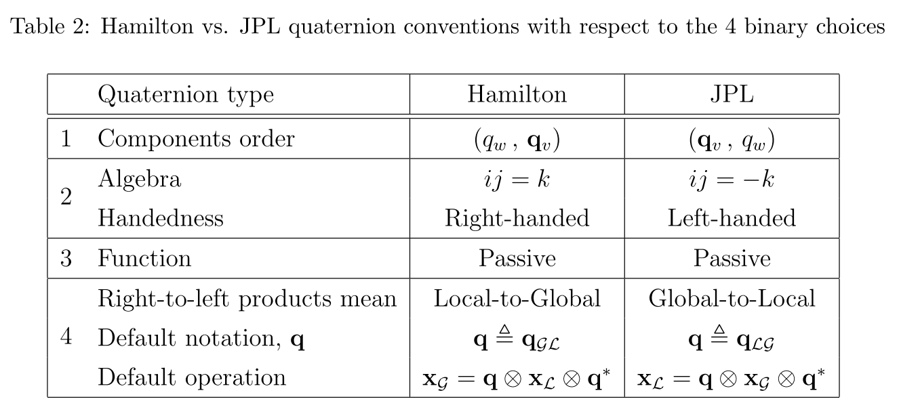

# MSCKF（二）——预测部分

----

[toc]

&nbsp;

----

## Reference

1. A Multi-State Constraint Kalman Filter for Vision-aided Inertial Navigation. MSCKF1.0的论文；
2. Quaternion Kinematics for Error-State KF. 关于四元数以及ESKF的论文；
3. Robust Stereo Visual Inertial Odometry for Fast Autonomous Flight. S-MSCKF对应的论文；
4. https://github.com/KumarRobotics/msckf_vio S-MSCKF的工程；
5. https://zhuanlan.zhihu.com/p/76341809 知乎上大佬对MSCKF的总结，本文没有过多的程序方面的讲解，都是从理论上推导的，也是个人的一些解惑过程；
6. https://blog.csdn.net/wubaobao1993/article/details/109297640  笔者写的关于两种四元数的表示；

> PS: MSCKF的工程算是我见过最贴近论文的工程了，基本上工程中的数学部分在论文里面都给了出来，所以对于MSCKF1.0来说，论文是一定要弄懂的。本篇将参考[1]和参考[3]放在一起进行梳理，因为两者确实很相似，不过在参考[3]中作者对能观性进行了一定程度的补偿。

&nbsp;

----

## EKF的状态变量构建

### 坐标系的表示问题

论文中{G}为世界(global)坐标系，{I}为IMU坐标系(或者称为机体坐标系)。

---

### 位姿表示方式

关于位姿的表示，在大多数的SLAM系统中，位姿表示一般为$T=\{q^{G}_{I}|t^{G}_{I}\}$，其中旋转部分为Hamilton的思源书表示法；但是MSCKF(或者大部分的EKF-base的VO/VIO系统)中的位姿表示变为了$T=\{{}^{I}_{G}q|p^{G}_{I}\}$，其中旋转部分为JPL的四元数表示法，这两种表示方法的区别和联系可以看笔者之前写的参考[6]，简单的说就是大佬们为了四元数乘法的一致性，自己又搞了一个表示方法出来，借用参考[2]中的区别图如下：

这里在本文的最后笔者会把两者的具体区别简单推导一下，这里先说比较影响推导的：

- 四元数的微分方程发生了变化，区别如下：

  - Hamilton表示法中，四元数的微分方程表示为$\dot{\mathbf{q}}=\frac{1}{2}\mathbf{q}\otimes\Omega(^Lw) $；
  - JPL表示法中，四元数的微分方程表示为$\dot{\mathbf{q}}=\frac{1}{2}\Omega(^Lw)\otimes \mathbf{q}$

  其中$\Omega(^Lw)$均用一个纯四元数（pure quaternions）的右乘矩阵形式（这个右乘矩阵是在Hamilton四元数表示法中的）：

$$
\Omega(w)=\begin{bmatrix}-[w]_{\times} & w \\ -w^T & 0 \end{bmatrix}
$$
- 四元数的扰动展开发生了变化：

  - 在Hamilton表示法中，扰动四元数表示为
    $$
    \mathrm{R}(\mathbf{\delta{q}}) \approx \mathrm{R}(\left[1, \frac{1}{2}\mathrm{\delta{\theta}}\right])=\mathrm{I_{3x3}}+[\delta{\theta}]_{\times}
    $$
    
  - 在JPL表示法中，扰动四元数表示为：
      $$
      \mathrm{R}(\mathbf{\delta{q}}) \approx \mathrm{R}(\left[1, \frac{1}{2}\mathrm{\delta{\theta}}\right])=\mathrm{I_{3x3}}-[\delta{\theta}]_{\times}
      $$

- 四元数参数的摄动坐标系的选择：
  
  - 在Hamilton表示法中，因为旋转是PBTW的，所以扰动量为$\delta{\theta}_{L'}^{L}$，参考系为{L}；
  - 在JPL表示法中，因为旋转是PWTB的，所以扰动量为${}_{L}^{L'}\delta{\theta}$，参考系也为{L}；

----

### IMU状态变量的表示方式

> Notation:
>
> 以下的参数表示中：
>
> 1. 若字母头上什么都没有，形如$\mathbf{X}$的形式，表示该变量为truth-state，这个值为理想值，永远不可能求得；
> 2. 若字母头上有尖号，形如$\widehat{\mathbf{X}}$，表示该变量为normal-state，也就是算法的估计值；
> 3. 若字母头上有飘号，形如$\widetilde{\mathbf{X}}$，表示该变量为error-state，也就是估计值与真值之间的差值；
> 4. 特别的，对于四元数表示旋转而言，头上都有一个横线，形如$\overline{\mathbf{q}}$，表示该四元数是一个单位四元数；

IMU状态变量一如既往的还是用5个变量表示，这里同时加上了相机与IMU的外参，如下：
$$
\mathrm{X}_{IMU}=\begin{bmatrix} ^{I}_{G}\overline{q}^T & b_g^{T} & ^{G}v_{I}^{T} & b_a^{T} & ^{G}p_{I}^{T} & ^{C}_{I}\overline{q} & ^{I}p_{C} \end{bmatrix}^{T}   \tag{1}
$$
IMU的error-state向量表示如下：
$$
\tilde{\mathrm{X}}_{IMU}=\begin{bmatrix} ^{I}_{G}\delta{\theta^T} & \tilde{b}_g^T & ^{G}\tilde{v}_{I}^T & \tilde{b}_{a}^T & ^{G}\tilde{p}_{I}^{T} & _{I}^{C}\delta{\theta}^T & ^{I}p_{C}^T \end{bmatrix}^{T}   \tag{2}
$$
这边稍微对Notation进行一下说明：

- 对于旋转的误差向量$\delta{\theta}$来说，我们通常认为其表示绕一个轴向旋转一个角度，这个轴向其实是有参考系的，一般情况下，**算法求解的旋转向量的参考系均为估计的机体坐标系（也可以说是摄动坐标系）**，即$\mathbf{\hat{L}}$或者$\mathbf{\hat{I}}$，而公式（2）中没有实际的体现出来，误差旋转向量前的字母完全是为了区别开IMU位姿和IMU与Camera外参；
- 对于非旋转的误差向量来说，他们均是在世界坐标系下表示的，所以前面的字母{G}、{I}和{C}均是有意义的，表示它的参考坐标系；
- 公式（2）中的IMU和Camera的相机外参中旋转的定义方向是不同的（实际上，如果按照参考3中的定义，那么它后面AppendixB中的Jacobian是不对的，且S-MSCKF的工程中，它的变量也是用IMU到Camera的旋转方向表示的）；

&nbsp;

---

### 带相机位姿的状态变量表示方式

k时刻的整个滤波器的位姿为：
$$
\mathrm{\widehat{X}_{k}}=\begin{bmatrix}\mathrm{\widehat{X}_{IMU}} & ^{C_1}_{G}\widehat{\overline{q}}^T & ^{G}\widehat{p}_{C_1}^T & ... & ^{C_N}_{G}\widehat{\overline{q}}^T & ^{G}\widehat{p}_{C_N}^T	\end{bmatrix}^T  \tag{3}
$$
对应的error-state为：
$$
\mathrm{\tilde{X}_{k}}=\begin{bmatrix}\mathrm{\tilde{X}_{IMU}} & \delta{\theta}_{C_1} & ^{G}\tilde{p}_{C_1}^T & ... & \delta{\theta}_{C_N} & ^{G}\tilde{p}_{C_N}^T	\end{bmatrix}^T  \tag{4}
$$
&nbsp;

----

## MSCKF位姿估计——估计的变量是什么？

这一小节主要搞清楚MSCKF中的状态量是什么，这个也是理解MSCKF的一个重要的部分。

相比于EKF-Base的方法，MSCKF使用的是ESKF的方式，也就是对**误差变量error-state**进行估计，而不是**对表示位姿的状态变量normal-state**进行估计。与Graph-base的方法求解的量是一样的。

使用ESKF的好处是不言而喻的，引用参考2中的原话：

- The orientation error-state is minimal (i.e., it has the same number of parameters as degrees of freedom), avoiding issues related to over-parametrization (or redundancy) and the consequent risk of singularity of the involved covariances matrices, resulting typically from enforcing constraints.
- The error-state system is always operating close to the origin, and therefore far from possible parameter singularities, gimbal lock issues, or the like, providing a guarantee that the linearization validity holds at all times.
- The error-state is always small, meaning that all second-order products are negligible. This makes the computation of Jacobians very easy and fast. Some Jacobians may even be constant or equal to available state magnitudes.
- The error dynamics are slow because all the large-signal dynamics have been inte- grated in the nominal-state. This means that we can apply KF corrections (which are the only means to observe the errors) at a lower rate than the predictions.

&nbsp;

----

## MSCKF位姿估计——状态变量的估计

搞清楚了估计的变量是什么之后（一定注意是error-state），下面就可以开始构建整个滤波问题了，但是因为本质上算法还是在求解状态变量（也就是$\widehat{\mathbf{X}}$），因此这里先看一下状态变量的递推过程；

### IMU姿态的传导（Propagation）

#### IMU的运动方程

对于IMU而言，姿态传导部分基本上依赖于IMU的运动方程，使用IMU的测量进行最新时刻的位姿的推导，并以此作为机体位姿转移到相机位姿上，在连续时域上，IMU的运动方程如下：
$$
\begin{aligned}
\begin{cases}
^{I}_{G}\dot{\bar{q}}(t) &=\frac{1}{2} \boldsymbol{\Omega}(\boldsymbol{\omega}(t))_{G}^{I} \bar{q}(t) \\ 
\dot{\mathbf{b}}_{g}(t) &=\mathbf{n}_{w g}(t) \\
^{G}\dot{\mathbf{v}}(t) &= ^{G}\mathbf{a}(t) \\ 
\dot{\mathbf{b}}_{a}(t) &=\mathbf{n}_{w a}(t) \\
^{G}\dot{\mathbf{p}}(t) &= ^{G}\mathbf{v}(t)
\end{cases}
\end{aligned}   \tag{5}
$$
其中四元数为JPL表示法，$\Omega$为上面的纯四元数右乘矩阵形式。

公式（5）中的参数均为理想情况下的参数，实际过程中的运动方程为：
$$
\begin{aligned}
\begin{cases}
^{I}_{G}\dot{\widehat{\bar{q}}}(t) &=\frac{1}{2} \boldsymbol{\Omega}(\boldsymbol{\widehat\omega}(t))_{G}^{I} \bar{q}(t) \\ 
\dot{\mathbf{\widehat b}}_{g}(t) &=0 \\
^{G}\dot{\mathbf{\widehat v}}(t) &= \mathbf{C}_{\hat{q}}^{T} \hat{\mathbf{a}}-2\left\lfloor\boldsymbol{\omega}_{G} \times\right\rfloor^{G} \hat{\mathbf{v}}_{I}-\left\lfloor\boldsymbol{\omega}_{G} \times\right\rfloor^{2} G_{\hat{\mathbf{p}}_{I}}+{ }^{G} \mathbf{g} \\ 
\dot{\mathbf{\widehat b}}_{a}(t) &= 0 \\
^{G}\dot{\mathbf{p}}(t) &= ^{G}\mathbf{\widehat v}(t)
\end{cases}
\end{aligned}   \tag{6}
$$
其中：

1. $\widehat \omega(t)=\omega_{m}-\widehat b_{g}-R^{b}_{w}\omega_{G}$，表示实际过程中通过测量减去零偏的值，同时作者这里考虑了地球转动的影响；
2. $\widehat a=a_m-\widehat b_a$，表示实际过程中通过测量减去零偏的值，作者在计算速度的微分时，也考虑了地球转动对于测量值的影响；
3. 以上均在连续时域中进行的分析，对连续函数进行离散化时需要在位置上考虑加速度的影响，这样会更加的准确一些（在开源的S-MSCKF代码中是没有考虑地球自传的影响的）；

&nbsp;

#### IMU状态积分

由IMU的运动方程可以得到一个非线性的微分方程，如下：
$$
\mathrm{\dot{X}_{IMU}}=\mathbf{f}(t, \mathrm{X_{IMU}}) \tag{7}
$$
可以使用参考2中的Appendix A中的方法对状态量进行更新，在S-MSCKF中采用的是RK4的方法。

----

### Camera姿态的传导

以上均是IMU位姿的递推过程，因为这个过程中并没有观测，因此相机的位姿都保持不变；

当有新的图像到来的时候，直接用IMU的最新位姿并经过IMU与相机的外参作为相机的最新位姿，公式如下：
$$
{ }_{G}^{C} \hat{\mathbf{q}}={ }_{I}^{C} \hat{\mathbf{q}} \otimes_{G}^{I} \hat{\mathbf{q}}, \quad{ }^{G} \hat{\mathbf{p}}_{C}={ }^{G} \hat{\mathbf{p}}_{C}+C\left(^{I}_{G}{\hat{q}}\right)^{\top}{ }^{I} \hat{\mathbf{p}}_{C} \tag{8}
$$
&nbsp;

----

## MSCKF位姿估计——预测阶段（predict）

这部分着重推导以误差状态变量为参数的EKF（也叫作ESKF）的预测阶段：

### IMU误差状态的微分方程

这部分请读者参考参考2第五章的内容，这里直接给出结论，如下，其中考虑了相机与IMU的外参变量：
$$
\dot{\tilde{\mathbf{X}}}_{\mathrm{IMU}}=\mathbf{F} \tilde{\mathbf{X}}_{\mathrm{IMU}}+\mathbf{G} \mathbf{n}_{\mathrm{IMU}}  \tag{9}
$$
其中：

1. $$
   \mathbf{F}=\left[\begin{array}{ccccc}
   -\lfloor\hat{\boldsymbol{\omega}} \times\rfloor & -\mathbf{I}_{3} & \mathbf{0}_{3 \times 3} & \mathbf{0}_{3 \times 3} & \mathbf{0}_{3 \times 3} & \mathbf{0}_{3 \times 3} & \mathbf{0}_{3 \times 3} \\
\mathbf{0}_{3 \times 3} & \mathbf{0}_{3 \times 3} & \mathbf{0}_{3 \times 3} & \mathbf{0}_{3 \times 3} & \mathbf{0}_{3 \times 3} & \mathbf{0}_{3 \times 3} & \mathbf{0}_{3 \times 3} \\
   -\mathbf{C}_{\hat{q}}^{T}\lfloor\hat{\mathbf{a}} \times\rfloor & \mathbf{0}_{3 \times 3} & \mathbf{0}_{3 \times 3} & \mathbf{-} \mathbf{C}_{\hat{q}}^{T} & \mathbf{0}_{3 \times 3} & \mathbf{0}_{3 \times 3} & \mathbf{0}_{3 \times 3} \\
   \mathbf{0}_{3 \times 3} & \mathbf{0}_{3 \times 3} & \mathbf{0}_{3 \times 3} & \mathbf{0}_{3 \times 3} & \mathbf{0}_{3 \times 3} & \mathbf{0}_{3 \times 3} & \mathbf{0}_{3 \times 3} \\
   \mathbf{0}_{3 \times 3} & \mathbf{0}_{3 \times 3} & \mathbf{I}_{3} & \mathbf{0}_{3 \times 3} & \mathbf{0}_{3 \times 3} & \mathbf{0}_{3 \times 3} & \mathbf{0}_{3 \times 3} \\
   \mathbf{0}_{3 \times 3} & \mathbf{0}_{3 \times 3} & \mathbf{0}_{3} & \mathbf{0}_{3 \times 3} & \mathbf{0}_{3 \times 3} & \mathbf{0}_{3 \times 3} & \mathbf{0}_{3 \times 3} \\
   \mathbf{0}_{3 \times 3} & \mathbf{0}_{3 \times 3} & \mathbf{0}_{3} & \mathbf{0}_{3 \times 3} & \mathbf{0}_{3 \times 3} & \mathbf{0}_{3 \times 3} & \mathbf{0}_{3 \times 3}
   \end{array}\right]
   $$
   
2. $$
   \mathbf{G}=\left[\begin{array}{cccc}
   -\mathbf{I}_{3} & \mathbf{0}_{3 \times 3} & \mathbf{0}_{3 \times 3} & \mathbf{0}_{3 \times 3}  \\
   \mathbf{0}_{3 \times 3} & \mathbf{I}_{3} & \mathbf{0}_{3 \times 3} & \mathbf{0}_{3 \times 3} \\
   \mathbf{0}_{3 \times 3} & \mathbf{0}_{3 \times 3} & -\mathbf{C}_{\hat{q}}^{T} & \mathbf{0}_{3 \times 3} \\
   \mathbf{0}_{3 \times 3} & \mathbf{0}_{3 \times 3} & \mathbf{0}_{3 \times 3} & \mathbf{I}_{3} \\
   \mathbf{0}_{3 \times 3} & \mathbf{0}_{3 \times 3} & \mathbf{0}_{3 \times 3} & \mathbf{0}_{3 \times 3} \\
   \mathbf{0}_{3 \times 3} & \mathbf{0}_{3 \times 3} & \mathbf{0}_{3 \times 3} & \mathbf{0}_{3 \times 3} \\
   \mathbf{0}_{3 \times 3} & \mathbf{0}_{3 \times 3} & \mathbf{0}_{3 \times 3} & \mathbf{0}_{3 \times 3}
   \end{array}\right]
   $$

稍微不同的一点是参考2中考虑了重力，而这里并没有考虑重力。

> Notation
>
> 公式（6）中考虑了地球的自转（MSCKF1.0论文中的做法），但是公式（9）中没有考虑（S-MSCKF论文中的做法）。

----

### IMU误差状态传递过程的推导

根据MSCKF2.0中的表述，在MSCK1.0中使用的是数值推导而非理论推导，这里先按照1.0中的思路来，之后总结2.0的时候再按照2.0的方法进行推导。

公式（9）表示了误差状态的微分关系，根据线性系统的离散化知识，可以得到误差状态的递推方程为：
$$
\boldsymbol{\tilde{X}}\left(t_{k+1}\right)=\boldsymbol{\Phi}\left(t_{k+1}, t_{k}\right) \boldsymbol{\tilde{X}}\left(t_{k}\right)+\int_{t_{k}}^{t_{k+1}} \boldsymbol{\Phi}\left(t_{k+1}, \tau\right) \boldsymbol{G}(\tau) \boldsymbol{n}(\tau) \mathrm{d} \tau \tag{10}
$$
其中状态传递矩阵$\dot\Phi(t_{k+1}, t_k)=F(t)\Phi(t_{k+1})$，可以明显看到，该状态转移矩阵的闭式解是指数函数，形式为：
$$
\boldsymbol{\Phi}\left(t_{k+1}, t_{k}\right)=\exp \int_{t_{k}}^{t_{k+1}} \boldsymbol{F}(t) \mathrm{d} t   \tag{11}
$$
针对公式（8），对协方差矩阵进行推导的话可以得到：
$$
\begin{aligned}
E\left[\boldsymbol{W}_{k} \boldsymbol{W}_{j}^{\mathrm{T}}\right]=& E\left[\int_{t_{k}}^{t_{k+1}} \boldsymbol{\Phi}\left(t_{k+1}, t\right) \boldsymbol{G}(t) \boldsymbol{w}(t) \mathrm{d} t \cdot \int_{t_{j}}^{t_{j+1}} \boldsymbol{w}^{\mathrm{T}}(\tau) \boldsymbol{G}^{\mathrm{T}}(\tau) \boldsymbol{\Phi}^{\mathrm{T}}\left(t_{k+1}, \tau\right) \mathrm{d} \tau\right] \\
&= \int_{t_{k}}^{t_{k+1}} \boldsymbol{\Phi}\left(t_{k+1}, t\right) \boldsymbol{G}(t)\left[\int_{t_{j}}^{t_{j+1}} E\left[\boldsymbol{w}(t) \boldsymbol{w}^{\mathrm{T}}(\tau)\right] \cdot \boldsymbol{G}^{\mathrm{T}}(\tau) \boldsymbol{\Phi}^{\mathrm{T}}\left(t_{k+1}, \tau\right) \mathrm{d} \tau\right] \mathrm{d} t\\
&= \int_{t_{k}}^{t_{k+1}} \boldsymbol{\Phi}\left(t_{k+1}, t\right) \boldsymbol{G}(t)\left[\int_{t_{j}}^{t_{j+1}} \boldsymbol{q} \delta(t-\tau) \boldsymbol{G}^{\mathrm{T}}(\tau) \boldsymbol{\Phi}\left(t_{k+1}, \tau\right) \mathrm{d} \tau\right] \mathrm{d} t
\end{aligned}  \tag{12}
$$
于是看到，当$t！=\tau$的时候，因为狄更斯函数的关系导致积分值为0；而当$t==\tau$的时候，整个积分不为0：
$$
\left.E\left[\boldsymbol{W}_{k} \boldsymbol{W}_{j}^{\mathrm{T}}\right]\right|_{j=k}=\int_{t_{k}}^{t_{k+1}} \boldsymbol{\Phi}\left(t_{k+1}, t\right) \boldsymbol{G}(t) \boldsymbol{q} \boldsymbol{G}^{\mathrm{T}}(t) \boldsymbol{\Phi}^{\mathrm{T}}\left(t_{k+1}, t\right) \mathrm{d} t \tag{13}
$$
对于离散情况而言，如果采样周期足够短，我们可以简单的假设在$t \in [t_k, t_{k+1}]$这段时间内，转移矩阵$\Phi$和驱动矩阵$G$均不变化，于是整个**误差状态**传递过程就比较明了了：

1. 通过公式（9）获得误差状态**微分方程**的传递矩阵$\mathbf{F(t)}$；
2. 通过公式（11）获得**误差状态**的转移矩阵$\mathbf{\Phi(t_{k+1}, t_k)}$，这里通常使用泰勒展开，论文中保留到了三阶；
3. 通过公式（13）获得误差状态的系统协方差矩阵$\mathrm{Q}$；

----

### IMU误差状态的预测部分

由上面的推导可以得到以IMU误差状态为估计量的KF的预测过程（这里直接在离散时域上推导）：
$$
\begin{aligned}
\begin{cases}
\mathrm{\tilde{x}_{k+1}^{IMU}} &= \Phi(\mathrm{k+1},\mathrm{k})\mathrm{\tilde{x}_k^{IMU}} \\
\mathrm{P_{k+1|k}^{IMU}} &=\Phi(\mathrm{k+1},\mathrm{k})\mathrm{P_{k|k}^{IMU}}\Phi(\mathrm{k+1},\mathrm{k})^T + \Phi(\mathrm{k+1},\mathrm{k})\mathrm{G}\mathrm{N}\mathrm{G}^T\Phi(\mathrm{k+1},\mathrm{k})^T
\end{cases}
\end{aligned}  \tag{14}
$$
其中：

1. 转移矩阵$\Phi(k+1, k)$由公式（11）算的的闭式解表示，程序中采用了泰勒展开的前三阶表示；
2. 矩阵G为微分方程的噪声驱动矩阵，这里假设在k到k+1时刻，该矩阵恒定不变；
3. 噪声协方差矩阵N是IMU的固有属性，这些值可以由数据手册获得，也可以根据实际数据估计一下；

----

### Camera误差状态的预测部分

因为在预测阶段并没有相机姿态的信息，因此对于k+1时刻之前的误差状态其实都是不变的，对于最新时刻的相机位姿的误差状态，算法直接给0就可以了，**而且其实对于ESKF而言，每次使用观测更新完误差变量之后，当次的误差变量是要reset为0的，所以其实每次的预测方程我们仅仅关注协方差矩阵的部分就足够了**，所以下面主要分三个部分推导一下协方差的更新：

#### k+1帧之前的Camera自身的协方差更新

由于Camera这部分没有任何的信息，因此对于预测部分，可以认为其状态转移矩阵为单位阵，噪声驱动矩阵为全零矩阵，所以Camera的协方差不做变化；
$$
\mathrm{P_{k+1|k}^{CC}}=\mathrm{P_{k}^{CC}} \tag{15}
$$
&nbsp;

#### k+1帧之前的IMU与Camera的协方差更新

该部分因为IMU的状态更新了，因此IMU方差（这里说是方差是想把IMU与Camera看做两个简单的变量）发生变化，导致IMU与Camera的协方差变化，如下：
$$
\begin{aligned}
\mathrm{P_{k+1|k}^{IC}}&=\mathrm{E}((\mathrm{\tilde{x}^{IMU}_{k+1|k}-\hat{\tilde{x}}^{IMU}_{k+1|k}})(\mathrm{\tilde{x}^{CAM}_{k+1|k}-\hat{\tilde{x}}^{CAM}_{k+1|k}})) \\
&=\mathrm{E}(\Phi(k+1,k)(\mathrm{\tilde{x}^{IMU}_{k}-\hat{\tilde{x}}^{IMU}_{k}})(\mathrm{\tilde{x}^{CAM}_{k}-\hat{\tilde{x}}^{CAM}_{k}})) \\
&=\Phi(k+1, k)\mathrm{E}((\mathrm{\tilde{x}^{IMU}_{k}-\hat{\tilde{x}}^{IMU}_{k}})(\mathrm{\tilde{x}^{CAM}_{k}-\hat{\tilde{x}}^{CAM}_{k}})) \\
&=\Phi(k+1,k)\mathrm{P_{k}^{IC}}
\end{aligned}  \tag{16}
$$
&nbsp;

#### k+1帧的协方差初值

对于k+1帧来说，因为是从IMU的位姿直接拿过来使用的，因此k+1帧的误差向量初值与当前IMU的误差向量的协方差息息相关，具体关系主要由公式（8）得到：

设k+1帧的误差向量为$^{C}_{G}\delta{\theta}$和$\mathrm{^{G}{\tilde{p}}_{C}}$，该误差向量与IMU的误差向量关系如下：

##### 旋转的误差向量

四元数的推导因为涉及到左乘矩阵和右乘矩阵等等，推导有些繁琐，这里使用旋转矩阵的方法：
$$
\begin{aligned}
\mathrm{R(_{G}^{C}\delta{\theta})} = \mathrm{I_{3x3}}-[_{G}^{C}\delta{\theta}]_{\times} &= \mathrm{R_{G}^{C}}\mathrm{\hat{R_{G}^{C}}}^T \\
&=\underbrace{\mathrm{R(_{I}^{C}\delta{\theta})}\mathrm{\hat{R}_{I}^{C}}\mathrm{R(_{G}^{I}\delta{\theta})\mathrm{\hat{R}_{G}^{I}}}}_{\mathrm{R_{G}^{C}}} (\underbrace{\mathrm{\hat{R}_{I}^{C}}\mathrm{\hat{R}_{G}^{I}}}_{\mathrm{\hat{R_{G}^{C}}}})^T \\
&=(\mathrm{I_{3x3}}-[_{I}^{C}\delta{\theta}]_{\times})\mathrm{\hat{R}_{I}^{C}}(\mathrm{I_{3x3}}-[_{G}^{I}\delta{\theta}]_{\times})(\mathrm{\hat{R}_{I}^{C}})^T \\
&=\mathrm{I_{3x3}}-[_{I}^{C}\delta{\theta}]_{\times}-\mathrm{\hat{R}_{I}^{C}}[_{G}^{I}\delta{\theta}]_{\times}(\mathrm{\hat{R}_{I}^{C}})^T \\
&= \mathrm{I_{3x3}}-[_{I}^{C}\delta{\theta}]_{\times}-[\mathrm{\hat{R}_{I}^{C}}_{G}^{I}\delta{\theta}]_{\times} + o(2)
\end{aligned}
$$
省略最后的二阶无穷小，并且等号左右两边消元，将反对称矩阵映射回向量空间可以推得：
$$
_{G}^{C}\delta{\theta} = \mathrm{\hat{R}_{I}^{C}} {}_{G}^{I}\delta{\theta} + {}_{I}^{C}\delta{\theta} \tag{17}
$$
&nbsp;

##### 位置的误差向量

$$
\begin{aligned}
^{G}\mathrm{\tilde{p}_{C}} &= ^{G}\mathrm{{p}_{C}}-^{G}\mathrm{\hat{p}_{C}} \\
&= \underbrace{^{G}\mathrm{\hat{p}_{I}}+^{G}\mathrm{\tilde{p}_{I}}+(\mathrm{R(_{G}^{I}\delta{\theta})\hat{R}_{G}^{I})^{T}(^{I}\mathrm{\hat{p}_{C}}+^{I}\mathrm{\tilde{p}_{C}})}}_{^{G}\mathrm{{p}_{C}}}-(\underbrace{^{G}\mathrm{\hat{p}_{I}}+(\mathrm{\hat{R}_{G}^{I})^{T} {}^{I}\mathrm{\hat{p}_{C}}}}_{^{G}\mathrm{\hat{p}_{C}}}) \\
&= ^{G}\mathrm{\tilde{p}_{I}}+\mathrm{\hat{R}_{G}^{I}}^{T}(\mathrm{I_{3x3}}+[_{G}^{I}\delta{\theta}]_{\times})^{I}\mathrm{\hat{p}_{C}}+\mathrm{\hat{R}_{G}^{I}}^{T}(\mathrm{I_{3x3}}+[_{G}^{I}\delta{\theta}]_{\times})^{I}\mathrm{\tilde{p}_{C}}-(\mathrm{\hat{R}_{G}^{I})^{T} {}^{I}\mathrm{\hat{p}_{C}}} \\
&= ^{G}\mathrm{\tilde{p}_{I}}+\mathrm{\hat{R}_{G}^{I}}^{T}([_{G}^{I}\delta{\theta}]_{\times})^{I}\mathrm{\hat{p}_{C}}+\mathrm{\hat{R}_{G}^{I}}^{T}\mathrm{\tilde{p}_{C}}+o(2)
\end{aligned}
$$

省略二阶无穷小并根据反对称矩阵相乘的性质得：
$$
^{G}\mathrm{\tilde{p}_{C}} = -\mathrm{\hat{R}_{G}^{I}}^{T}([{}^{I}\mathrm{\hat{p}_{C}}]_{\times}) {}_{G}^{I}\delta{\theta} +^{G}\mathrm{\tilde{p}_{I}}+\mathrm{\hat{R}_{G}^{I}}^{T}\mathrm{\tilde{p}_{C}} \tag{18}
$$
&nbsp;

##### Camera与IMU的状态转移方程

根据公式（17）和（18）很容易得到Camera的误差向量与IMU的误差向量的关系：
$$
\mathrm{\tilde{X}^{CAM}_{k+1|k}}=\begin{bmatrix} {}_{G}^{C}\delta{\theta} \\ ^{G}\tilde{p}_{C} \end{bmatrix}=\begin{bmatrix}\mathrm{\hat{R}_{I}^{C}} & \mathbf{0}_{3x3} & \mathbf{0}_{3x3} & \mathbf{0}_{3x3} & \mathbf{0}_{3x3} & \mathbf{I}_{3x3} & \mathbf{0}_{3x3} \\ 
-\mathrm{\hat{R}_{G}^{I}}^{T}([{}^{I}\mathrm{\hat{p}_{C}}]_{\times}) & \mathbf{0}_{3x3} & \mathbf{0}_{3x3} & \mathbf{0}_{3x3} & \mathbf{I}_{3x3} & \mathbf{0}_{3x3} & \mathrm{\hat{R}_{G}^{I}}^{T} \end{bmatrix} \begin{bmatrix} ^{I}_{G}\delta{\theta} \\ \tilde{b}_g \\ ^{G}\tilde{v}_{I} \\ \tilde{b}_{a} \\ ^{G}\tilde{p}_{I} \\ _{I}^{C}\delta{\theta} \\ ^{I}p_{C} \end{bmatrix} = \mathbf{J}^{CAM}_{IMU} \mathrm{\tilde{X}^{IMU}_{k+1|k}} \tag{19}
$$
于是根据线性系统的理论，k+1时刻Camera的协方差为：
$$
\mathrm{P}^{CAM}_{k+1|k}=\mathbf{J}_{IMU}^{CAM} \mathrm{P}^{IMU}_{k+1|k} (\mathbf{J}_{IMU}^{CAM})^T  \tag{20}
$$

----

### 预测部分总结

结合公式（14）（15）（16）（20），容易得出，在预测阶段，协方差的传导（propagation）可以分为两步：

1. 最新帧没有到来的更新：
   $$
   \mathrm{P}_{k+1|k}=\begin{bmatrix} \mathrm{P}^{IMU}_{k+1|k} & \Phi(k+1, k)\mathrm{P}^{IC}_{k|k} \\ (\Phi(k+1, k)\mathrm{P}^{IC}_{k|k})^T & \mathrm{P}^{CAM}_{k|k} \end{bmatrix}  \tag{21}
   $$

2. 最新帧到来，进行状态扩展（state augmentation）:
   $$
   \mathbf{P}_{k+1 \mid k} \leftarrow\left[\begin{array}{c}
   \mathbf{I}_{6 N+21} \\
   \mathbf{J}
   \end{array}\right] \mathbf{P}_{k+1 \mid k}\left[\begin{array}{c}
   \mathbf{I}_{6 N+21} \\
   \mathbf{J}
   \end{array}\right]^{T} \tag{22}
   $$
   这个地方和论文中也不一样，论文中的协方差均是$\mathbf{P}_{k|k}$，但是实际上应该是经过预测步骤更新过的协方差矩阵进行扩充；

&nbsp;

------

## 总结

本文主要介绍了MSCKF的预测部分，重点主要是：

1. 对于MSCKF而言，待估计量为Error-State；
2. 由IMU的运动方程可以对Normal-State进行积分；
3. 由Error-State的微分方程可以推导得到状态转移方程的闭式解，进而构成了整个Kalman Filter的预测部分；

