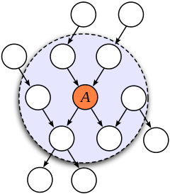

# Decoupled, Consistent Node Removal and Edge Sparsification for Graph-based SLAM

---

## Abstract

基于图优化的SLAM方法已经取得了成功，但是图的大小会随着时间的增长而变得很大，从而变得computational costs。为了解决这个问题，论文使用分开的边缘化和稀疏化解决这个问题。同时，论文还做了以下两个工作：

1. 论文验证了在边缘化的时候，构建密集因子时使用的线性化点要使用Markov blanket的相对位姿，而不是绝对位姿；
2. 在稀疏化的时候，论文通过在线的方法来确定最相似的稀疏结构，而不是通过离线的结构选择；

---

## Introduction

首先在实践中，有两种方法——Generic LInear Contraints(GLC)和Nonlinear Factor Recovery(NFR)。但是这两个方法都是将边缘化和稀疏化是耦合的，但是这种方法并不能保证所有的信息都能保存在稠密因子中，主要原因是因为边缘化和稀疏化都在同一时刻的话，稀疏化的线性化点并不是边缘化之后的线性化点，也就是说，稀疏化的时候并没有最大程度的利用稠密因子的信息。

所以在这个论文中，作者将这两个操作解耦了，在边缘化之后进行稀疏化，保证可以利用边缘化留下的信息。最后，在稀疏化的过程中主要构建了一个稀疏正则的凸优化来在线决定如何进行图的稀疏。本文的工作主要有：

- 在局部图上（Markov blanket）进行边缘化和稀疏化。在边缘化的时候，在局部地图上找到一个参考点，并求解最大似然问题，相比于使用全局的位姿，这样的方法才能保证一致性。边缘化之后的分布将以非线性测量的形式为后续的优化提供先验信息；
- 操作的解耦一方面是为了更好的利用边缘化信息，另一方面是为了更好的分散计算量。在稀疏化的工程中，首先对稠密分布的内部团（**团概念**参考图模型的相关文章）因子进行稀疏化（就是与被边缘化帧相关的帧），注意这些约束要在稀疏化之前被排除出来，这样保证稀疏化之前能对这些测量进行再次的线性化（相当于也没有丢掉，只是以另一种形式存在了）；然后构建一个L1正则凸优化来决定最终要优化的稀疏结构，这个结构旨在获得一组最好的反应Markov blanket中全部信息的稀疏测量值，然后以此来代替稠密因子；

> PS: Markov blanket
>
> 直译为马尔科夫毯子，也有翻译为马尔科夫覆盖域，一个例子如下图1。因为这个概念是全文得以推导的基础，因此这里有必要着重说一下：
>
> 1. wiki百科对Markov blanket解释为：“the **Markov blanket** for a [node](https://en.wikipedia.org/wiki/Vertex_(graph_theory)) in a [graphical model](https://en.wikipedia.org/wiki/Graphical_model) contains all the variables that shield the node from the rest of the network. This means that the Markov blanket of a node is the only knowledge needed to predict the behavior of that node and its children”，我个人的理解是说Markov blanket要包含一些node，这些node是为了做预测所需要的全部信息，而网络中的其他信息都可以被屏蔽。
> 2. 在下图中，可以看到如果我们以节点A来建立一个Markov blanket，那么此时A的父节点、兄弟节点以及子节点都是影响A预测的因素，因此他们和A一起构成了一个Markov blanket。
>
> 

---

## Related Work

为了解决基于图的SLAM系统的计算量，人们尝试了很多种方法，但是边缘化是一种最稳妥的方法，因为这样可以很好的保留之前的信息不被丢失，但是边缘化之后会导致图变得稠密，但是可以通过近似的方法减少这部分填充。

GLC 方法在边缘化节点的markov blanket上应用边缘化，但使用了内部团的测量，从而产生n元线性约束来近似覆盖域。 但是，这些线性因子是在全局状态下被估计的，这可能导致测量的不一致性。

NFR方法不同，他的因子并不限制为线性的。这些因子的信息矩阵是通过最小化近似边缘分布与原始边缘分布的KL散度来获得的。除了使用全局的状态来进行线性化，作者也尝试了局部状态的估计作为线性化点，但是作者并没有严格的论证。

上述两个方法有一个共同的特点，就是他们的近似都是采用预先决定的稀疏结构对边进行加权的方法，并不是在线的计算这个稀疏的结构。

文章为了解决上述的问题，首先是把边缘化和稀疏化进行了解耦，其次就是在线的计算稀疏结构，最后就是论证了使用局部的估计是最好的办法。

---

## Graph-based SLAM

这个章节就是介绍了一下整个基于图优化的SLAM的方法，主要是下面三个公式：

1. 观测方程，观测认为是满足一个高斯分布
   $$
   \mathbf{z}_{i j}=\mathbf{h}_{i j}\left(\mathbf{x}_{i}, \mathbf{x}_{j}\right)+\mathbf{n}_{i j}
   $$

2. 最大似然问题：
   $$
   \hat{\mathbf{x}}=\arg \min _{\mathbf{x}} \sum_{(i, j) \in \operatorname{supp}(\mathbf{z})}\left\|\mathbf{z}_{i j}-\mathbf{h}_{i j}\left(\mathbf{x}_{i}, \mathbf{x}_{j}\right)\right\|_{\Lambda_{i j}}^{2} \tag{1}
   $$

3. 最大似然转换为非线性最小二乘问题，使用高斯牛顿方法如下：
   $$
   \delta \mathbf{x}^{(k)}=\arg \min _{\delta \mathbf{x}} \sum_{(i, j) \in \operatorname{supp}(\mathbf{z})}\left\|\mathbf{z}_{i j}-\mathbf{h}_{i j}\left(\hat{\mathbf{x}}_{i}^{(k)}, \hat{\mathbf{x}}_{j}^{(k)}\right)-\mathbf{J}_{i j}^{(k)} \delta \mathbf{x}\right\|_{\Lambda_{i j}}^{2} \tag{2}
   $$

4. 更新状态变量：
   $$
   \hat{\mathbf{x}}^{(k+1)}=\hat{\mathbf{x}}^{(k)}+\delta \mathbf{x}^{(k)}
   $$
   

---

## Marginalization

首先构建一个Markov blanket，其中以$X_1$为中心节点，如下图2：

其中：

- 红色的顶点代表被边缘化的帧，表示为$X_m=\{X_1\}$；
- 绿色的顶点代表关联帧，表示为$X_b=\{X_0, X_2, X_3\}$；
- 蓝色的顶点表示无关帧，表示为$X_r=\{X_4\}$；
- 红色的测量表示与边缘化帧相关的测量，表示为$Z_m=\{Z_{01}, Z{_{12}}\}$；
- 绿色的测量表示与关联帧相关的测量，表示为$Z_c=\{Z_0, Z_{03}, Z_{23}\}$；
- 蓝色的测量表示与无关帧相关的测量，表示为$Z_r=\{Z_{04}, Z_{34}\}$；

当Markov blanket建立完成之后，就把边缘化的节点在局部边缘化掉，公式如下：
$$
\begin{equation}
p\left(\mathbf{x}_{b} | \mathbf{z}_{m}\right)=\int_{\mathbf{x}_{m}} p\left(\mathbf{x}_{b}, \mathbf{x}_{m} | \mathbf{z}_{m}\right) \mathrm{d} \mathbf{x}_{m}=: \mathcal{N}\left(\hat{\mathbf{x}}_{b}, \mathbf{\Lambda}_{t}^{-1}\right)  \tag{3}
\end{equation}
$$
实际中相当于仅仅用$X_b, X_m, Z_m$构建最大似然估计问题，然后把$X_m$边缘化掉，下面就是边缘化的理论推导了：

### 使用边缘化求解$X_b$的先验分布

实际上，对于求解公式（3）的时候，我们需要使用贝叶斯公式求解一个最大后验的问题，但是因为并没有$X_m，X_b$的先验信息，所以最终求解的还是一个最大似然的问题（$p(X_m, X_b|Z_m) \propto p(Z_m|X_b, X_m) $）：
$$
\begin{array}{l}
{\left\{\hat{\mathbf{x}}_{b}, \hat{\mathbf{x}}_{m}\right\}=\arg \max _{\mathbf{x}_{b}, \mathbf{x}_{m}} p\left(\mathbf{z}_{m} | \mathbf{x}_{b}, \mathbf{x}_{m}\right)=} \\
{\arg \min _{\mathbf{x}_{b}, \mathbf{x}_{m}} \sum_{(i, j) \in \operatorname{supp}\left(\mathbf{z}_{m}\right)}\left\|\mathbf{z}_{i j}-\mathbf{h}_{i j}\left(\mathbf{x}_{i}, \mathbf{x}_{j}\right)\right\|_{\Lambda_{i j}}^{2}}
\end{array} \tag{4}
$$
其中信息矩阵为：
$$
\boldsymbol{\Lambda}=\sum_{(i, j) \in \operatorname{supp}\left(\mathbf{z}_{m}\right)} \mathbf{J}_{i j}^{\top} \boldsymbol{\Lambda}_{i j} \mathbf{J}_{i j}=:\left[\begin{array}{cc}
{\boldsymbol{\Lambda}_{m m}} & {\boldsymbol{\Lambda}_{m b}} \\
{\boldsymbol{\Lambda}_{b m}} & {\boldsymbol{\Lambda}_{b b}}
\end{array}\right]
$$
其中$J_{ij}$使用局部估计的线性点，使用Schur补就可以得到边缘化之后的$X_b$的信息矩阵，如下：
$$
\boldsymbol{\Lambda}_{t}=\boldsymbol{\Lambda}_{b b}-\boldsymbol{\Lambda}_{b m} \boldsymbol{\Lambda}_{m m}^{-1} \boldsymbol{\Lambda}_{b m}^{\top}
$$
得到先验信息之后，整个没有边缘化的MLE（最大似然估计）问题（公式1）就可以写作下面带先验的非线性最小二乘问题（这个是一个引理，下面证明）：
$$
\hat{\mathbf{x}}=\arg \min _{\mathbf{x}}\left\|\hat{\mathbf{x}}_{b}-\mathbf{x}_{b}\right\|_{\Lambda_{t}}^{2}+\sum_{(i, j) \in \operatorname{supp}\left(\mathbf{z}_{r}, \mathbf{z}_{c}\right)}\left\|\mathbf{z}_{i j}-\mathbf{h}_{i j}\left(\mathbf{x}_{i}, \mathbf{x}_{j}\right)\right\|_{\Lambda_{i j}}^{2} \tag{5}
$$

> 引理：如果Jacobian和信息矩阵都使用公式（4）所示的局部MLE估计的线性化点，那么边缘化的非线性化最小二乘问题可以最好的近似未边缘化的MLE问题。
>
> 证明：
>
> - 原始局部MLE问题的误差形式：
> $$
> c(\mathbf{x})=c_{m}\left(\mathbf{x}_{m}, \mathbf{x}_{b}\right)+c_{r}\left(\mathbf{x}_{b}, \mathbf{x}_{r}\right)
> $$
> ​		其中$c_m$表示边缘化边的误差项，$c_r$表示非边缘化边的误差项；
>
> - 求解使得误差最小时的状态变量：
> $$
> \min _{\mathbf{x}} c(\mathbf{x})=\min _{\mathbf{x}_{b}, \mathbf{x}_{r}}\left(\min _{\mathbf{x}_{m}} c\left(\mathbf{x}_{m}, \mathbf{x}_{b}, \mathbf{x}_{n}\right)\right)=\min _{\mathbf{x}_{b}, \mathbf{x}_{r}}\left(c_{r}\left(\mathbf{x}_{b}, \mathbf{x}_{r}\right)+\min _{\mathbf{x}_{m}} c_{m}\left(\mathbf{x}_{m}, \mathbf{x}_{b}\right)\right)
> $$
> ​		可以看到又因为要边缘化掉$X_m$状态量，因此式子最后只把最小化$X_m$项添加进去了；
>
> - 对$c_{m}\left(\mathbf{x}_{m}, \mathbf{x}_{b}\right)$进行近似，有如下形式：
> $$
> c_{m} \simeq c_{m}\left(\hat{\mathbf{x}}_{m}, \hat{\mathbf{x}}_{b}\right)+\mathbf{g}^{T}\left[\begin{array}{c}
> {\mathbf{x}_{m}-\hat{\mathbf{x}}_{m}} \\
> {\mathbf{x}_{b}-\hat{\mathbf{x}}_{b}}
> \end{array}\right]+\frac{1}{2}\left[\begin{array}{c}
> {\mathbf{x}_{m}-\hat{\mathbf{x}}_{m}} \\
> {\mathbf{x}_{b}-\hat{\mathbf{x}}_{b}}
> \end{array}\right]^{T} \mathbf{\Lambda}\left[\begin{array}{c}
> {\mathbf{x}_{m}-\hat{\mathbf{x}}_{m}} \\
> {\mathbf{x}_{b}-\hat{\mathbf{x}}_{b}}
> \end{array}\right]   \tag{6}
> $$
> ​		其中$g$表示公式(1)对于状态的求导（其实相当于是增量方程中的$b$项），即：
> $$
> \frac{\partial{e^2}}{\partial{X}} = 2e\frac{\partial{e}}{\partial{X}}=2e
> \begin{bmatrix}
> \frac{\partial{e}}{\partial{X_m}} \\ \frac{\partial{e}}{\partial{X_b}} 
> \end{bmatrix} = 
> \begin{bmatrix}
> g_{mm} \\ g_{mb}
> \end{bmatrix}
> \text{ where } e=\mathbf{z}_{i j}-\mathbf{h}_{i j}\left(\mathbf{x}_{i}, \mathbf{x}_{j}\right)
> $$
> ​		然后信息矩阵还是也一样，是$e^2$对状态的求导，不过推导出来和上面的信息矩阵一样（跟增量方程中的$H$一		样），即：
> $$
> \boldsymbol{\Lambda}=\left[\begin{array}{cc}
> {\boldsymbol{\Lambda}_{m m}} & {\boldsymbol{\Lambda}_{m b}} \\
> {\boldsymbol{\Lambda}_{b m}} & {\boldsymbol{\Lambda}_{b b}}
> \end{array}\right]
> $$
>
> - **随后就是求导等于0**，然后运行schur补，可以得到最优的$X_m$值为：
> $$
> \mathbf{x}_{m}=\hat{\mathbf{x}}_{m}-\mathbf{\Lambda}_{m m}^{-1}\left(\mathbf{g}_{m m}+\mathbf{\Lambda}_{m b}\left(\mathbf{x}_{b}-\hat{\mathbf{x}}_{b}\right)\right)
> $$
>
> - 把上式代入原式中可以得到误差仅与$X_b$的关系，如下：
> $$
> \min _{\mathbf{x}_{m}} c_{m}\left(\mathbf{x}_{m}, \mathbf{x}_{b}\right) \simeq \zeta+\mathbf{g}_{t}^{T}\left(\mathbf{x}_{b}-\hat{\mathbf{x}}_{b}\right)+\frac{1}{2}\left(\mathbf{x}_{b}-\hat{\mathbf{x}}_{b}\right)^{T} \mathbf{\Lambda}_{t}\left(\mathbf{x}_{b}-\hat{\mathbf{x}}_{b}\right)
> $$
> ​		需要注意的是这里的误差和上面的$c_{m}\left(\hat{\mathbf{x}}_{m}, \hat{\mathbf{x}}_{b}\right)$不一样的，如果需要解的话，需要从$g_t$和$\Lambda$联合求解出来，		不过因为这个值在边缘化之后，就固定了，所以可以忽略这个值继续求解增量等值；
>
> - 所以最终误差项变为：
>
> $$
> \begin{aligned}
> c_{r}^{\prime}\left(\mathbf{x}_{b}, \mathbf{x}_{r}\right) &=\mathbf{g}_{t}^{T}\left(\mathbf{x}_{b}-\hat{\mathbf{x}}_{b}\right)+\frac{1}{2}\left(\mathbf{x}_{b}-\hat{\mathbf{x}}_{b}\right)^{T} \mathbf{\Lambda}_{t}\left(\mathbf{x}_{b}-\hat{\mathbf{x}}_{b}\right) \\
> &+\frac{1}{2} \sum_{(i, j) \in \operatorname{supp}\left(\mathbf{z}_{r}, \mathbf{z}_{c}\right)}\left\|\mathbf{z}_{i j}-\mathbf{h}_{i j}\left(\mathbf{x}_{i}, \mathbf{x}_{j}\right)\right\|_{\Lambda_{i j}}^{2}
> \end{aligned}  \tag{7}
> $$
>
> - 进一步，如果我们的线性化点是整个局部图的最优值，那么公式（6）中的$g$就会为0，进而公式（7）中的$ g_t $也为0，所以公式（7）也就写作公式（5）。但是实际上，我们在使用的时候依旧选择公式（7）的形式，因为我们并不能保证当时的线性化点就是最优的，如果是，那么$g_t$为0，也不会影响结果。
>
>   

下面深入一点，来看一下我们得到了先验之后，怎么用这个先验：

当状态$X_m$被边缘化掉之后，之后的优化我们求解公式（7）所示的误差函数就可以了，后一项很熟悉，就是BA的误差，这里不再多讲；对于先验项，在K时刻，我们需要利用这个信息构建增量方程，过程如下：

1. 首先把先验的部分提取出来，如下：
   $$
   c_{b}^{\prime}\left(\mathbf{x}_{b}\right) =\mathbf{g}_{t}^{T}\left(\mathbf{x}_{b}-\hat{\mathbf{x}}_{b}\right)+\frac{1}{2}\left(\mathbf{x}_{b}-\hat{\mathbf{x}}_{b}\right)^{T} \mathbf{\Lambda}_{t}\left(\mathbf{x}_{b}-\hat{\mathbf{x}}_{b}\right) \tag{8}
   $$

2. 当有增量$\delta{x_b}$时，取泰勒二阶展开式为：
   $$
   c_{b}^{\prime}\left(\mathbf{x}_{b}+\delta{x_b}\right)=c_{b}^{\prime}(x_b)+\frac{\partial{c_b^{\prime}}}{\partial{x_b}}\delta{x_b}+\delta{x_b}^T \frac{\partial^2{c_b^{\prime}}}{\partial{x_b}^2}\delta{x_b} \tag{9}
   $$
   其中，一阶偏导（**后面增量方程中的b**）和二阶偏导（**后面增量方程中的H**）的形式如下：
   $$
   \begin{aligned}
   \frac{\partial{c_b^{\prime}}}{\partial{x_b}}&=g_t^T+\Lambda_t(x_b-\hat{x}_b) \\
   \frac{\partial^2{c_b^{\prime}}}{\partial{x_b}^2}&=\Lambda_t
   \end{aligned}
   $$
   可以看到的是，在使用边缘化之后的先验时，增量方程中的b是要更新的，但是H部分不再更新，保持边缘化时刻的优化方向；

3. 最后一点，在LM过程中，当我们计算出了新的$x_b$时，我们需要把这个值带入到公式（8）中指导算法接受更新还是拒绝更新；

### 局部MLE问题

这个部分就和Markov blanket息息相关了，最重要的原因就是上述的推导都是在一个**局部且认为不受其他变量影响的条件下进行的（就是公式（4）中只能引入$Z_m$）**，所以得到的先验信息也都是给局部graph的因子的，这也是为什么作者说不能使用全局graph进行边缘化（因为全局边缘化的时候，会有非$Z_m$的影响）。

回到优化问题上来，通常的SLAM优化不可能仅仅建立在Markov blanket那么一点儿数据上，一定是$X_m, X_b, X_r$一起在做优化，那么此时我们如何用这个先验信息呢？总不能把原本的紧耦合变为分开求解的松耦合吧？

作者给出的方法就是将要被边缘化的因子构成的Markov blanket给以某一个节点shift起来，我个人觉得这个操作有如下的优点：

- 由于shift操作，Markov blanket就有一个很稳定的参考点，不管这个参考点怎么变化，内部都是一致的；
- 同样，因为shift起来了，整个Markov blanket中就只包含$Z_m$而不含其他信息了；

针对上面图2所示的Markov blanket，我们把整个子图以$X_0$为参考帧shift起来，所以在这个过程中，我们认为$X_0$是不变的，仿照公式（3），我们在shift之后的Markov blanket可以建立下面的未边缘化的最大似然问题，如下：
$$
\left\{^{0} \hat{\mathbf{x}}_{i}\right\}_{i=1}^{3}=\arg \max _{\left\{0 \mathbf{x}_{i}\right\}_{i=1}^{3}} p\left(\left.\mathbf{z}_{m}\right|^{0} \mathbf{x}_{1},^{0} \mathbf{x}_{2},^{0} \mathbf{x}_{3}\right)  \tag{10}
$$
然后同样经过上面的推导，我们同样可以得到先验的形式如下：
$$
prior=\left\|\left[\begin{array}{l}
{^0\hat{\mathbf{x}}_{2}} \\
{^0\hat{\mathbf{x}}_{3}}
\end{array}\right]-\left[\begin{array}{l}
{\mathbf{x}_{2} \ominus \mathbf{x}_{0}} \\
{\mathbf{x}_{3} \ominus \mathbf{x}_{0}}
\end{array}\right]\right\|_{^0\Lambda_{t}}^{2}
$$
可以看到，这个先验中，我们的线性化点是边缘化时刻，局部图中的相对位姿。

作者在这个部分也说，很显然，我们推断的这个先验信息对于局部的帧而言，是一个线性关系（$x_b-\hat{x}_b$），但是放在全局来看，先验则变为了非线性，因为这个先验中不包含非$Z_m$的信息。

### 个人感想

那么我们可以看到，其实边缘化这个操作需要注意的方面无非两个点：

1. 在边缘化的时候，要形成一个独立的Markov blanket，不要引入非$Z_m$的约束影响；
2. 在后续优化的时候，一定要把局部的先验考虑进来，我个人的感觉像是$X_b, X_r$正常构建BA优化，但是优化的过程中，$X_b $一定要转回到局部坐标系中看一下先验（颇有种常回家看看的感觉）；

那么这么看来，个人看来港科开源的VINS-Mono似乎有问题：主要是在边缘化时，VINS-Mono并非仅考虑了$Z_m $，也考虑了其他的约束；然后DSO在这方面做的就比较好了：在边缘化的时候，DSO会仅仅使用那些跟要被边缘化的帧有关的约束，其他的约束都不会参与到边缘中过程中。

但是对于第二点，我个人并没有很明显的看到现有框架下的shift操作，难道都以坐标原点进行shift了？

