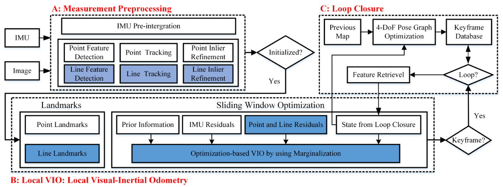
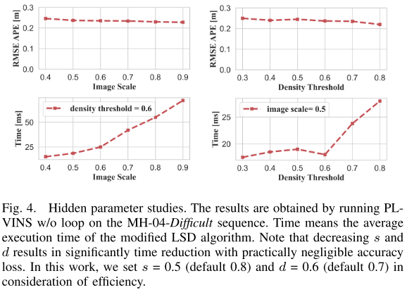
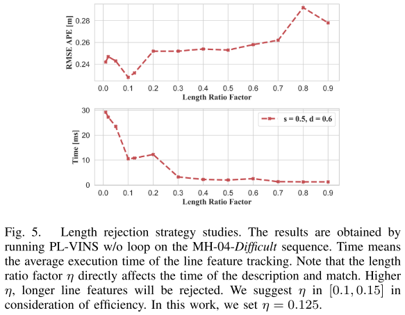
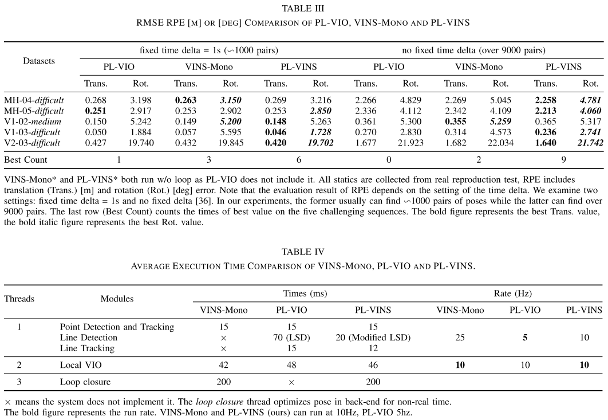

本文档主要涉及贺一家博士关于线面特征一系列工作中的两篇论文的解读，以及线面特征的相关基础知识。

**感叹贺一家博士及团队在线面特征的多年深耕，向你们致敬。**

### PL-VINS: Real-Time Monocular Visual-Inertial SLAM with Point and Line Features

这篇文章是基于PL-VIO和VINS-mono的改进，以VINS为基础框架，引入线特征约束，而相较于PL-VIO中LSD提取线特征不能实时的问题进行了改进，相比于原版本LSD提升至至少三倍的速度，这也使得其成为第一个基于单目点线特征的实时VINS方法。定位误差方面，相较于VINS降低12-16%。系统框架如下图所示：

#### Line Feature Detection

OpenCV中提供的LSD算法(笔者发现OpenCV自3.4.6起由于版权已移除相关源码实现)并不是面向位姿估计场景设计，其无法满足实时性需求，例如对于一张782*480的图片，提取了647个线特征共耗时62ms，且其中有大量长度很短的线段，不利于帧间跟踪且是没有必要的，我们只需要关注那些能够在帧间观测、匹配的线特征即可，不管从耗时还是精度上都是有意义的。

LSD是一种无参数整定的线特征检测器(更多原理参见其他资料)，作者发现整定其中的几个参数可以实现加速求解。LSD通过固定image_scale $s$、sigma_scale $r$ (代码实现中高斯函数中的 $\sigma$ 来自 $\sigma = r / s$ ) 构建$N$层高斯金字塔进行多尺度表示，即输入图像被进行 $N-1$ 次下采样和$N$次高斯滤波，对于 $r$ 、 $N$ 采用默认值 $r = 0.5$、$N = 2$ 。另外，LSD中对于初步提取的每一个line-support region进行最小密度阈值(minimal density threshold) $d$ 过滤。作者通过实验认为整定 $s$ 和 $d$ 可以提升计算速度，结果是 $s = 0.5$ (default 0.8)、$d = 0.6$ (default 0.7)。

#### Length rejection strategy

对于LSD所提取的线段长度进行阈值过滤，其阈值是图像窄边的长度乘以一个因子，作者通过实验认为该因子 $\eta=0.125$ 可实现精度和耗时的最优。
$$
L_{\min }=\left\lceil\eta * \min \left(W_{I}, H_{I}\right)\right\rceil
$$

#### Space Lines

(仅简述结论，更多的细节参考其他资料，推荐本repo下的Line_Feature.md。)

##### Space line representation

使用普吕克坐标系实现对于空间中线段的表达，定义 $ L_w = \left(\mathbf{n}_{w}^{\top}, \mathbf{d}_{w}^{\top}\right)^{\top} \in \mathbb{R}^{6}$，即线段和坐标原点构成的平面的**单位**法向量、线段两个端点坐标差值得到的线段方向向量(**非单位向量**)。其实也会看到有些地方将方向向量表示为单位向量那么法向量则不进行单位化，总之保留一个非单位向量的表达可以表示**尺度**就好了。

##### Orthonormal representation

对于空间中的线段来说，实际上只有4个自由度，因为方向向量的旋转和平移是零空间。那么上述普吕克坐标系的表达并不是正交的，那么需要寻求线特征的最小表达(正交表达)，类似李群和李代数的关系。定义正交表达 $\left( \mathbf{U}, \mathbf{W} \right) = \left( \mathbf{R}(\boldsymbol{\theta}), \mathbf{R}(\theta) \right) \in S O(3) \times S O(2)$ 。将 $L_w$ 重写为 $\left[ \mathbf{n}_{w}, \mathbf{d}_{w} \right] \in \mathbb{R}^{3*2}$ ，那么QR分解可得：
$$
\left[\begin{array}{ll}
\mathbf{n}_w & \mathbf{d}_w
\end{array}\right]=\left[\begin{array}{ccc}
\frac{\mathbf{n}_w}{\|\mathbf{n}_w\|} & \frac{\mathbf{d}_w}{\|\mathbf{d}_w\|} & \frac{\mathbf{n}_w \times \mathbf{d}_w}{\|\mathbf{n}_w \times \mathbf{d}_w\|}
\end{array}\right]\left[\begin{array}{cc}
\|\mathbf{n}_w\| & 0 \\
0 & \|\mathbf{d}_w\| \\
0 & 0
\end{array}\right]
$$
 第一项天然符合$S O(3)$，即是 $\mathbf{U}$ ，而第二项实际就是尺度和单位1，只有一个自由度，我们可以使用三角函数进行替换：
$$
\begin{aligned}
\mathbf{R}(\theta) &=\left[\begin{array}{cc}
\omega_{1} & \omega_{2} \\
-\omega_{2} & \omega_{1}
\end{array}\right]=\left[\begin{array}{cc}
\cos (\theta) & -\sin (\theta) \\
\sin (\theta) & \cos (\theta)
\end{array}\right] \\
&=\frac{1}{\sqrt{\left(\left\|\mathbf{n}_{w}\right\|^{2}+\left\|\mathbf{d}_{w}\right\|^{2}\right)}}\left[\begin{array}{ll}
\left\|\mathbf{n}_{w}\right\| & -\left\|\mathbf{d}_{w}\right\| \\
\left\|\mathbf{d}_{w}\right\| & \left\|\mathbf{n}_{w}\right\|
\end{array}\right]
\end{aligned}
$$
那么到这里，就得到了四个变量最小表达：$\mathbf{o}^{\top}=\left(\boldsymbol{\theta}^{\top}, \theta\right)$，而正交表达 $\left( \mathbf{U}, \mathbf{W} \right)$ 和普吕克之间的转换关系为：
$$
\mathbf{L}_{w}= \sqrt{\left(\left\|\mathbf{n}_{w}\right\|^{2}+\left\|\mathbf{d}_{w}\right\|^{2}\right)} \left[\omega_{1} \mathbf{u}_{1}^{\top}, \omega_{2} \mathbf{u}_{2}^{\top}\right]
$$

#### Line Reprojection Residual Model

对于$\mathbf{T}_{c w}=\left[\mathbf{R}_{c w}, \mathbf{t}_{c w}\right]$，则线特征的变换关系可表示为：
$$
\mathbf{L}_{c}=\left[\begin{array}{l}
\mathbf{n}_{c} \\
\mathbf{d}_{c}
\end{array}\right]=\mathbf{T}_{c w} L_{w}=\left[\begin{array}{cc}
\mathbf{R}_{c w} & {\left[\mathbf{t}_{c w}\right]_{\times} \mathbf{R}_{c w}} \\
0 & \mathbf{R}_{c w}
\end{array}\right]\left[\begin{array}{l}
\mathbf{n}_{w} \\
\mathbf{d}_{w}
\end{array}\right]
$$
第一行是对于单位法向量的变换，除了w系下单位法向量的旋转之外，还有因为平移量的存在导致法平面的变化而引入的分量；第二行就是非单位向量的方向向量的旋转，不受平移的影响。

相机坐标系到图像坐标系的投影可以表示为下式，注意这里的 $\mathbf{K}_{L}$ 不同于点特征投影的内参矩阵 $\mathbf{K}$。
$$
\mathbf{l}=\left[l_{1}, l_{2}, l_{3}\right]^{\top}=\mathbf{K}_{L} \mathbf{n}_{c}
$$
证：

设线特征的两个端点在相机坐标系下的坐标分别为 ${^c}\mathbf{P}^1, {^c}\mathbf{P}^2$，对应图像坐标系下坐标为 ${^i}\mathbf{P}^1,  {^i}\mathbf{P}^2$，相机内参矩阵 $\mathbf{K}$。
$$
\begin{aligned}
{^i}\mathbf{P}^1 \times {^i}\mathbf{P}^2 &= (\mathbf{K} {^c}\mathbf{P}^1) \times \mathbf{K} {^c}\mathbf{P}^2) \\
&=\begin{bmatrix}f_x {^c}\mathbf{P}^1_x + c_x \\ f_y {^c}\mathbf{P}^1_y +c_y \\ 1\end{bmatrix}_{\times}
\begin{bmatrix}f_x {^c}\mathbf{P}^2_x + c_x \\ f_y {^c}\mathbf{P}^2_y +c_y \\ 1\end{bmatrix} \\
&=\begin{bmatrix}0 & -1 & f_y {^c} \mathbf{P}^1_y + c_y \\ 1 & 0 & -(f_x {^c} \mathbf{P}^1_x + c_x) \\ 
-(f_y {^c} \mathbf{P}^1_y + c_y) & f_x {^c} \mathbf{P}^1_x + c_x & 0 \end{bmatrix}
\begin{bmatrix}f_x {^c}\mathbf{P}^2_x + c_x \\ f_y {^c}\mathbf{P}^2_y +c_y \\ 1\end{bmatrix} \\

&=\begin{bmatrix}f_y({^c}\mathbf{P}^1_y-{^c}\mathbf{P}^2_y) \\ f_x({^c}\mathbf{P}^1_x-{^c}\mathbf{P}^2_x) \\ 
f_x f_y({^c}\mathbf{P}^1_x {^c}\mathbf{P}^2_y-{^c}\mathbf{P}^1_y{^c}\mathbf{P}^2_x)+f_x c_y({^c}\mathbf{P}^2_x-{^c}\mathbf{P}^1_x)+f_y c_x({^c}\mathbf{P}^2_y-{^c}\mathbf{P}^1_y) \end{bmatrix} \\ 

&=\begin{bmatrix}f_y & 0 & 0 \\ 0 & f_x & 0 \\ -f_yc_x & -f_xc_y & f_xf_y \end{bmatrix}
\begin{bmatrix}{^c}\mathbf{P}^2_y-{^c}\mathbf{P}^1_y \\ {^c}\mathbf{P}^2_x-{^c}\mathbf{P}^1_x \\ {^c}\mathbf{P}^1_x {^c}\mathbf{P}^2_y-{^c}\mathbf{P}^1_y {^c}\mathbf{P}^2_x \end{bmatrix} \\ 

&=\begin{bmatrix}f_y & 0 & 0 \\ 0 & f_x & 0 \\ -f_y c_x & -f_x c_y & f_x f_y \end{bmatrix}
\begin{bmatrix}{^c}\mathbf{P}^1_x \\ {^c}\mathbf{P}^1_y \\ 1 \end{bmatrix}_{\times} \begin{bmatrix}{^c}\mathbf{P}^2_x \\ {^c}\mathbf{P}^2_y \\ 1 \end{bmatrix} \\ 
&=\mathbf{K}_L({^c}\mathbf{P}^1 \times {^c}\mathbf{P}^2) \\
&=\mathbf{K}_L \mathbf{n}_c
\end{aligned}
$$
第 $j$ 个空间线特征在第 $i$ 个图像上的投影误差可以表示为下式，$\mathbf{m} = [m_x, m_y, 1]$ 表示图像坐标系下线特征中点的齐次坐标。也会看到PL-VIO等将线特征的两个端点分别求解点到线的距离误差，即构建 $\mathbb{R}^{2}$ 的投影误差。
$$
\mathbf{r}_{L}\left(\mathbf{z}_{\mathcal{L}_{j}}^{c_{i}}, \mathcal{X}\right)=\mathbf{d}(\mathbf{m}, \mathbf{l})=\frac{\mathbf{m}^{\top} \mathbf{l}}{\sqrt{l_{1}^{2}+l_{2}^{2}}} \in \mathbb{R}^{1}
$$

#### Jacobian

状态变量可以表示为：
$$
\begin{array}{l}
\mathcal{X}=\left[\mathbf{x}_{0}+\mathbf{x}_{1}, \ldots, \mathbf{x}_{n_{k}}, \lambda_{0}, \lambda_{1}, \ldots \lambda_{n_{p}}, \mathbf{o}_{1}, \mathbf{o}_{2}, \ldots, \mathbf{o}_{n_{l}}\right] \\
\mathbf{x}_{k}=\left[\mathbf{p}_{b_{k}^{w}}, \mathbf{q}_{b_{k}^{w}}, \mathbf{v}_{b_{k}^{w}}, \mathbf{b}_{a}, \mathbf{b}_{g}\right], k \in\left[0, n_{k}\right]
\end{array}
$$
那么，线特征反投影误差分别对 $\delta \mathbf{x}$ 和 $\delta \mathbf{o}$ 求导：
$$
\mathbf{J}_l = \cfrac{\partial r_L}{\partial \mathbf{l}_i} \cfrac{\partial \mathbf{l}_i}{\partial \mathbf{l}_c} 
\begin{aligned}
\begin{bmatrix}
\cfrac{\partial \mathbf{l}_c}{\partial \mathbf{\delta \mathbf{x}}} &
\cfrac{\partial \mathbf{l}_c}{\partial \mathbf{l}_w} \cfrac{\partial \mathbf{l}_w}{\partial \delta \mathbf{o}}
\end{bmatrix}
\end{aligned}
$$

$$
\begin{aligned}
\cfrac{\partial r_L}{\partial \mathbf{l}_i} &= 
\begin{bmatrix}
\cfrac{\partial r_L}{\partial l_{ix}} & \cfrac{\partial r_L}{\partial l_{iy}} & \cfrac{\partial r_L}{\partial l_{iz}}
\end{bmatrix}_{1 \times 3} \\ 
&= \begin{bmatrix}
\cfrac{-l_{ix} \mathbf{m}^{\top} \mathbf{l}_i}{({l_{ix}^2 + l_{iy}^2})^{3/2}} + 
\cfrac{m_x}{({l_{ix}^2 + l_{iy}^2})^{1/2}} &
\cfrac{-l_{iy} \mathbf{m}^{\top} \mathbf{l}_i}{({l_{ix}^2 + l_{iy}^2})^{3/2}} + 
\cfrac{m_y}{({l_{ix}^2 + l_{iy}^2})^{1/2}} &
\cfrac{1}{({l_{ix}^2 + l_{iy}^2})^{1/2}}
\end{bmatrix}_{1 \times 3}
\end{aligned}
$$

$$
\cfrac{\partial \mathbf{l}_i}{\partial \mathbf{l}_c} = 
\begin{bmatrix}
\mathbf{K}_L & \mathbf{0}
\end{bmatrix} _{3 \times 6}
$$

由于VIO系统中引入了body系，因此线特征从 $w$ 系到 $c$ 系的变换写为：
$$
\begin{aligned}
\mathbf{l}_c &= \mathbf{T}_{bc}^{-1} \mathbf{T}_{wb}^{-1} \mathbf{l}_w \\
&= \mathbf{T}_{bc}^{-1}
\begin{bmatrix}
\mathbf{R}_{wb}^{\top}(\mathbf{n}_w + [\mathbf{d}_w]_{\times} \mathbf{p}_{wb}) \\
\mathbf{R}_{wb}^{\top} \mathbf{d}_w
\end{bmatrix}_{6 \times 1}
\end{aligned}
$$
接着推导 $\mathbf{l}_c$ 对于状态量的偏导：
$$
\begin{aligned}
\cfrac{\partial \mathbf{l}_c}{\partial \delta \mathbf{x}} &= 
\begin{bmatrix}
\cfrac{\partial \mathbf{l}_c}{\partial \delta \mathbf{p}_{bb'}} & \cfrac{\partial \mathbf{l}_c}{\partial \delta \theta_{bb'}} & \mathbf{0} & \mathbf{0} & \mathbf{0}
\end{bmatrix}_{6 \times 15} \\
&=\begin{bmatrix}
\mathbf{T}_{bc}^{-1}
\begin{bmatrix}
\cfrac{\mathbf{R}_{wb}^{\top}(\mathbf{n}_w + [\mathbf{d}_w]_{\times} (\mathbf{p}_{wb} + \delta \mathbf{p}_{bb'}))}{\partial \delta \mathbf{p}_{bb'}} \\
\cfrac{\mathbf{R}_{wb}^{\top} \mathbf{d}_w}{\partial \delta \mathbf{p}_{bb'}}
\end{bmatrix} &
\mathbf{T}_{bc}^{-1}
\begin{bmatrix}
\cfrac{\partial(\mathbf{I}-[\delta \theta _ {bb'}]_{\times}) \mathbf{R}_{wb}^{\top}(\mathbf{n}_w + [\mathbf{b}_w] _ {\times} \mathbf{p}_{wb})}{\partial \delta \theta_{bb'}} \\
\cfrac{\partial(\mathbf{I}-[\delta \theta _ {bb'}]_{\times}) \mathbf{R}_{wb}^{\top} \mathbf{d}_w}{\partial \delta \theta_{bb'}}
\end{bmatrix} &
\mathbf{0} & \mathbf{0} & \mathbf{0}
\end{bmatrix}_{6 \times 15} \\
&=\begin{bmatrix}
\mathbf{T}_{bc}^{-1}
\begin{bmatrix}
\mathbf{R}_{wb}^{\top}[\mathbf{d}_w]_{\times} \\
\mathbf{0}
\end{bmatrix} &
\mathbf{T}_{bc}^{-1}
\begin{bmatrix}
[\mathbf{R}_{wb}^{\top}(\mathbf{n}_w + [\mathbf{d}_w]_{\times} \mathbf{p}_wb]_{\times} \\
\mathbf{[\mathbf{R}_{wb}^{\top} \mathbf{d}_w]_{\times}}
\end{bmatrix} & \mathbf{0} & \mathbf{0} & \mathbf{0}
\end{bmatrix}_{6 \times 15}
\end{aligned}
$$

$$
\cfrac{\partial \mathbf{l}_c}{\partial \mathbf{l}_w} \cfrac{\partial \mathbf{l}_w}{\partial \delta \mathbf{o}} = 
\mathbf{T}_{wc}^{-1}
\begin{bmatrix}
\mathbf{0} & -w_1 \mathbf{u}_3 & w_1 \mathbf{u}_2 & -w_2 \mathbf{u}_1 \\
w_2 \mathbf{u}_3 & \mathbf{0} & -w_2 \mathbf{u}_1 & w_1 \mathbf{u}_2
\end{bmatrix}_{6 \times 4}
$$

另外，线特征的协方差和点特征一致，即线特征端点的像素噪声。

#### Sliding Window Optimization with Point, Line and IMU

相较于VINS来说引入了对于线特征的重投影误差，可表示为：
$$
\left\{\begin{array}{l}
\mathbf{e}_{l i n e}=\sum_{(i, j) \in \mathcal{L}}\left(\rho\left\|\mathbf{r}_{\mathcal{L}}\left(\mathbf{z}_{\mathcal{L}_{j}}^{c_{i}}, \mathcal{X}\right)\right\|_{\sum_{\mathcal{L}_{j}}^{c_{i}}}^{2}\right) \\
\rho(s)=\left\{\begin{array}{ll}
s & s \leq 1 \\
2 \sqrt{s}-1 & s>1
\end{array}\right.
\end{array}\right.
$$
线特征的正交表达的迭代表示：
$$
\left\{\begin{array}{l}
\mathbf{U}_{t+1} \leftarrow \mathbf{U}_{t}\left(\mathbf{I}+[\delta \boldsymbol{\theta}]_{\times}\right) \\
\mathbf{W}_{t+1} \leftarrow \mathbf{W}_{t}\left(\mathbf{I}+\left[\begin{array}{cc}
0 & -\delta \theta \\
\delta \theta & 0
\end{array}\right]\right)
\end{array}\right.
$$

#### Experiments

#### Conclusions

本文是第一个基于优化方法、使用点线特征的实时单目VINS方法，通过整定LSD参数大幅度减少了线特征提取耗时，从结果来说，在一些复杂的场景精度相比VINS更高。本框架的回环部分沿用VINS，即线特征仅存在于前端并没有加入回环部分。当前对于线特征的使用仍是frame-to-frame的方式，并忽略了上一帧之前的线特征，后续应该尝试像点特征那样增加frame-to-model的策略，即引入local map model约束。另外，计划扩展成双目方案，以及尝试更多的复杂场景，类似大尺度、低纹理、低光照的室内场景。

### PL-VIO: Tightly-coupled monocular visual–inertial odometry using point and line features

这一篇是PL-VINS的前序工作，其中涉及更为详细的关系VIO、线特征等相关理论知识，上面的笔记已经涉及一部分，更多内容推荐查阅原文。

### Reference

- [lsd_opencv](https://github.com/23pointsNorth/lsd_opencv)
- [直线检测算法汇总](https://www.it610.com/article/1294640224181231616.htm)

- [PL-VINS: Real-Time Monocular Visual-Inertial SLAM with Point and Line Features](http://arxiv.org/abs/2009.07462)

- [PL-VIO: Tightly-coupled monocular visual–inertial odometry using point and line features](https://www.mdpi.com/1424-8220/18/4/1159)
- [Leveraging Planar Regularities for Point Line Visual-Inertial Odometry](https://ras.papercept.net/proceedings/IROS20/0835.pdf)
- [Plücker_coordinates](https://en.wikipedia.org/wiki/Pl%C3%BCcker_coordinates)
- [Structure-From-Motion Using Lines: Representation, Triangulation and Bundle Adjustment](https://hal.archives-ouvertes.fr/hal-00092589/document)
- [Visual-Inertial Odometry with Point and Line Features](https://ieeexplore.ieee.org/document/8967905)
- [SLAM中线特征的参数化和求导](https://zhuanlan.zhihu.com/p/65674067)
