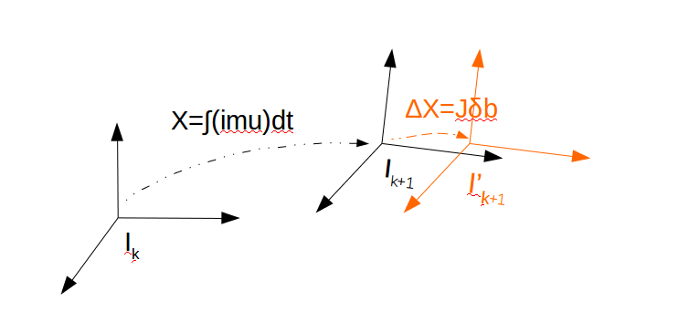
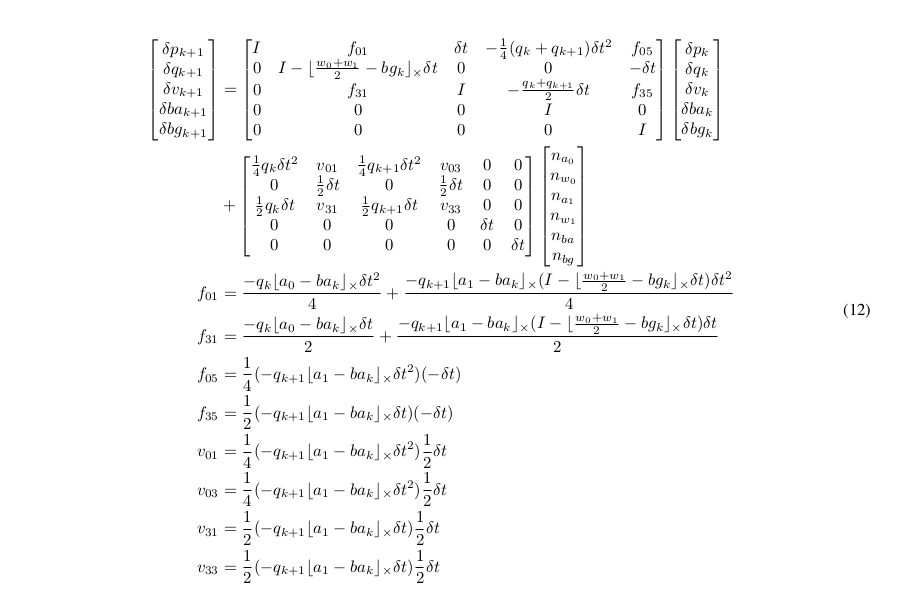
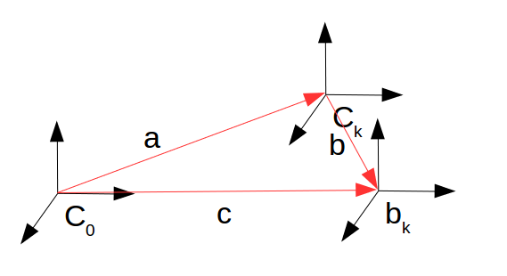
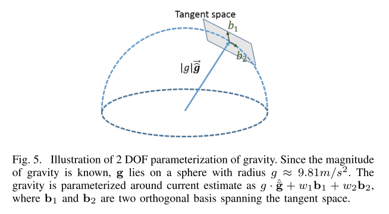

# VINS-Mono(一)——预积分推导

&nbsp;

[toc]

---

## Reference

1. VINS-Mono: A Robust and Versatile Monocular Visual-Inertial State Estimator.
2. Quaternion Kinematics for Error-State KF.

&nbsp;

---

## 预积分的推导

预积分是VINS-Mono中十分重要的一个步骤，主要涉及的是IMU的运动方程，下面对这部分进行一个简单的推导，主要使用的是ESKF中的方法，采用简单的欧拉法在连续时域下进行推导。

---

### ESKF

这部分详细可以参照参考【2】，这里做一个记录，ESKF的主要精髓在于分析的是error-state，并且获得的是error-state的状态更新方程，但是对于优化问题，优化的变量其实并不是error-state，而是state，那为什么会有这个理论的诞生，这里先**埋个坑（坑1）**，后面会解释。

1. ESKF有两个变量，一个是normal-state $X$，一个是truth-state $X_t$，两者的关系如下：
   $$
   \mathbf{X_t}=\left[\begin{array}{c}
   \mathbf{p_t} \\
   \mathbf{v_t} \\
   \mathbf{q_t} \\
   \mathbf{a}_{bt} \\
   \boldsymbol{\omega}_{bt}
   \end{array}\right]=
   \left[\begin{array}{c}
   \mathbf{p}+\delta{p} \\
   \mathbf{v}+\delta{v} \\
   \mathbf{q}\otimes\delta{q} \\
   \mathbf{a}_{b}+\delta{a_b} \\
   \boldsymbol{\omega}_{b}+\delta{\omega_b}
   \end{array}\right]=\mathbf{X}\boxplus\mathbf{\delta{X}} \tag{1}
   $$
   
2. 进一步，通过对两边求微分得到：
   $$
   \begin{aligned}
   \dot{\delta \mathbf{p}} &=\delta \mathbf{v} \\
   \dot{\delta \mathbf{v}} &=-\mathbf{R}\left[\mathbf{a}_{m}-\mathbf{a}_{b}\right]_{\times} \delta \boldsymbol{\theta}-\mathbf{R} \delta \mathbf{a}_{b}-\mathbf{R} \mathbf{a}_{n} \\
   \dot{\delta \boldsymbol{\theta}} &=-\left[\boldsymbol{\omega}_{m}-\boldsymbol{\omega}_{b}\right]_{\times} \delta \boldsymbol{\theta}-\delta \boldsymbol{\omega}_{b}-\boldsymbol{\omega}_{n} \\
   \dot{\delta \mathbf{a}_{b}} &=\mathbf{a}_{w} \\
   \delta \dot{\boldsymbol{\omega}}_{b} &=\boldsymbol{\omega}_{w}
   \end{aligned} \tag{2}
   $$

3. 对公式2进行离散化
   $$
   \begin{aligned}
   \delta \mathbf{p} & \leftarrow \delta \mathbf{p}+\delta \mathbf{v} \Delta t \\
   \delta \mathbf{v} & \leftarrow \delta \mathbf{v}+\left(-\mathbf{R}\left[\mathbf{a}_{m}-\mathbf{a}_{b}\right]_{\times} \delta \boldsymbol{\theta}-\mathbf{R} \delta \mathbf{a}_{b}\right) \Delta t+\mathbf{v}_{\mathbf{i}} \\
   \delta \boldsymbol{\theta} & \leftarrow I-\left[\boldsymbol{\omega}_{m}-\boldsymbol{\omega}_{b}\right]_{\times} \Delta t \delta \boldsymbol{\theta}-\delta \boldsymbol{\omega}_{b} \Delta t+\boldsymbol{\theta}_{\mathbf{i}} \\
   \delta \mathbf{a}_{b} & \leftarrow \delta \mathbf{a}_{b}+\mathbf{a}_{\mathbf{i}} \\
   \delta \boldsymbol{\omega}_{b} & \leftarrow \delta \boldsymbol{\omega}_{b}+\boldsymbol{\omega}_{\mathbf{i}} 
   \end{aligned} \tag{3}
   $$
   其中：

   - $R$表示从机体系到世界坐标系的旋转；
   - $a_m$表示IMU的测量减去重力加速度的值；

4. 将公式3写作矩阵形式，得到kalman滤波的预测阶段：
   $$
   \begin{array}{l}
   \hat{\delta} \boldsymbol{\mathbf { x }} \leftarrow \mathbf{F}_{\mathbf{x}}\left(\mathbf{x}, \mathbf{u}_{m}\right) \cdot \hat{\boldsymbol{\delta}} \mathbf{x} \\
   \mathbf{P} \leftarrow \mathbf{F}_{\mathbf{x}} \mathbf{P} \mathbf{F}_{\mathbf{x}}^{\top}+\mathbf{F}_{\mathbf{i}} \mathbf{Q}_{\mathbf{i}} \mathbf{F}_{\mathbf{i}}^{\top}
   \end{array} \tag{4}
   $$
   其中：

   - $$
     \mathbf{F}_{\mathbf{x}}=\left.\frac{\partial f}{\partial \delta \mathbf{x}}\right|_{\mathbf{x}, \mathbf{u}_{m}}=\left[\begin{array}{ccccc}
     \mathbf{I} & \mathbf{I} \Delta t & 0 & 0 & 0 & 0 \\
     0 & \mathbf{I} & -\mathbf{R}\left[\mathbf{a}_{m}-\mathbf{a}_{b}\right]_{\times} \Delta t & -\mathbf{R} \Delta t & 0 & \mathbf{I} \Delta t \\
     0 & 0 & I-\left[\boldsymbol{\omega}_{m}-\boldsymbol{\omega}_{b}\right]_{\times} \Delta t & 0 & -\mathbf{I} \Delta t & 0 \\
     0 & 0 & 0 & \mathbf{I} & 0 & 0 \\
     0 & 0 & 0 & 0 & \mathbf{I} & 0 \\
     0 & 0 & 0 & 0 & 0 & \mathbf{I}
     \end{array}\right]
     $$

   - $$
     \mathbf{F}_{\mathbf{i}}=\left.\frac{\partial f}{\partial \mathbf{i}}\right|_{\mathbf{x}, \mathbf{u}_{m}}=\left[\begin{array}{cccc}
     0 & 0 & 0 & 0 \\
     \mathbf{I} & 0 & 0 & 0 \\
     0 & \mathbf{I} & 0 & 0 \\
     0 & 0 & \mathbf{I} & 0 \\
     0 & 0 & 0 & \mathbf{I} \\
     0 & 0 & 0 & 0
     \end{array}\right]
     $$

   - $$
     \mathbf{Q}_{\mathbf{i}}=\left[\begin{array}{cccc}
     \mathbf{V}_{\mathbf{i}} & 0 & 0 & 0 \\
     0 & \mathbf{\Theta}_{\mathbf{i}} & 0 & 0 \\
     0 & 0 & \mathbf{A}_{\mathbf{i}} & 0 \\
     0 & 0 & 0 & \Omega_{\mathbf{i}}
     \end{array}\right]
     $$

   

---

### 积分与预积分

积分比较简单，拿到IMU的数据进行常规的积分操作，就可以得到两节点之间的相对位姿和速度。这里祭出IMU的运动模型：
$$
\begin{cases}
\dot{p}=v \\
\dot{v}=R_{i_k}^{i_0}(a_m-b_a-n_a) \\
\dot{q}=q\otimes q\{w_m-b_w-n_w\} \\
\dot{b_a}=w_a \\
\dot{b_w}=w_w
\end{cases} \tag{5}
$$
可以看到，在进行积分的时候，公式中不仅使用了各个时刻的IMU测量值，而且用到零偏值，因此当零偏值变化的时候，整个微分数值就产生了变化，于是最后的相对状态值就会产生变化，此时一种方法是将修改后的零偏值带入到积分过程中得到新的相对位姿和速度。

重新带入的方法是可行的，但是这样会比较浪费时间和算力。于是预积分的方法就提出来了。

承接上面的ESKF，把正常的积分过程看做是normal-state，**这部分积分仅与这段时间的IMU测量值以及零偏bias有关，与其他量都无关**，当零偏bias被优化之后，此时并不用修改normal-state的量，而是认为变化的这部分在error-state中，下面有个简略的示意图：



图中X表示使用IMU数据进行积分的过程，IMU认为在这段时间内，坐标系的变化为从$I_k$到$I_{k+1}$，而当状态变量进行了优化，零偏变化$\delta b$时，积分过程需要加上$\Delta X$，即假如零偏变化了$\delta b$，那么IMU认为坐标系的变化应该到$I^{'}_{k+1}$，所以剩下就是求解上图中的黄色部分的变化了，这里采用一阶近似来表示这个变化，推导如下：
$$
\begin{cases}
p_{nt}=p_{n}+\frac{\partial{p}}{\partial{b}}\delta{b}=p_{n}+\frac{p+\delta{p}-p}{\delta{b}}\delta{b}=p_{n}+\frac{\delta{p}}{\delta{b}}\delta{b} \\
v_{nt}=v_{n}+\frac{\partial{v}}{\partial{b}}\delta{b}=v_{n}+\frac{v+\delta{v}-v}{\delta{b}}\delta{b}=v_{n}+\frac{\delta{v}}{\delta{b}}\delta{b} \\
q_{nt}=q_{n}\otimes\begin{bmatrix}1\\ \frac{1}{2}\frac{\partial{\theta}}{\partial{b}}\delta{b} \end{bmatrix}=q_{n}\otimes\begin{bmatrix}1\\ \frac{1}{2}\frac{\partial{\theta}}{\partial{b}}\delta{b} \end{bmatrix}=q_{n}\otimes\begin{bmatrix}1\\ \frac{1}{2}\frac{\theta+\delta{\theta}-\theta}{\delta{b}}\delta{b} \end{bmatrix}=q_{n}\otimes\begin{bmatrix}1\\ \frac{1}{2}\frac{\delta{\theta}}{\delta{b}}\delta{b} \end{bmatrix}
\end{cases}  \tag{6}
$$


其中需要说明的几个点为：

- 偏导这里采用了求导的原始定义；
- 相对姿态使用四元数进行表示，这里使用旋转向量来表示误差量，这样的好处就是能在$\R^3$空间上直接进行向量的加减操作，十分方便；

剩下的就是如何求解上述推导中的$\frac{\delta{p}}{\delta{b}},\frac{\delta{v}}{\delta{b}},\frac{\delta{q}}{\delta{b}}$了，特别注意的这里的三个导数和公式4中的变量并不一样，因为公式（4）是两个IMU周期之间的递推公式，而公式（6）是两个相机周期（一般都是N倍于IMU周期）之间的递推公式，那这个数值是多少呢？这里其实是一个连乘的操作，如下：
$$
\frac{\delta{p_n}}{\delta{b}}=\frac{F_{n-1}\delta{p_{n-1}}}{\delta{b}}=\frac{F_{n-1}F_{n-2}\delta{p_{n-2}}}{\delta{b}}=\frac{\prod_{i=0}^{n-1}F_{i}\delta{p_0}}{\delta{b}}=\prod_{i=0}^{n-1}F_{i} \text{ where } \frac{\delta{p_{0}}}{\delta{b}}=I
$$
所以为什么要用ESKF也就很明显了，同时使用ESKF进行error-state状态的更新还有另一个好处就是能够得到这次观测的协方差，如何得到呢？其实也很简单，使用协方差的原始定义就好啦，这里以位置为例：
$$
P_p=E((p_t-p_{int})^T(p_t-p_{int}))=E(\delta{p}^T\delta{p})=P_{\delta{p}} \tag{7}
$$

----

### VINS中的中点法（mid-point）

在VINS-Mono的代码中，作者使用的是中点法得到上面的公式4的，其实和参考【2】中的中点法不太一样，这里的中点法使用的是两端点的平均，下面进行简单的推导，先给出离散时间下的迭代步骤：
$$
\begin{cases}
p_{k+1}=p_{k}+v_{k}\Delta{t}+\frac{1}{2}\frac{R_k(a_k-b_{ak})+R_{k+1}(a_{k+1}-b_{ak})}{2}\Delta{t}^2 \\
v_{k+1}=v_k+\frac{R_k(a_k-b_k)+R_{k+1}(a_{k+1}-b_{k+1})}{2}\Delta{t}\\
q_{k+1}=q_{k}\otimes q\{(\frac{(w_k+w_{k+1})}{2}-b_{wk})\Delta{t}\}\\
b_{ak+1}=b_{ak}+n_{ba}\Delta{t} \\
b_{wk+1}=b_{wk}+n_{bw}\Delta{t}
\end{cases}  \tag{8}
$$


整个过程中稍微有些奇怪的是VINS在表示陀螺仪的真值的时候，使用的是$w_t=w_m-b_w-\delta{b_w}+n_w$，不过因为噪声是高斯白噪声，加和减是一样的，所以这里按这样推导也无妨。


#### 旋转的error-state

这里先推导旋转的误差项是因为后面的位移和速度会用到这部分结论，整体来说和上面的ESKF一样，使用truth-state=normal-state+error-state的方法进行推导，这部分沿用微分的方式：
$$
\begin{aligned}
\dot{q_{t}}&=\dot{(q\otimes \delta{q})}=\frac{1}{2}q_t\otimes \Omega_t \\
&=\dot{q}\otimes \delta{q}+q \otimes \dot{\delta{q}}=\frac{1}{2}q_t\otimes \Omega_t \\
&=\frac{1}{2}q \otimes \Omega \otimes \delta{q}+q\otimes \dot{\delta{q}}=\frac{1}{2}q\otimes\delta{q}\otimes \Omega_t \\
&=[\Omega]_L\delta{q}+2\dot{\delta{q}} = [\Omega_t]_R \delta{q} \\
&=2\dot{\delta{q}}  = ([\Omega_t]_R-[\Omega]_L)\delta{q}
\end{aligned} \tag{9}
$$

下面对其中的一些符号进行说明：

- $$
  \delta{q}=\begin{bmatrix} 1 \\ \frac{1}{2}\delta{\theta} \end{bmatrix}
  $$

- $$
  \begin{aligned}
  [\Omega]_R&= \begin{bmatrix}0 & -\Omega^T \\ \Omega & -[\Omega]_{\times} \end{bmatrix} \\ 
  [\Omega]_L&= \begin{bmatrix}0 & -\Omega^T \\ \Omega & [\Omega]_{\times} \end{bmatrix}
  \end{aligned}
  $$

- $$
  \begin{aligned}
  \Omega  &=\frac{w^k_m+w^{k+1}_m}{2}-b^k_w \\
  \Omega_t&=\frac{w^k_m+n^k_w+w^{k+1}_m+n^{k+1}_{w}}{2}-b^k_w-\delta{b^k_w}=\Omega-\delta{b^k_w}+\frac{1}{2}n^{k}_{w}+\frac{1}{2}n^{k+1}_{w} \\
  \end{aligned}
  $$

至此，把上述的展开代入到公式9最后一行中中：
$$
\begin{aligned}
\begin{bmatrix}0 \\ \dot{\delta{\theta}} \end{bmatrix}&=\begin{bmatrix}0 & -(\Omega_t-\Omega)^T \\ (\Omega_t-\Omega) & -([\Omega_t]_{\times}+[\Omega]_{\times}) \end{bmatrix} \begin{bmatrix}1 \\ \frac{1}{2}\delta{\theta}\end{bmatrix} \\
&=\begin{bmatrix}0 & -(-\delta{b^k_w}+\frac{1}{2}n^{k}_{w}+\frac{1}{2}n^{k+1}_{w})^T \\ 
-\delta{b^k_w}+\frac{1}{2}n^{k}_{w}+\frac{1}{2}n^{k+1}_{w} &  -(2[\Omega]-[\delta{b^k_w}_{\times}+\frac{1}{2}n^{k}_{w}+\frac{1}{2}n^{k+1}_{w}]_{\times})\end{bmatrix}\begin{bmatrix}1 \\ \frac{1}{2}\delta{\theta}\end{bmatrix} \\
&=\begin{bmatrix}... \\ -[\Omega]_{\times}\delta{\theta}-\delta{b^k_w}+\frac{1}{2}n^{k}_{w}+\frac{1}{2}n^{k+1}_{w} \end{bmatrix} \\
\dot{\delta{\theta}}&\rightarrow -[\Omega]_{\times}\delta{\theta}-\delta{b^k_w}+\frac{1}{2}n^{k}_{w}+\frac{1}{2}n^{k+1}_{w}
\end{aligned}  \tag{10}
$$
所以离散化之后：
$$
\delta{\theta}_{k+1}=\delta{\theta}_k-[\Omega]_{\times}\Delta{t} \delta{\theta}_k-\delta{b^k_w}\Delta{t}+\frac{1}{2}n^{k}_{w}\Delta{t}+\frac{1}{2}n^{k+1}_{w}\Delta{t} \tag{11}
$$


#### 位移的error-state

取公式8中的位移迭代公式，并使用truth-state=normal-state+error-state的方法进行推导，有：
$$
\begin{aligned}
p_{k+1}^{t}&=p_{k+1}+\delta{p_{k+1}}=p^{t}_{k}+v_{k}^t+\frac{1}{2}\frac{R_k^t(a_k^t-b_{ak}^t)+R_{k+1}^t(a_{k+1}^t-b_{ak}^t)}{2}\Delta{t}^2 \\
&=p_{k+1}+\delta{p_{k+1}}=p_{k}+\delta{p_k}+(v_{k}+\delta{v_k})\Delta{t}+\frac{1}{2}\frac{R_k^t(a_k^t-b_{ak}^t)+R_{k+1}^t(a_{k+1}^t-b_{ak}^t)}{2}\Delta{t}^2 
\end{aligned}
$$
把$p_{k+1}$的迭代公式代入之后有：
$$
\begin{align}
\delta{p_{k+1}}&=\delta{p_k}+\delta{v_k}\Delta{t}+\frac{1}{4}\{[R_k^t(a_k^t-b_{ak}^t)- R_k(a_k-b_{ak})]+[R_{k+1}^t(a_{k+1}^t-b_{ak}^t)-R_{k+1}(a_{k+1}-b_{ak}]\}\Delta{t}^2
\end{align} \tag{12}
$$
把后面的大括号中的部分设为E，单独拿出来化简，有：
$$
\begin{aligned}
E&=R_kExp(\delta{\theta_k})(a_k-n^k_{a}-b_{ak}-\delta{b_{ak}})-R_k(a_k-b_{ak}) \\
&+R_{k+1}Exp(\delta{\theta_{k+1}})(a_{k+1}-n^{k+1}_{a}-b_{ak+1}-\delta{b_{ak+1}})-R_k(a_{k+1}-b_{ak+1}) \\
\\
&=R_k(-\delta{b}_{ak}-n_{a}^k)+R_k[\delta{\theta_k}]_{\times}(a_k-n^k_{a}-b_{ak}-\delta{b_{ak}})\\
&+R_{k+1}(-\delta{b}_{ak+1}-n_{a}^{k+1})+R_{k+1}[\delta{\theta_{k+1}}]_{\times}(a_{k+1}-n^{k+1}_{a}-b_{ak+1}-\delta{b_{ak+1}}) \\
\\
&=R_k(-\delta{b}_{ak}-n_{a}^k)+R_{k}[\delta{\theta_k}]_{\times}(a_k-b_{ak})+O(||\delta{\theta_k}||^2)+R_{k+1}(-\delta{b}_{ak+1}-n_{a}^{k+1}) \\
&+R_{k+1}[\delta{\theta_{k+1}}]_{\times}(a_{k+1}-b_{ak+1})+O(||\delta{\theta_{k+1}}||^2) \\
\\
&\approx R_k(-\delta{b}_{ak}-n_{a}^k)+R_{k}[\delta{\theta_k}]_{\times}(a_k-b_{ak})\\
&+R_{k+1}(-\delta{b}_{ak+1}-n_{a}^{k+1})+R_{k+1}[\delta{\theta_{k+1}}]_{\times}(a_{k+1}-b_{ak+1}) \\
\\
&\approx R_k(-\delta{b}_{ak}-n_{a}^k)-R_{k}[a_k-b_{ak}]_{\times}\delta{\theta_k}\\
&+R_{k+1}(-\delta{b}_{ak+1}-n_{a}^{k+1})-R_{k+1}[a_{k+1}-b_{ak+1}]_{\times}\delta{\theta_{k+1}}\\
&\text{where equation(11)} \\ \\
&\approx R_k(-\delta{b}_{ak}-n_{a}^k)-R_{k}[a_k-b_{ak}]_{\times}\delta{\theta_k}+R_{k+1}(-\delta{b}_{ak+1}-n_{a}^{k+1})\\
&-R_{k+1}[a_{k+1}-b_{ak+1}]_{\times}(\delta{\theta}_k-[\Omega]_{\times}\Delta{t} \delta{\theta}_k-\delta{b^k_w}\Delta{t}+\frac{1}{2}n^{k}_{w}\Delta{t}+\frac{1}{2}n^{k+1}_{w}\Delta{t}) \\
\\
&\approx R_k(-\delta{b}_{ak}-n_{a}^k)-R_{k}[a_k-b_{ak}]_{\times}\delta{\theta_k}+R_{k+1}(-\delta{b}_{ak+1}-n_{a}^{k+1})\\
&-R_{k+1}[a_{k+1}-b_{ak+1}]_{\times}([I-[\Omega]_{\times}\Delta{t}]\delta{\theta}_k-\delta{b^k_w}\Delta{t}+\frac{1}{2}n^{k}_{w}\Delta{t}+\frac{1}{2}n^{k+1}_{w}\Delta{t}) \\
&\text{where } \dot{\delta{b_a}}=0 \rightarrow \delta{b_{ak+1}}=\delta{b_{ak}} \\ \\

&\approx \underbrace{-(R_k[a_k-b_{ak}]_{\times}+R_{k+1}[a_{k+1}-b_{ak}]_{\times}([I-[\Omega]_{\times}\Delta{t}])\delta{\theta}_k}_{\delta{\theta}}\\
&+\underbrace{(-R_{k}+R_{k+1})\delta{b_{ak}}}_{b_{ak}}+\underbrace{(R_{k+1}[a_{k+1}-b_{ak+1}]_{\times}\Delta{t})\delta{b_{wk}}}_{b_{wk}}\\
&+\underbrace{(-R_{k+1}[a_{k+1}-b_{ak+1}]_{\times}\frac{1}{2}\Delta{t})n_{w}^k}_{n_{w}^k}+\underbrace{(-R_{k+1}[a_{k+1}-b_{ak+1}]_{\times}\frac{1}{2}\Delta{t})n_{w}^{k+1}}_{n_{w}^{k+1}} \\
&+\underbrace{(-R_{k})n_{a}^k}_{n_{a}^k}+\underbrace{(-R_{k+1})n_{a}^{k+1}}_{n_{a}^{k+1}}
\end{aligned} \tag{13}
$$
把公式13的结论代入到公式12中，就可以得到关于位移的error-state的离散形势下的状态转移方程了。


#### 速度的error-state

和位移同理：
$$
\begin{align}
\delta{v_{k+1}}&=\delta{v_k}+\{[R_k^t(a_k^t-b_{ak}^t)- R_k(a_k-b_{ak})]+[R_{k+1}^t(a_{k+1}^t-b_{ak}^t)-R_{k+1}(a_{k+1}-b_{ak}]\}\Delta{t}
\end{align} \tag{14}
$$
可以看到，这次后面的部分和公式13是一模一样的，这里就不进行过多的推导了。


#### 零偏Bias的error-state

同样的方式有：
$$
\begin{align}
b_{k+1}^t&=b_{k+1}+\delta{b_{k+1}}=b_{k}^t+n^t\Delta{t} \\
&=b_{k}+n\Delta{t}+\delta{b_{k+1}}=b_{k}+\delta{b_k}+n^t\Delta{t} \\
& \rightarrow \delta{b_{k+1}}=\delta{b_k}+\underbrace{(n^t-n)}_{n_b}\Delta{t} 
\end{align} \tag{15}
$$


#### 整个状态转移方程的矩阵形式

结合上述的公式（11）（12）（14）（15），可以得到最终的状态转移方程的矩阵形式为下图，相比于之前的欧拉法复杂了很多：




&nbsp;

## visual-inertial alignment

这部分属于VINS中初始化阶段，我个人认为是一个不错的部分，因为VINS没有引入任何先验性的东西来初始化，而是真正的进行了各个量的估计，主要包括：

1. 对陀螺仪初始零偏的估计；
2. 对初始重力的估计；
3. 对机体坐标系速度的估计；
4. 对初始机体坐标系到世界坐标系的转移；

下面各个击破，这部分的前提是整个系统已经通过足够的激励得到了较好的IMU积分和Visual位姿估计（这些位姿没有尺度）。

---

#### 对陀螺仪初始零偏的估计

这部分主要涉及到旋转，因此和尺度没有关系，因此作为第一步进行计算。

整体的思路为：

1. 算法通过视觉SFM得到了一系列初始姿态$\{q_i|i=0,...,N\}$；

2. 同时预积分阶段得到了每两帧之间的相对姿态$\{r^j_{j+1}|j=0,...,N-1\}$；

3. 构建优化问题为：视觉帧间的相对姿态$q_{i+1}^i$与IMU积分相对姿态$r_{j+1}^j$的差的和最小，即：
   $$
   E=||e_{i+1}^i||^2=||(\underbrace{q_i^{-1}\otimes q_{i+1}}_{visual})^{-1} \otimes \underbrace{r_{i}^{i+1}}_{IMU} ||^2 \tag{16}
   $$
   

针对公式16，下面构建最小二乘问题有：
$$
\begin{align}
E=||e_{i+1}^{i}(b_w)||^2&=||\begin{bmatrix}1 \\ \phi(b_w) \end{bmatrix} ||^2 \text{ where } \phi=\frac{1}{2}\theta \\
&=1+\phi(b_w)^T \phi(b_w)
\end{align} \tag{17}
$$
取$\delta{b_w}$的扰动之后有：
$$
\begin{align}
E=||e_{i+1}^{i}(b_w+\delta{b_w})||^2&=1+(\phi(b_w)+J\delta{b_w})^T(\phi(b_w)+J\delta{b_w}) \text{ where } J=\frac{\part\phi}{\part{b_w}}=\frac{\phi+\delta{\phi}-\phi}{\delta{b_w}}=\frac{1}{2}\frac{\delta{\theta}}{\delta{b_w}}=\frac{1}{2}J^{\theta}_{b_w} \\
&=1+\phi(b_w)^T\phi(b_w)+\phi(b_w)^TJ\delta{b_w}+\delta{b_w}^TJ^T\phi(b_w)+\delta{b_w}^TJ^TJ\delta{b_w} \\
\frac{\part{E}}{\part{\delta{b_w}}}=0 &\rightarrow J^T\phi(b_w)+J^TJ\delta{b_w}=0 \\
& \rightarrow 2(J^{\theta}_{b_w})^T\phi(b_w)+(J^{\theta}_{b_w})^T(J^{\theta}_{b_w})\delta{b_w}=0 \\
& \rightarrow \delta{b_w}=-((J^{\theta}_{b_w})^T(J^{\theta}_{b_w}))^{-1}(2(J^{\theta}_{b_w})^T\phi(b_w)) \tag{18}
\end{align}
$$
这部分推导和代码中的基本上是一模一样了，唯一需要特别注意的是代码中的$\phi$是IMU与visual的差，而这里的推导使用的是visual与IMU的差，所以差了一个负号（下面注释中的**注意1**），这里简单贴一下代码：

```c++
void solveGyroscopeBias(map<double, ImageFrame> &all_image_frame, Vector3d* Bgs)
{
    Matrix3d A;
    Vector3d b;
    Vector3d delta_bg;
    A.setZero();
    b.setZero();
    map<double, ImageFrame>::iterator frame_i;
    map<double, ImageFrame>::iterator frame_j;
    // 构建增量方程
    for (frame_i = all_image_frame.begin(); next(frame_i) != all_image_frame.end(); frame_i++)
    {
        frame_j = next(frame_i);
        MatrixXd tmp_A(3, 3);
        tmp_A.setZero();
        VectorXd tmp_b(3);
        tmp_b.setZero();
        Eigen::Quaterniond q_ij(frame_i->second.R.transpose() * frame_j->second.R);
        tmp_A = frame_j->second.pre_integration->jacobian.template block<3, 3>(O_R, O_BG);
        // 注意1. 这个地方是对IMU的预积分取转置，根据四元数的转置的性质，后面的所有的相关变量都多了个负号
        tmp_b = 2 * (frame_j->second.pre_integration->delta_q.inverse() * q_ij).vec();
        A += tmp_A.transpose() * tmp_A;
        b += tmp_A.transpose() * tmp_b;

    }
    
    // 相当于对所有的状态求了一个公共的bias
    // 个人认为初始化部分的时间较短，所有共享一个bias是没有问题的
    delta_bg = A.ldlt().solve(b);
    ROS_WARN_STREAM("gyroscope bias initial calibration " << delta_bg.transpose());

    for (int i = 0; i <= WINDOW_SIZE; i++)
        Bgs[i] += delta_bg;
	
    // 重新预积分
    for (frame_i = all_image_frame.begin(); next(frame_i) != all_image_frame.end( ); frame_i++)
    {
        frame_j = next(frame_i);
        frame_j->second.pre_integration->repropagate(Vector3d::Zero(), Bgs[0]);
    }
}
```

---

#### Visual Inertial Alignment

经过了上一步骤之后，算法开始进行整个的视觉位姿和惯导位姿的对齐工作，算法在这个过程中主要求解的变量为每个预积分时间间隔的速度、整个视觉的尺度以及**在视觉初始帧上的重力加速度**（这个地方也是笔者认为VINS-Mono工作很细致且合理的地方，因为整个过程中算法并没有依靠任何的先验信息），求解的状态变量如下：
$$
\mathcal{X}_{I}=\left[\mathbf{v}_{b_{0}}^{b_{0}}, \mathbf{v}_{b_{1}}^{b_{1}}, \cdots \mathbf{v}_{b_{n}}^{b_{n}}, \mathbf{g}^{c_{0}}, s\right]
$$

还是先看算法的输入：

- 相机参考系$C_0$下的每个时刻的位姿$T^{c0}_{c_k}=[R^{c0}_{c_k}|p^{c0}_{c_k}],k=0,...,N$；
- IMU坐标系$b$下的每个时间间隔的积分值${p_{bk+1}^{bk}, v_{bk+1}^{bk},k=0,...,N-1}$；

于是可以在相机的参考系$C_0$构建如下的模型：
$$
\begin{aligned}
\begin{cases}
s{^{c0}}p_{bk+1} &= s^{c0}p_{bk}+{^{c0}}v_{bk}\Delta{t}-\frac{1}{2}{^{c0}}g\Delta{t}^2+{^{c0}}p_{bk+1}^{bk} \\
{^{c0}}v_{bk+1} &= {^{c0}}v_{bk}-{^{c0}}g\Delta{t}+{^{c0}}v_{bk+1}^{bk}
\end{cases}
\end{aligned} \tag{18}
$$
在上述公式中，笔者特别把参考系写在了符号的左上角，例如$^{c0}p_{bk}$表示在$C_0$坐标系下，IMU在K时刻的位置；但是我们仅仅有K时刻Camera的位置，这个也很简单，基本上就是一个简单的三角转换关系，图形表示的话如下：



其中：

- $a={^{c0}}p_{ck}$，$b={^{c0}}p^{ck}_{bk}$，$c={^{c0}}p_{bk}$；

- 那么c是需要求解的量，a是视觉得到的量，那么剩下的关键就是b如何得到了，其实也比较简单，因为通常情况下我们知道了IMU与Camera之间的外参$T_{c}^{b}=[R_{c}^{b}|t_{c}^{b}]=[R_{ck}^{bk}|t_{ck}^{bk}]$，那可以看到，外参对应的参考系是K时刻的IMU系，即$b_k$，那转到$C_0$坐标系下也简单，直接转一下就OK了，于是有：
  $$
  \begin{aligned}
  s{^{c0}}p_{bk}&=s{^{c0}}p_{ck}+(-\underbrace{R^{c0}_{bk}p_{ck}^{bk}}_{{^{c0}}p_{ck}^{bk}}) \\
  &=s{^{c0}}p_{ck}-\underbrace{R^{c0}_{ck}(R_c^b)^T}_{R_{bk}^{c0}} p_{c}^{b} 
  \end{aligned} \tag{19}
  $$

所以公式（18）可以进一步写作：
$$
\begin{aligned}
\begin{cases}
p_{bk+1}^{bk} &= R_{c0}^{bk} \left[s({^{c0}}p_{bk+1}-{^{c0}}p_{bk})-R_{bk}^{c0}v_{bk}\Delta{t}+\frac{1}{2}{^{c0}}g\Delta{t}^2\right] \\
&= R_{c0}^{bk} \left[s{^{c0}}p_{ck+1}-R_{bk+1}^{c0}p_{c}^{b}-s{^{c0}}p_{bk}+R_{bk}^{c0}p_{c}^{b}-R_{bk}^{c0}v_{bk}\Delta{t}+\frac{1}{2}{^{c0}}g\Delta{t}^2\right]\\
&= R_{c0}^{bk} \left[s({^{c0}}p_{ck+1}-{^{c0}}p_{bk})-R_{bk}^{c0}v_{bk}\Delta{t}+\frac{1}{2}{^{c0}}g\Delta{t}^2\right]-R_{bk+1}^{bk}p_{c}^{b}+p_{c}^{b}\\
v_{bk+1}^{bk} &= R_{c0}^{bk}({^{c0}}v_{bk+1} - {^{c0}}v_{bk}+{^{c0}}g\Delta{t}) \\
&= R_{c0}^{bk}(R_{bk+1}^{c0}v_{bk+1} - R_{bk}^{c0}v_{bk}+{^{c0}}g\Delta{t}) \\
\end{cases}
\end{aligned} \tag{20}
$$
公式（20）可以理解为一个观测方程，由状态变量$\left[ v_{bk} , v_{bk+1}, {^{c0}}g, s \right]$得到K～K+1时刻IMU积分的值，所以写作矩阵的形式就是：
$$
\hat{\mathbf{z}}_{b_{k+1}}^{b_{k}}=\left[\begin{array}{c}
\hat{\boldsymbol{\alpha}}_{b_{k+1}}^{b_{k}}-\mathbf{p}_{c}^{b}+\mathbf{R}_{c_{0}}^{b_{k}} \mathbf{R}_{b_{k+1}}^{c_{0}} \mathbf{p}_{c}^{b} \\
\hat{\boldsymbol{\beta}}_{b_{k+1}}^{b_{k}}
\end{array}\right]=\mathbf{H}_{b_{k+1}}^{b_{k}} \mathcal{X}_{I}+\mathbf{n}_{b_{k+1}}^{b_{k}} \tag{21}
$$
其中：
$$
\mathbf{H}_{b_{k+1}}^{b_{k}}=\left[\begin{array}{cccc}
-\mathbf{I} \Delta t_{k} & \mathbf{0} & \frac{1}{2} \mathbf{R}_{c_{0}}^{b_{k}} \Delta t_{k}^{2} & \mathbf{R}_{c_{0}}^{b_{k}}\left(\overline{\mathbf{p}}_{c_{k+1}}^{c_{0}}-\overline{\mathbf{p}}_{c_{k}}^{c_{0}}\right) \\
-\mathbf{I} & \mathbf{R}_{c_{0}}^{b_{k}} \mathbf{R}_{b_{k+1}}^{c_{0}} & \mathbf{R}_{c_{0}}^{b_{k}} \Delta t_{k} & \mathbf{0}
\end{array}\right]
$$
那么对于公式（21）的解法就比较多了，可以直接用线性方程的解，也可以用迭代的方式求解，这里就不赘述了。

需要特别注意的一点，在VINS-Mono的实现中，作者在尺度部分引入了一个100倍的系数，个人理解这里并不是权重，应该是怕最终解算出来的的尺度很小，因此想把这个数值变得大一些，防止因为数值问题而导致结果错误。

&nbsp;

---

#### Refine Gravity

算法在获取了初始 的重力加速度之后，又对重力加速度进行了细调，期望找到一个更准的重力加速度，这部分和上部分的理论基本一致，不过对于重力变量的优化，作者采用的是球面坐标的表示方法，论文中给出的图示如下：



其中：

- $|g|$表示标准的重力加速度的模长，$\overrightarrow{g}$表示本次优化的初始重力方向的方向向量；
- $b_1, b_2$表示在Tangent平面上的两个正交向量，当做是优化空间的基底；

那么重写公式（18）有：
$$
\begin{aligned}
\begin{cases}
s{^{c0}}p_{bk+1} &= s^{c0}p_{bk}+{^{c0}}v_{bk}\Delta{t}-\frac{1}{2}({^{c0}}g_0+[b1, b2]\begin{bmatrix}w1 \\ w2\end{bmatrix})\Delta{t}^2+{^{c0}}p_{bk+1}^{bk} \\
{^{c0}}v_{bk+1} &= {^{c0}}v_{bk}-({^{c0}}g_0+[b1, b2]\begin{bmatrix}w1 \\ w2\end{bmatrix})\Delta{t}+{^{c0}}v_{bk+1}^{bk}
\end{cases}
\end{aligned} \tag{22}
$$
于是公式（20）变作：
$$
\begin{aligned}
\begin{cases}
p_{bk+1}^{bk} &= R_{c0}^{bk} \left[s({^{c0}}p_{ck+1}-{^{c0}}p_{bk})-R_{bk}^{c0}v_{bk}\Delta{t}+[b1, b2]\begin{bmatrix}w1 \\ w2\end{bmatrix}\right]-R_{bk+1}^{bk}p_{c}^{b}+p_{c}^{b}+\frac{1}{2}R_{c0}^{bk}{^{c0}}g_0\Delta{t}^2\\
v_{bk+1}^{bk} &= R_{c0}^{bk}(R_{bk+1}^{c0}v_{bk+1}-R_{bk}^{c0}v_{bk}+([b1, b2]\begin{bmatrix}w1 \\ w2\end{bmatrix})\Delta{t})+R_{c0}^{bk}{^{c0}}g_0\Delta{t}
\end{cases}
\end{aligned} \tag{23}
$$
这部分也可以写作线性方程的形式，这里就不赘述了。


