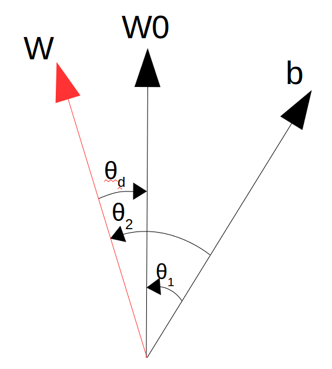

# VINS-Mono(二)——优化问题建模

&nbsp;

[toc]

---

## Reference

1. VINS-Mono: A Robust and Versatile Monocular Visual-Inertial State Estimator.
2. Quaternion Kinematics for Error-State KF.

&nbsp;

---

## 视觉部分的优化问题建模

视觉部分的问题就是一个BA问题，不过与纯视觉不同，这里涉及到两个坐标系之间的变换，分别是camera坐标系C和IMU坐标系（通常认为这个是机体坐标系）b，同时因为整个过程中使用的是逆深度表示空间中的Landmark，因此这个投影过程会变得稍微麻烦一些，但是整个过程还是比较清晰的。
$$
\begin{aligned}
\begin{cases}
P_{ci} &= \frac{f_{ci}}{\rho} \\
P_{bi} &= R^{b}_{c}P_{ci}+t^{b}_{c} \\
P_w &= R^{w}_{bi}P_{bi}+t^{w}_{bi} \\
P_{bj} &= (R^{w}_{bj})^T(P_w-t^{w}_{bj}) \\
P_{cj} &= (R^{b}_{c})^T(P_{bj}-t^{b}_{c}) = \left[ X_j, Y_j, Z_j \right]^T \\
p_{cj} &= \left[ \frac{X_j}{Z_j}, \frac{Y_j}{Z_j} \right]^T \\
error_{ij} &= \left[ \frac{X_j}{Z_j}-u_j, \frac{Y_j}{Z_j}-v_j \right]^T
\end{cases}
\end{aligned} \tag{1}
$$
于是可以逐个求解Jacobian矩阵了：

### 对第 i 帧的位姿进行求导

$$
\begin{aligned}
\frac{\partial{e_{ij}}}{\partial{T^{w}_{bi}}} &= \left[\frac{\partial{e_{ij}}}{\partial{t^{w}_{bi}}}, \frac{\partial{e_{ij}}}{\partial{R^{w}_{bi}}}\right] \\
&= \frac{\partial{e_{ij}}}{\partial{p_{cj}}}\frac{\partial{p_{cj}}}{\partial{P_{cj}}}\frac{\partial{P_{cj}}}{\partial{P_{bj}}} \frac{\partial{P_{bj}}}{\partial{P_{w}}} \left[\frac{\partial{P_w}}{\partial{t^{w}_{bi}}}, \frac{\partial{P_w}}{\partial{R^{w}_{bi}}}\right] \\
&= I_{2\times2}\begin{bmatrix}\frac{1}{Z_j} & 0 & -\frac{X_j}{Z^2_j} \\ 0 & \frac{1}{Z_j} & -\frac{Y_j}{Z^2_j}\end{bmatrix}_{2\times3} (R^{b}_{c})^T_{3\times3}(R^{w}_{bj})^T_{3\times3}\left[I,  -R^{w}_{bi}[P_{bi}]_{\times} \right]_{3\times6}
\end{aligned} \tag{2}
$$

### 对第 j 帧的位姿进行求导

$$
\begin{aligned}
\frac{\partial{e_{ij}}}{\partial{T^{w}_{bj}}} &= \left[\frac{\partial{e_{ij}}}{\partial{t^{w}_{bj}}}, \frac{\partial{e_{ij}}}{\partial{R^{w}_{bj}}}\right] \\
&= \frac{\partial{e_{ij}}}{\partial{p_{cj}}}\frac{\partial{p_{cj}}}{\partial{P_{cj}}}\frac{\partial{P_{cj}}}{\partial{P_{bj}}} \left[\frac{\partial{P_{bj}}}{\partial{t^{w}_{bj}}}, \frac{\partial{P_{bj}}}{\partial{R^{w}_{bj}}}\right] \\
&= I_{2\times2}\begin{bmatrix}\frac{1}{Z_j} & 0 & -\frac{X_j}{Z^2_j} \\ 0 & \frac{1}{Z_j} & -\frac{Y_j}{Z^2_j}\end{bmatrix}_{2\times3} (R^{b}_{c})^T_{3\times3}\left[-(R^{w}_{bj})^T,  [P_{bj}]_{\times} \right]_{3\times6}
\end{aligned} \tag{3}
$$

### 对逆深度$\rho$进行求导

$$
\begin{aligned}
\frac{\partial{e_{ij}}}{\partial{\rho}} &= \frac{\partial{e_{ij}}}{\partial{p_{cj}}}\frac{\partial{p_{cj}}}{\partial{P_{cj}}}\frac{\partial{P_{cj}}}{\partial{P_{bj}}}\frac{\partial{P_{bj}}}{\partial{P_{w}}}\frac{\partial{P_{w}}}{\partial{P_{bi}}}\frac{\partial{P_{bi}}}{\partial{P_{ci}}}\frac{\partial{P_{ci}}}{\partial{\rho}} \\
&= I_{2\times2}\begin{bmatrix}\frac{1}{Z_j} & 0 & -\frac{X_j}{Z^2_j} \\ 0 & \frac{1}{Z_j} & -\frac{Y_j}{Z^2_j}\end{bmatrix}_{2\times3} (R^{b}_{c})^T_{3\times3}(R^{w}_{bj})^T_{3\times3}(R^{w}_{bi})_{3\times3}(R^{b}_{c})_{3\times3}(-\frac{f_i}{\rho^2})_{3\times1}
\end{aligned} \tag{4}
$$

### 对IMU和Camera的外参进行求导

$$
\begin{aligned}
\frac{\partial{e_{ij}}}{\partial{T^{b}_{c}}} &= \left[\frac{\partial{e_{ij}}}{\partial{t^{b}_{c}}}, \frac{\partial{e_{ij}}}{\partial{R^{b}_{c}}}\right] \\
&= \frac{\partial{e_{ij}}}{\partial{p_{cj}}}\frac{\partial{p_{cj}}}{\partial{P_{cj}}}\frac{\partial{P_{cj}}}{\partial{T^{b}_{c}}} \\
&= \frac{\partial{e_{ij}}}{\partial{p_{cj}}}\frac{\partial{p_{cj}}}{\partial{P_{cj}}}(\frac{\partial{P_{cj}}}{\partial{T^{b}_{c}}}+(R^{b}_{c})^T\frac{\partial{P_{bj}}}{\partial{T^{b}_{c}}}) \\
&= \frac{\partial{e_{ij}}}{\partial{p_{cj}}}\frac{\partial{p_{cj}}}{\partial{P_{cj}}}(\frac{\partial{P_{cj}}}{\partial{T^{b}_{c}}}+(R^{b}_{c})^T\frac{\partial{P_{bj}}}{\partial{P_{w}}}\frac{\partial{P_{w}}}{\partial{P_{bi}}}\frac{\partial{P_{bi}}}{\partial{T^{b}_{c}}}) \\
&= I_{2\times2}\begin{bmatrix}\frac{1}{Z_j} & 0 & -\frac{X_j}{Z^2_j} \\ 0 & \frac{1}{Z_j} & -\frac{Y_j}{Z^2_j}\end{bmatrix}_{2\times3}\left( \left[ -(R^{b}_{c})^T, [P_{cj}]_{\times} \right] + (R^{b}_{c})^T(R^{w}_{bj})^TR^{w}_{bi} \left[ I, -R^{b}_{c}[P_{ci}]_{\times} \right] \right)_{3\times6} \\
&= I_{2\times2}\begin{bmatrix}\frac{1}{Z_j} & 0 & -\frac{X_j}{Z^2_j} \\ 0 & \frac{1}{Z_j} & -\frac{Y_j}{Z^2_j}\end{bmatrix}_{2\times3}\left( \left[ (R^{b}_{c})^T((R^{w}_{bj})^TR^{w}_{bi}-I), ([P_{cj}]_{\times}-(R^{b}_{c})^T(R^{w}_{bj})^TR^{w}_{bi}R^{b}_{c}[P_{ci}]_{\times}) \right] \right)_{3\times6}
\end{aligned} \tag{5}
$$

在VINS-Mono的代码中，作者把$[P_{ci}]_{\times}$给分解了，这块儿不太理解作者为什么要分解开，但是其实展开之后的结果是一样的。

&nbsp;

---

## 惯导部分的优化问题建模

惯导部分的建模也是一个最小化误差的问题，该误差部分由两个部分组成，一部分是状态变量组成的帧间间隔，这部分与位置、角度、速度相关，与bias不相关：
$$
\begin{aligned}
\begin{cases}
p^{bi}_{bj} &= (R^{w}_{bi})^T \left[({^w}p_{bj}-{^{w}}p_{bi})-{^w}v_{bi}\Delta{t}+\frac{1}{2}{^{w}}g\Delta{t}^2\right] \\
v^{bi}_{bj} &= (R^{w}_{bi})^T\left[({^w}v_{bj} - {^w}v_{bi})+{^{w}}g\Delta{t}\right] \\
q^{bi}_{bj} &= (q^{w}_{bi})^{-1}\otimes(q^{w}_{bj}) \\
ba_{j} &= ba_{i} \\
bg_{j} &= bg_{i}
\end{cases}
\end{aligned} \tag{6}
$$
另一部分是IMU的积分值$\{\overline{p}^{bi}_{bj}, \overline{v}^{bi}_{bj}, \overline{q}^{bi}_{bj}\}$，这部分因为是在$bi$系下的积分，因此与位置、角度、速度（均在世界坐标系下）无关，但是这部分与bias息息相关，所以这部分笔者认为不能叫观测值；

所以整个问题的误差为：
$$
\begin{aligned}
\begin{cases}
e_p &= p^{bi}_{bj}-\overline{p}^{bi}_{bj}=(R^{w}_{bi})^T \left[({^w}p_{bj}-{^{w}}p_{bi})-{^w}v_{bi}\Delta{t}+\frac{1}{2}{^{w}}g\Delta{t}^2\right]-\overline{p}^{bi}_{bj} = (R^{w}_{bi})^T {^w}\Delta{p} - \overline{p}^{bi}_{bj} \\
e_q &= 2[ (\overline{q}^{bi}_{bj})^{-1} \otimes q^{bi}_{bj}]_{3\times1} \\ 
e_v &= v^{bi}_{bj}-\overline{v}^{bi}_{bj}=(R^{w}_{bi})^T({^w}v_{bj} - {^w}v_{bi}+{^{w}}g\Delta{t})-\overline{v}^{bi}_{bj} = (R^{w}_{bi})^T {^w}\Delta{v}-\overline{v}^{bi}_{bj} \\
e_{ba} &= ba_j - ba_i \\
e_{bg} &= bg_j - bg_i
\end{cases}
\end{aligned} \tag{7}
$$
**我这里稍微有一个问题就是在代码中的姿态误差$e_q$和论文中的公式并不相同，起初笔者还是比较在意这个事情的，但是后来个人认为只要整个推导过程中按照一个公式来就可以了**。

所以根据公式（7）对状态变量进行求导（按照VINS-Mono中的组织形式）：

### 误差部分对 i 时刻状态量的求导

#### 误差部分对于i 时刻位姿状态量的求导

$$
\begin{aligned}
\frac{\partial{e}}{\partial{T_{bi}}} &= \left[\frac{\partial{e}}{\partial{p_{bi}}}, \frac{\partial{e}}{\partial{\theta_{bi}}} \right] \\
&= \begin{bmatrix} \frac{\partial{e_p}}{\partial{p_{bi}}} & \frac{\partial{e_p}}{\partial{\theta_{bi}}} \\ \frac{\partial{e_q}}{\partial{p_{bi}}} & \frac{\partial{e_q}}{\partial{\theta_{bi}}} \\ \frac{\partial{e_v}}{\partial{p_{bi}}} & \frac{\partial{e_v}}{\partial{\theta_{bi}}} \\ \frac{\partial{e_{ba}}}{\partial{p_{bi}}} & \frac{\partial{e_{ba}}}{\partial{\theta_{bi}}} \\ \frac{\partial{e_{bg}}}{\partial{p_{bi}}} & \frac{\partial{e_{bg}}}{\partial{\theta_{bi}}} \\  \end{bmatrix}\\
&= \begin{bmatrix} -(R^{w}_{bi})^T & [(R^{w}_{bi})^T \Delta{p}]_{\times} \\  0 & -\left[ [q^{j}_{i}]_{\mathrm{L}} [\overline{q}^{i}_{j} \otimes \mathrm{J}^{q}_{bg}\delta{bg_{i}}]_{\mathrm{R}} \right]_{3\times3} \\ 0 & [(R^{w}_{bi})^T {^w}\Delta{v}]_{\times} \\ 0 & 0 \\ 0 & 0 \end{bmatrix}\\
\end{aligned} \tag{8}
$$

> 这里简单推导一下姿态误差对姿态的求导：
> $$
> \begin{aligned}
> e(\theta+\delta{\theta}) &= 2[(\overline{q}^{i}_{j})^{-1} \otimes [(q^{w}_{i}\otimes q(\delta{\theta}))^{-1}\otimes q^{w}_{j}]]_{3\times1} \\
> &= 2[(\overline{q}^{i}_{j})^{-1} \otimes q(\delta{\theta})^{-1}\otimes q^{i}_{j}]_{3\times1} \\ 
> &= 2[[(q^{i}_{j})^{-1}\otimes q(\delta{\theta}) \otimes \overline{q}^{i}_{j})]^{-1}]_{3\times1} \\
> &= 2[[[q^{j}_{i}]_{\mathrm{L}}[\overline{q}^{i}_{j}]_{\mathrm{R}}\begin{bmatrix}1 \\ \frac{1}{2}\delta{\theta}\end{bmatrix}]^{-1}]_{3\times1} \\ 
> &= 2[[q^{j}_{i}]_{\mathrm{L}}[\overline{q}^{i}_{j}]_{\mathrm{R}}\begin{bmatrix}1 \\ -\frac{1}{2}\delta{\theta}\end{bmatrix}]_{3\times1} \\
> &= 2[[q^{j}_{i}]_{\mathrm{L}}[\overline{q}^{i}_{j}]_{\mathrm{R}}\begin{bmatrix}1 \\ 0\end{bmatrix}+[q^{j}_{i}]_{\mathrm{L}}[\overline{q}^{i}_{j}]_{\mathrm{R}}\begin{bmatrix} 0 \\ -\frac{1}{2}\delta{\theta} \end{bmatrix}]_{3\times1} \\
> &= e(\theta)+[[q^{j}_{i}]_{\mathrm{L}}[\overline{q}^{i}_{j}]_{\mathrm{R}}\begin{bmatrix} 0 \\ -\delta{\theta} \end{bmatrix}]_{3\times1}
> \end{aligned}
> $$
> 这部分其实看到中间取了一个求逆操作，主要是为了和VINS-Mono中的公式对上。
>
> 所以采用求导的原始定义有：
> $$
> \frac{\partial{e_q}}{\partial{\theta}}=\mathrm{lim}\frac{e(\theta+\delta{\theta})-e(\theta)}{\delta{\theta}}=-[[q^{j}_{i}]_{\mathrm{L}}[\overline{q}^{i}_{j}]_{\mathrm{R}}]_{3\times3}
> $$

#### 误差部分对于 i 时刻运动状态量的求导

$$
\begin{aligned}
\frac{\partial{e}}{\partial{M_{bi}}} &= \left[\frac{\partial{e}}{\partial{v_{bi}}}, \frac{\partial{e}}{\partial{ba_i}}, \frac{\partial{e}}{\partial{bg_i}} \right] \\
&= \begin{bmatrix} \frac{\partial{e_p}}{\partial{v_{bi}}} & \frac{\partial{e_p}}{\partial{ba_i}} & \frac{\partial{e_p}}{\partial{bg_i}} \\ 
\frac{\partial{e_q}}{\partial{v_{bi}}} & \frac{\partial{e_q}}{\partial{ba_i}} & \frac{\partial{e_q}}{\partial{bg_i}} \\ 
\frac{\partial{e_v}}{\partial{v_{bi}}} & \frac{\partial{e_v}}{\partial{ba_i}} & \frac{\partial{e_v}}{\partial{bg_i}} \\ 
\frac{\partial{e_{ba}}}{\partial{v_{bi}}} & \frac{\partial{e_{ba}}}{\partial{ba_i}} & \frac{\partial{e_{ba}}}{\partial{bg_i}} \\ 
\frac{\partial{e_{bg}}}{\partial{v_{bi}}} & \frac{\partial{e_{bg}}}{\partial{ba_i}} & \frac{\partial{e_{bg}}}{\partial{bg_i}} \\ \end{bmatrix}\\
&= \begin{bmatrix} -(R^{w}_{bi})^T \Delta{t} & -J^{p}_{ba_i}  & -J^{p}_{bg_i} \\  0 & 0 & -[[q^{j}_{i}\otimes \overline{q}^{i}_{j}]_{\mathrm{L}}]_{3\times3}J^{q}_{bg_i} \\ -(R^{w}_{bi})^T & -J^{v}_{ba_i}  & -J^{v}_{bg_i} \\ 0 & -I & 0 \\ 0 & 0 &-I \end{bmatrix}\\
\end{aligned} \tag{9}
$$

> 依旧简单推导一下姿态误差对角速度bias的求导过程：
> $$
> \begin{aligned}
> e(bg+\delta{bg}) &= 2[(\overline{q}^{i}_{j} \otimes \begin{bmatrix}1 \\ \frac{1}{2}J^{q}_{bg} \delta{bg}\end{bmatrix})^{-1} \otimes q^{i}_{j}]_{3\times1} \\
> &= 2[\begin{bmatrix}1 \\ \frac{1}{2}J^{q}_{bg} \delta{bg}\end{bmatrix}^{-1}(\overline{q}^{i}_{j})^{-1} \otimes q^{i}_{j}]_{3\times1} \\ 
> &= 2[[(q^{i}_{j})^{-1}\otimes \overline{q}^{i}_{j}) \otimes \begin{bmatrix}1 \\ \frac{1}{2}J^{q}_{bg} \delta{bg}\end{bmatrix} ]^{-1}]_{3\times1} \\
> &= 2[[[q^{j}_{i} \otimes \overline{q}^{i}_{j}]_{\mathrm{L}}\begin{bmatrix}1 \\ \frac{1}{2}J^{q}_{bg} \delta{bg}\end{bmatrix} ]^{-1}]_{3\times1} \\ 
> &= 2[[q^{j}_{i} \otimes \overline{q}^{i}_{j}]_{\mathrm{L}}\begin{bmatrix}1 \\ -\frac{1}{2}J^{q}_{bg} \delta{bg}\end{bmatrix}]_{3\times1} \\ 
> &= 2[[q^{j}_{i} \otimes \overline{q}^{i}_{j}]_{\mathrm{L}}\begin{bmatrix}1 \\ 0 \end{bmatrix}]_{3\times1} + 2[[q^{j}_{i} \otimes \overline{q}^{i}_{j}]_{\mathrm{L}}\begin{bmatrix}0 \\ -\frac{1}{2}J^{q}_{bg} \delta{bg}\end{bmatrix}]_{3\times1} \\
> &= e(bg) + [[q^{j}_{i} \otimes \overline{q}^{i}_{j}]_{\mathrm{L}}\begin{bmatrix}0 \\ -J^{q}_{bg} \delta{bg}\end{bmatrix}]_{3\times1}
> \end{aligned}
> $$
> 这部分很重要的一定是通过四元数的求逆法则将$\delta{bg}$转移到公式的最后，最后再通过四元数求逆其实就是把四元数的虚部部分添加负号的方法把求逆符号由公式外转到宫室内。
>
> 同样使用求导的定义有：
> $$
> \frac{\partial{e_q}}{\partial{bg}}=\mathrm{lim}\frac{e(bg+\delta{bg})-e(bg)}{\delta{bg}}=-[[q^{j}_{i}\otimes \overline{q}^{i}_{j}]_{\mathrm{L}}]_{3\times3}J^{q}_{bg}
> $$

### 误差部分对 j 时刻状态量的求导

#### 误差部分对于 j 时刻位姿状态量的求导

$$
\begin{aligned}
\frac{\partial{e}}{\partial{T_{bj}}} &= \left[\frac{\partial{e}}{\partial{p_{bj}}}, \frac{\partial{e}}{\partial{\theta_{bj}}} \right] \\
&= \begin{bmatrix} \frac{\partial{e_p}}{\partial{p_{bj}}} & \frac{\partial{e_p}}{\partial{\theta_{bj}}} \\ \frac{\partial{e_q}}{\partial{p_{bj}}} & \frac{\partial{e_q}}{\partial{\theta_{bj}}} \\ \frac{\partial{e_v}}{\partial{p_{bj}}} & \frac{\partial{e_v}}{\partial{\theta_{bj}}} \\ \frac{\partial{e_{ba}}}{\partial{p_{bj}}} & \frac{\partial{e_{ba}}}{\partial{\theta_{bj}}} \\ \frac{\partial{e_{bg}}}{\partial{p_{bj}}} & \frac{\partial{e_{bg}}}{\partial{\theta_{bj}}} \\  \end{bmatrix}\\
&= \begin{bmatrix} (R^{w}_{bi})^T & 0 \\  0 & \left[ \left[(\overline{q}^{i}_{j} \otimes \mathrm{J}^{q}_{bg}\delta{bg_{i}})^{-1} \otimes q^{i}_{j}  \right]_{\mathrm{L}} \right]_{3\times3} \\ 0 & 0 \\ 0 & 0 \\ 0 & 0 \end{bmatrix}\\
\end{aligned} \tag{10}
$$

> 简单推导一下姿态误差对姿态的求导：
> $$
> \begin{aligned}
> e(\theta+\delta{\theta}) &= 2[(\overline{q}^{i}_{j})^{-1} \otimes (q^{w}_{i})^{-1}\otimes q^{w}_{j}\otimes q(\delta{\theta})]_{3\times1} \\
> &= 2[(\overline{q}^{i}_{j})^{-1}\otimes q^{i}_{j} \otimes \begin{bmatrix}1 \\ \frac{1}{2}\delta{\theta}\end{bmatrix}]_{3\times1} \\ 
> &= 2[[(\overline{q}^{i}_{j})^{-1}\otimes q^{i}_{j}]_{\mathrm{L}} \begin{bmatrix}1 \\ \frac{1}{2}\delta{\theta}\end{bmatrix}]_{3\times1} \\ 
> &= e(\theta) + [[(\overline{q}^{i}_{j})^{-1}\otimes q^{i}_{j}]_{\mathrm{L}} \begin{bmatrix}0 \\ \delta{\theta}\end{bmatrix}]_{3\times1}
> \end{aligned}
> $$

#### 误差部分对于 j 时刻运动状态量的求导

$$
\begin{aligned}
\frac{\partial{e}}{\partial{M_{bj}}} &= \left[\frac{\partial{e}}{\partial{v_{bj}}}, \frac{\partial{e}}{\partial{ba_j}}, \frac{\partial{e}}{\partial{bg_j}} \right] \\
&= \begin{bmatrix} \frac{\partial{e_p}}{\partial{v_{bj}}} & \frac{\partial{e_p}}{\partial{ba_j}} & \frac{\partial{e_p}}{\partial{bg_j}} \\ 
\frac{\partial{e_q}}{\partial{v_{bj}}} & \frac{\partial{e_q}}{\partial{ba_j}} & \frac{\partial{e_q}}{\partial{bg_j}} \\ 
\frac{\partial{e_v}}{\partial{v_{bj}}} & \frac{\partial{e_v}}{\partial{ba_j}} & \frac{\partial{e_v}}{\partial{bg_j}} \\ 
\frac{\partial{e_{ba}}}{\partial{v_{bj}}} & \frac{\partial{e_{ba}}}{\partial{ba_j}} & \frac{\partial{e_{ba}}}{\partial{bg_j}} \\ 
\frac{\partial{e_{bg}}}{\partial{v_{bj}}} & \frac{\partial{e_{bg}}}{\partial{ba_j}} & \frac{\partial{e_{bg}}}{\partial{bg_j}} \\ \end{bmatrix}\\
&= \begin{bmatrix} 0 & 0 & 0 \\  0 & 0 & 0 \\ (R^{w}_{bi})^T & 0 & 0 \\ 0 & I & 0 \\ 0 & 0 & I \end{bmatrix}\\
\end{aligned} \tag{11}
$$

### 小结一下惯性部分的建模问题

1. 这部分的误差模型其实由两个部分组成，一部分是状态量构建的帧间变化量（与位姿和速度直接相关），另一部分是IMU预积分得到的帧间变化量，这部分由于是以 i 时刻作为参考系，因此和位姿速度无直接关系，但是在预积分过程中和角速度计和角速度计的bias息息相关；
2. 在预积分过程中，虽然使用了精度较高的中点法，但是整个预积分过程中并没有涉及到 j 时刻的零偏，或者说认为 j 时刻的零偏与 i 时刻是一样的，所以看到误差部分对 j 时刻状态的求导是比较简单的；

&nbsp;

---

## VINS对Yaw轴零空间的校正

VINS-Mono并没有像DSO那样显式的（在优化问题中）考虑零空间对整个优化问题的影响，但是对于Yaw轴，VINS-Mono在优化前后是做了一些补偿的，原理也很简单，对于滑动窗口中的最老的关键帧，优化前后的Yaw轴是不能改变的，因为在局部的优化问题上来说，最老的关键帧是一个基准，因此基准是不能改变的，否则整个局部优化问题的能观性得不到保证。

那这部分的公式也比较简单，其实用下图能表示的很好：



图中：

- $W0$表示原先的世界坐标系，$W$表示优化后的世界坐标系，$b$表示机体的yaw轴方向；
- $\theta_1$表示$b$系在$W0$坐标系下面的yaw角度，$\theta_2$表示$b$系在$W$坐标系下的yaw角度，$\theta_d$表示$W$系在$W0$系下的yaw角度；
- 图中角度箭头的方向表示旋转的变换关系；

这里需要说的一点是这个过程其实是在校正w坐标系，即认为优化之后是w坐标系发生了变化，之所以校正w坐标系是为了保证前后的w坐标系是一致的。

于是很容易的看到一个关系就是$\theta_d=-(\theta_2-\theta_1)=\theta_1-\theta_2$，代码基本就是这个样子做的，只不过作者对变量的命名确实有些让我难理解，这里笔者稍微进行了修改，如下：

```c++
// this place correct the world corrdination,
// not  b coordination
Matrix3d    Rw0b = RS_[0].toRotationMatrix();
Quaterniond Qwb  = Quaterniond(pose_params[0]+3);
Matrix3d    Rwb  = Qwb.toRotationMatrix();

// attitude of b in w0 coordination
// attitude of b in w  coordination
Vector3d ypr0 = Rnb2ypr<double>(Rw0b);
Vector3d ypr  = Rnb2ypr<double>(Rwb);

if (abs(abs(ypr.x())-90) < 1.0 || abs(abs(ypr0.x())-90) < 1.0) {
    Rw0w = Rw0b*Rwb.transpose();
}
else {
    // only correct 
    double yw0b = ypr0.x(); // b->w0
    double ywb  = ypr.x();  // b->w

    // yaw between w and w0
    double yw0w = yw0b - ywb;  // w->w0
    LOGE("[d2V] diff yaw : %lf", yw0w);   // 
    Rw0w = ypr2Rnb(Vector3d(yw0w, 0, 0)); // w0_R_w
}
```


&nbsp;

----

## 总结

建模这部分就先到这里，下部分关注的重点就是边缘化和优化问题的先验部分了。

