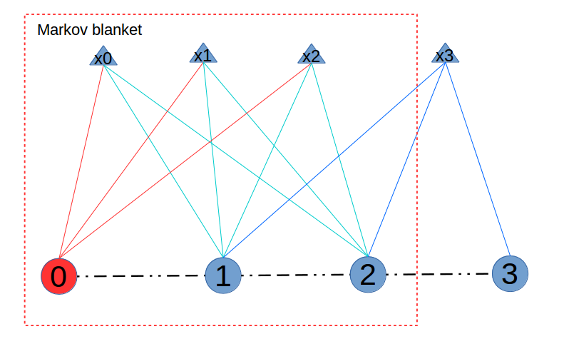
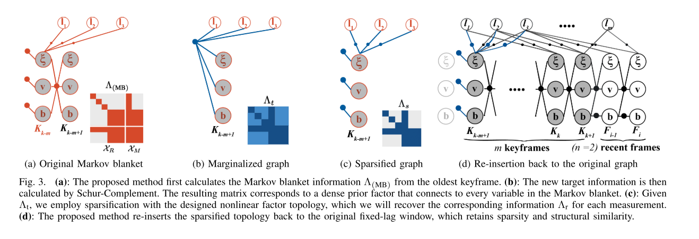

# VINS-Mono——滑动窗口优化

&nbsp;

[toc]

---

## Reference

1. Decoupled, Consistent Node Removal and Edge Sparsification for Graph-based SLAM 关于边缘化很好的一篇文章
2. Information Sparsification in Visual-Inertial Odometry 对边缘化进行稀疏化的文章
3. [https://blog.csdn.net/wubaobao1993/article/details/104512697](https://blog.csdn.net/wubaobao1993/article/details/104512697) 笔者之前小结的边缘化的笔记
4. https://blog.csdn.net/heyijia0327/article/details/53707261 贺博关于DSO中滑动窗口的介绍
5. https://blog.csdn.net/heyijia0327/article/details/52822104 贺博关于schur补以及边缘化的介绍
6. Keyframe-Based Visual-Inertial SLAM Using Nonlinear Optimization OKVIS 里面也简单的讲了边缘化的部分
7. VINS-Mono: A Robust and Versatile Monocular Visual-Inertial State Estimator 这个就不介绍了

&nbsp;

---

## 滑动窗口之边缘化

边缘化这个方法其实是在概率论中的概念了，主要的公式如下：
$$
p_{X}(x)=\int_{y} p_{X \mid Y}(x \mid y) p_{Y}(y) \mathrm{d} y=\mathrm{E}_{Y}\left[p_{X \mid Y}(x \mid y)\right]  \tag{1}
$$
就是对联合概率中不需要的部分进行概率积分，也可以看到边缘概率是条件概率对于被边缘化概率的概率期望，也就是综合考虑了被边缘化掉的变量之后的概率分布，因此保证了信息的完备性。

说到滑动窗口方法中的边缘化，个人觉得不得不讲的有三个点：

1. Schur Complement；
2. 线性化点的固定（并非是FEJ）；
3. 边缘化之后的优化问题的稀疏性；

下面浅谈一下以上几个点：

### Schur Complement在边缘化中的作用

笔者最开始接触边缘化也是从Schur Complement入门的，当时觉得是因为Schur Complement操作才使得边缘化能够保持信息的不丢失，对后续的优化给予一定的先验。但是随着理解的深入，才发现其实Schur Complement就是一个简单的操作而已，仅仅是因为从边缘化的公式上来讲，Schur Complement刚好可以派上用场而已。鉴于参考【3】已经从最小二乘的角度对边缘化做了总结，这里就用概率的角度进行推导。

#### Markov Blanket

对于边缘化而言，Markov Blanket是一个很重要的前提，在这个区域内做边缘化才是合理的，也就是红色部分和绿色部分所组成的图，蓝色的部分在边缘化的时候是不考虑的。

&nbsp;

#### Graph-based SLAM

使用贝叶斯公式表示整个优化问题，即：
$$
p(x|z) \propto p(z|x)p(x) \tag{2}
$$
在整个优化问题中，先验$p(x)$其实是不知道的，注意这里$x=\{x_0,...,x_k\}$，也就是把从0时刻到当前k时刻所有的变量都保留并考虑进来的时候，先验$p(x)$我们是不知道的。所以这里后验概率正比于似然概率，即$p(x|z) \propto p(z|x)$，这也是整个SLAM问题中为什么可以用最大似然法求解最优的状态量。

这里就引入一个巨大的问题，上述的推论建立在从0时刻一路把变量都考虑进来的基础上，但是实际上，滑动窗口的思路刚好与之相反，即窗口滑动的时候，丢掉最老的那一帧，那么在滑动窗口的方法中，整个公式是否还能用最大似然表示最大后验呢？**边缘化表示：安排！**

&nbsp;

#### 边缘化

假设在k时刻的时候，算法第一次进行了边缘化，有（特别注意的是下面的推导一定要在Markov Blanket中）：
$$
\begin{aligned}
p\left(\mathbf{x}_{b} | \mathbf{z}_{m}\right) &= \int_{\mathbf{x}_{m}} p\left( \begin{bmatrix}\mathbf{x}_{b} \\ \mathbf{x}_{m} \end{bmatrix} | \mathbf{z}_{m}\right) \mathrm{d} \mathbf{x}_{m}  \\
& \propto  \int_{\mathbf{x}_{m}} p\left( \mathbf{z}_{m} | \begin{bmatrix}\mathbf{x}_{b} \\ \mathbf{x}_{m} \end{bmatrix}\right) \mathrm{d} \mathbf{x}_{m} 
\end{aligned}  \tag{3}
$$
把公式（3）第二层的似然问题写出来就是：
$$
\begin{aligned}
p\left( \mathbf{z}_{m} | \begin{bmatrix}\mathbf{x}_{b} \\ \mathbf{x}_{m} \end{bmatrix}\right)
&=\eta \mathrm{exp}\{-\frac{1}{2}\left[z-h(\begin{bmatrix} x_b \\ x_m \end{bmatrix})\right]^T \Omega \left[z-h(\begin{bmatrix} x_b \\ x_m \end{bmatrix})\right]\}
\end{aligned}  \tag{4}
$$
这里着重对内部的公式进行化简，有：
$$
\begin{aligned}
\left[z-h(\begin{bmatrix}x_b\\x_m\end{bmatrix})\right]^T \Omega \left[z-h(\begin{bmatrix}x_b\\x_m\end{bmatrix})\right] &= \left[\underbrace{z-h(\begin{bmatrix}\hat{x_b}\\\hat{x_m}\end{bmatrix})}_{e(\hat{x_b}, \hat{x_m})}+\mathrm{J}\begin{bmatrix}x_b-\hat{x_b}\\x_m-\hat{x_m}\end{bmatrix}\right]^T \Omega \left[z-h(\begin{bmatrix}\hat{x_b}\\\hat{x_m}\end{bmatrix})+\mathrm{J}\begin{bmatrix}x_b-\hat{x_b}\\x_m-\hat{x_m}\end{bmatrix}\right]^T \\
&=e^T \Omega e + \left\{\mathrm{J}\begin{bmatrix}x_b-\hat{x_b}\\x_m-\hat{x_m}\end{bmatrix}\right\}^T\Omega e+e^T\Omega \left\{\mathrm{J}\begin{bmatrix}x_b-\hat{x_b}\\x_m-\hat{x_m}\end{bmatrix}\right\}+\begin{bmatrix}x_b-\hat{x_b}\\x_m-\hat{x_m}\end{bmatrix}^T \mathrm{J}^T\Omega \mathrm{J} \begin{bmatrix}x_b-\hat{x_b}\\x_m-\hat{x_m}\end{bmatrix} \\
&=e^T \Omega e + \begin{bmatrix}x_b-\hat{x_b}\\x_m-\hat{x_m}\end{bmatrix}^T\begin{bmatrix}b_b\\b_m\end{bmatrix}+\begin{bmatrix}b_b\\b_m\end{bmatrix}^T\begin{bmatrix}x_b-\hat{x_b}\\x_m-\hat{x_m}\end{bmatrix}+\begin{bmatrix}x_b-\hat{x_b}\\x_m-\hat{x_m}\end{bmatrix}^T\begin{bmatrix}\Omega_{bb}&\Omega_{bm}\\\Omega_{mb}&\Omega_{mm}\end{bmatrix}\begin{bmatrix}x_b-\hat{x_b}\\x_m-\hat{x_m}\end{bmatrix} \\
&=e^T \Omega e + \begin{bmatrix}\Delta x_b\\\Delta x_m\end{bmatrix}^T\begin{bmatrix}b_b\\b_m\end{bmatrix}+\begin{bmatrix}b_b\\b_m\end{bmatrix}^T\begin{bmatrix}\Delta x_b\\\Delta x_m\end{bmatrix}+\begin{bmatrix}\Delta x_b\\\Delta x_m\end{bmatrix}^T\begin{bmatrix}\Omega_{bb}&\Omega_{bm}\\\Omega_{mb}&\Omega_{mm}\end{bmatrix}\begin{bmatrix}\Delta x_b\\\Delta x_m\end{bmatrix}
\end{aligned}  \tag{5}
$$
公式到这里其实我们不用再去关注$e^T\Omega e$的部分了，因为这部分和$x_b, x_m$已经没有关系了，于是着重的看第二个部分，这部分其实就可以用到Schur Complement的操作，我们可以把后面的部分当做一个优化问题，该问题对$\mathbf{\Delta{x}}$进行求导就是我们熟悉的增量方程：
$$
\left[\begin{array}{cc}
\mathbf{\Omega}_{\mathbf{bb}} & \mathbf{\Omega}_{\mathbf{bm}} \\
\mathbf{\Omega}_{\mathbf{bm}}^{T} & \mathbf{\Omega}_{\mathbf{mm}}
\end{array}\right]\left[\begin{array}{l}
\Delta \mathbf{x}_{\mathbf{b}} \\
\boldsymbol{\Delta} \mathbf{x}_{\mathbf{m}}
\end{array}\right]=\left[\begin{array}{l}
-\mathbf{b}_{\mathbf{b}} \\
-\mathbf{b}_{\mathbf{m}}
\end{array}\right]  \tag{6}
$$
之后使用Schur Complement操作得到最佳的$\Delta{\mathbf{x}_m}$进而得到最佳的$\mathbf{x_m}$，于是有：
$$
\begin{aligned}
\left[\begin{array}{cc}
\mathbf{I} & -\mathbf{\Omega}_{\mathbf{bm}}\mathbf{\Omega}_{\mathbf{mm}}^{-1} \\
0 & \mathbf{I}\end{array}\right]
\left[\begin{array}{cc}
\mathbf{\Omega}_{\mathbf{bb}} & \mathbf{\Omega}_{\mathbf{bm}} \\
\mathbf{\Omega}_{\mathbf{bm}}^{T} & \mathbf{\Omega}_{\mathbf{mm}}
\end{array}\right]\left[\begin{array}{l}
\Delta \mathbf{x}_{\mathbf{b}} \\
\boldsymbol{\Delta} \mathbf{x}_{\mathbf{m}}
\end{array}\right]&=-\left[\begin{array}{cc}
\mathbf{I} & -\mathbf{\Omega}_{\mathbf{bm}}\mathbf{\Omega}_{\mathbf{mm}}^{-1} \\
0 & \mathbf{I}\end{array}\right]\left[\begin{array}{l}
\mathbf{b}_{\mathbf{b}} \\
\mathbf{b}_{\mathbf{m}}
\end{array}\right] \\
\left[\begin{array}{cc}
\mathbf{\Omega}_{\mathbf{bb}}-\mathbf{\Omega}_{\mathbf{bm}}\mathbf{\Omega}_{\mathbf{mm}}^{-1}\mathbf{\Omega}_{\mathbf{bm}}^T & 0 \\ \mathbf{\Omega}_{\mathbf{bm}}^T & \mathbf{\Omega}_{\mathbf{mm}}
\end{array}\right]\left[\begin{array}{l}
\Delta \mathbf{x}_{\mathbf{b}} \\
\boldsymbol{\Delta} \mathbf{x}_{\mathbf{m}}
\end{array}\right]&=-\left[\begin{array}{l}
\mathbf{b}_{\mathbf{b}}-\mathbf{\Omega}_{\mathbf{bm}}\mathbf{\Omega}_{\mathbf{mm}}^{-1}\mathbf{b_m} \\
\mathbf{b}_{\mathbf{m}}
\end{array}\right]
\end{aligned} \tag{7}
$$
所以很容易得到：
$$
\begin{aligned}
\mathbf{\Delta{x_m}}&=-\mathbf{\Omega_{mm}^{-1}}(\mathbf{b_m}-\mathbf{\Omega_{bm}^T}\mathbf{\Delta{x_b}}) \\
\mathbf{x_m}&=\mathbf{\hat{x_m}}-\mathbf{\Omega_{mm}^{-1}}(\mathbf{b_m}-\mathbf{\Omega_{bm}^T}\mathbf{\Delta{x_b}})
\end{aligned} \tag{8}
$$
带入到公式（5）中有：
$$
\left[z-h(\begin{bmatrix}x_b\\x_m\end{bmatrix})\right]^T \Omega \left[z-h(\begin{bmatrix}x_b\\x_m\end{bmatrix})\right] \approx \zeta+\mathbf{b}_{t}^{T}\left(\mathbf{x}_{b}-\hat{\mathbf{x}}_{b}\right)+\frac{1}{2}\left(\mathbf{x}_{b}-\hat{\mathbf{x}}_{b}\right)^{T} \mathbf{\Omega}_{t}\left(\mathbf{x}_{b}-\hat{\mathbf{x}}_{b}\right) \tag{9}
$$
其中：

1. 约等号并不是近似，而是因为使用了Schur Complement的时候，求解的$\mathbf{\Delta{x_m}}$是期望的，而不是真实的；

2. 其中$\mathbf{b_t}$是新的梯度方向，如下：
   $$
   \mathbf{b}_{\mathbf{t}}=\mathbf{b}_{\mathbf{b}}-\mathbf{\Omega}_{\mathbf{bm}}\mathbf{\Omega}_{\mathbf{mm}}^{-1}\mathbf{b_m}
   $$

3. 其中$\mathbf{\Omega_t}$为新的信息矩阵，如下：
   $$
   \mathbf{\Omega_t}=\mathbf{\Omega}_{\mathbf{bb}}-\mathbf{\Omega}_{\mathbf{bm}}\mathbf{\Omega}_{\mathbf{mm}}^{-1}\mathbf{\Omega}_{\mathbf{bm}}^T
   $$

可以看到刚好就是对增量方程运用Schur Complement之后的结果。

回到我们的初衷，也就是公式（3）和公式（4），似然问题的部分现在可以重写为如下形式：
$$
\begin{aligned}
p\left( \mathbf{z}_{m} | \begin{bmatrix}\mathbf{x}_{b} \\ \mathbf{x}_{m} \end{bmatrix}\right)
&\approx \eta \mathrm{exp}\{-\frac{1}{2}\left[\zeta+\mathbf{b}_{t}^{T}\left(\mathbf{x}_{b}-\hat{\mathbf{x}}_{b}\right)+\frac{1}{2}\left(\mathbf{x}_{b}-\hat{\mathbf{x}}_{b}\right)^{T} \mathbf{\Omega}_{t}\left(\mathbf{x}_{b}-\hat{\mathbf{x}}_{b}\right)\right]\} \\
&\approx \eta_1 \mathrm{exp}\{-\frac{1}{2}\left[\mathbf{b}_{t}^{T}\left(\mathbf{x}_{b}-\hat{\mathbf{x}}_{b}\right)+\frac{1}{2}\left(\mathbf{x}_{b}-\hat{\mathbf{x}}_{b}\right)^{T} \mathbf{\Omega}_{t}\left(\mathbf{x}_{b}-\hat{\mathbf{x}}_{b}\right)\right]\}
\end{aligned} \tag{10}
$$
于是整个似然在使用了Schur Complement操作之后，整个概率中就把$\mathbf{x_m}$消去了，于是再回到公式（3）中对$\mathbf{x_m}$进行概率积分的话，就可以把这部分提取出来，如下：
$$
\begin{aligned}
p\left(\mathbf{x}_{b} | \mathbf{z}_{m}\right) 
& \propto  \int_{\mathbf{x}_{m}} p\left( \mathbf{z}_{m} | \begin{bmatrix}\mathbf{x}_{b} \\ \mathbf{x}_{m} \end{bmatrix}\right) \mathrm{d} \mathbf{x}_{m} \\
&= \eta_1 \mathrm{exp}\{-\frac{1}{2}\left[\mathbf{b}_{t}^{T}\left(\mathbf{x}_{b}-\hat{\mathbf{x}}_{b}\right)+\frac{1}{2}\left(\mathbf{x}_{b}-\hat{\mathbf{x}}_{b}\right)^{T} \mathbf{\Omega}_{t}\left(\mathbf{x}_{b}-\hat{\mathbf{x}}_{b}\right)\right]\} \int_{\mathbf{x_m}}1 \mathrm{d}\mathbf{x_m} \\
&= \eta_1 \mathrm{exp}\{-\frac{1}{2}\left[\mathbf{b}_{t}^{T}\left(\mathbf{x}_{b}-\hat{\mathbf{x}}_{b}\right)+\frac{1}{2}\left(\mathbf{x}_{b}-\hat{\mathbf{x}}_{b}\right)^{T} \mathbf{\Omega}_{t}\left(\mathbf{x}_{b}-\hat{\mathbf{x}}_{b}\right)\right]\}
\end{aligned}  \tag{11}
$$
这就是边缘化之后的结果了，可以看到，其实Schur Complement这个操作确实是一个比较关键的一步（消除了一个变量），但是从整个边缘化公式上来讲，其仅仅是其中的一环。但是对于实现来讲，其价值就非常大了，因为操作直接给出了边缘化概率之后的参数。

> **值得注意的是**
>
> 上述的过程有一个很重要的条件就是**当边缘化$\mathbf{x_m}$之后，就不会再去优化$\mathbf{x_m}$了**，这也是用完Schur Complement操作之后可以保持信息不丢失的本质原因，也就是说这些点的值在这之后都被固定了，这与保留所有的节点的Graph-based SLAM很不一样，因为Graph-based SLAM会一直对这些点进行优化，不过当窗口足够长的时候，可以认为在边缘化的时刻，该点已经足够好了，就不需要再被优化了。

公式（11）所表示的就是边缘化对后续优化所产生的先验，于是下次优化的时候就可以使用完整的贝叶斯公式，有：
$$
\begin{aligned}
p(x_b|z_b) &= p(z_b|x_b)p(x_b) \\
&= \eta \mathrm{exp}\left\{-\frac{1}{2} \left( \underbrace{ \| z_b-\mathrm{h}(x_b) \|_{\Lambda_b}^2}_{\text{linear point?}} + \mathbf{b}_{t}^{T}\left(\mathbf{x}_{b}-\hat{\mathbf{x}}_{b}\right)+\frac{1}{2}\left(\mathbf{x}_{b}-\hat{\mathbf{x}}_{b}\right)^{T} \mathbf{\Omega}_{t}\left(\mathbf{x}_{b}-\hat{\mathbf{x}}_{b}\right) \right) \right\}
\end{aligned}  \tag{12}
$$
到此其实我们也可以给出加入先验之后的因子图表示了，大致画了一下如下：

其中：

1. 红色的节点和线表示被边缘化的变量和观测$\mathbf{x_m}, \mathbf{z_m}$；蓝色表示与被边缘化变量相关的变量$\mathbf{x_b}$，整个方框中的变量构成了一个Markov Blanket；
2. 绿色的节点和线表示边缘化留下的先验信息，这里笔者把先验信息表示为了一个观测的形式，因为从上面的推导可以看出来，先验部分其实也可以表示为一个观测方程$\mathbf f(\mathrm{x_b})$（参考公式11，指数项可以通过配方得到一个二次型表达式，**但是笔者认为从先验公式的形式上来看先验更多的是约束优化变量的变化量**）；

如上述2中所说，如果把先验看做是一个关于剩余状态$\mathbf{x_b}$的观测方程的话，那么观测量的维度是多少？其实笔者认为这个维度没有一个明确的理论数值，但是为了计算和分解上的方便，这个观测的维度会和$\mathbf{x_b}$的流形上的维度一致。

公式（12）中笔者认为比较重要的一点就是如何选取线性化点了，也就是要谈论的第二个点。

&nbsp;

----

### 线性化点的固定

其实这个地方就可以用到之前的一些铺垫：

1. 如果没有边缘化，依旧按照从0时刻到k时刻的最大似然问题求解的话，那么相信我们就不会纠结于线性化点的事情了，因为必然会用k时刻的状态量作为线性化点（不引入FEJ理论的话）；

2. 但是由于在k-1时刻使用了边缘化，整个优化变量$\mathbf{x}=\left[\mathbf{x_m}, \mathbf{x_b} \right]$的边缘化点被选定为$\left[\mathbf{\hat{x_m}}, \mathbf{\hat{x_b}}\right]$，因此对于边缘化之后的线性化点而言，其取值理论上来说要选择为$\mathbf{\hat{x_b}}$，那么如果不选择$\mathbf{\hat{x_b}}$会怎么样呢？于是有了下面这张经典的图：

   

   其实整个图要表达的事情也很简单，如果对于**同一个优化变量**的**两个目标函数**在不同的线性化点进行线性化的话，那么最终的目标函数会引入虚假信息，造成整个优化问题零空间的丢失。

   

   那么对应到使用边缘化的系统方程中（也就是公式（12）），则有：
   $$
   \mathbf{E}=\underbrace{ \| z_b-\mathrm{h}(x_b) \|_{\Lambda_b}^2}_{\mathbf{E_1}} + \underbrace{ \mathbf{b}_{t}^{T}\left(\mathbf{x}_{b}-\hat{\mathbf{x}}_{b}\right)+\frac{1}{2}\left(\mathbf{x}_{b}-\hat{\mathbf{x}}_{b}\right)^{T} \mathbf{\Omega}_{t}\left(\mathbf{x}_{b}-\hat{\mathbf{x}}_{b}\right)}_{\mathbf{E_2}} \tag{13}
   $$
   所以可以看到，边缘化的先验部分$\mathbf{E}_2$的线性化点已经固定在了$\mathbf{\hat{x_b}}$处了（$\mathbf{E}_2$对$\mathbf{x_b}$的二阶导数已经固定了，可以认为该二阶导数就是正规方程中的H矩阵，由Jaconbian组成），则前一部分的线性化点理论上也应该使用$\mathbf{\hat{x_b}}$。

   > 在VINS-Mono中，作者并没有在后续的过程中固定线性化点，个人觉得一方面来说如果整个优化问题的误差较小、鲁棒性很好的时候，其线性化点变化也不会特别大；另一方面来说也并不能保证固定的线性化点所产生的优化方向就一定比后续优化的好。

&nbsp;

----

### 边缘化之后的优化问题的稀疏性

边缘化保留了优化问题的信息，使得求解出来的值更接近于真实的值；但是同时，因为边缘化也把整个优化问题的正规方程变得稠密，使得实时性下降。当然也有很多方法对稠密的先验进行近似，使得整个优化问题加上先验之后还是稀疏的（主要参考【1】【2】）。

这里因为VINS-Mono稍微引入了一些稀疏化的策略，因此这里的组织结构如下：

1. 正常流程下边缘化对整个优化问题的影响；
2. VINS-Mono所采用的稀疏化策略；
3. 一般性稀疏化策略；

#### 边缘化对优化问题的影响

这里说的优化问题一般是指**正规方程**的求解了，这里贴上参考【1】中的图例部分，个人觉得还是很能把这个影响表述明白的：

> 笔者认为这个图例不太好的地方就是Markov blanket中的剩余变量$\mathbf{x_b}$太少了，给人一种边缘化仅仅影响下一个关键帧的感觉；

可以看到，标准的边缘化仅仅把不用的状态量$\mathbf{x_{k-m}}$给边缘化出去了，具体来说：**仅仅把k-m时刻的位姿和运动参数给边缘化掉了，其特征点都还保留了（VINS-Mono将特征点也都边缘化掉保持后面优化问题的稀疏性）**。于是后续的优化中，这些点与点之间其实不再满足独立的特点，而是相互之间有了一定的约束，位姿与运动信息之间也是相互之间有了约束，于是造成整个信息矩阵（对应正规方程中的H矩阵）的稠密化。

&nbsp;

#### VINS-Mono所采用的稀疏化策略

VINS-Mono为了保证实时性，也做了一些稀疏化的工作，但是是从边缘化的步骤就开始了，本质是就是在边缘化的时候，把特征点的信息也当做被边缘化的部分，于是剩余的稠密约束都是位姿和运动信息的了，只会造成后续正规方程中相机节点部分的稠密。图示如公式（12）下面的图示一样。因为整个边缘化的剩余变量仅剩下位姿部分和下一帧的运动参数部分，因此整个**先验部分$\mathbf{r_{prior}}$**与**剩余部分$\mathbf{r_{z\in {Z_{res}}}}$**的信息矩阵的对应部分如下：

这里以一个四个相机节点和四个三维特征点的例子为例，如下图：

其中：

1. 圆圈表示相机节点的参数，包括位姿和运动信息；
2. 红色的圆和线表示边缘化掉的变量；
3. 黑色的虚线表示两帧之间的运动约束；

上述例子经过边缘化之后的信息矩阵如下：

可以看到整体上相机节点的参数块会变得稠密了一些，但是不影响其他部分的稀疏性。

&nbsp;

#### 一般性稀疏化策略

经过上面的解释之后其实可以发现，如果真正的采用正常流程的边缘化方法，那么后面整个问题的信息矩阵将会十分稠密，根本无法用稀疏特性进行加速求解，于是有一些稀疏化的方法被提出来，大概都是把稠密的先验拆成一些独立的观测，使得后续的信息矩阵也是稀疏的，这里放两张参考【1】中的图示，个人认为还是比较能表示清楚思路的：

这篇里面不进行过多的涉及，有时间会稍微总结一下这方面的东西，如果能看到一些源码就更好了。

&nbsp;

----

## 总结

本文主要总结了滑动窗口方法中的边缘化部分：

1. 这里主要是从概率角度出发，看到了边缘化操作其实是把从0时刻到k时刻的最大似然问题转化为了一个k-n到k时刻的最大后验问题，保证了信息的完备性；
2. 通过推导可以看到经过边缘化之后，Markov Blanket下的剩余变量在之后优化时候的线性化点是要固定住的，否则就会造成信息的不一致性，使得问题的零空间产生变化；
3. 因为先验信息会使得后面优化问题的稠密化，因此为了保证实时性，VINS-Mono采用在边缘化的时候就扔掉特征点的方法来使得后面的信息矩阵部分稠密，使得问题的求解仍能利用矩阵的稀疏性加速求解；

最后说一下在实现过程中个人遇到的一个大坑，就是Eigen的Map操作在对一个内存块进行映射的时候，特别是当后面的赋值与内存块的大小不符时（例如对于四元数表示的旋转而言，其Jacobian是一个n×4的大小，但是后面的赋值是一个n×3的大小），此时一定指名Matrix内存的排列方式。